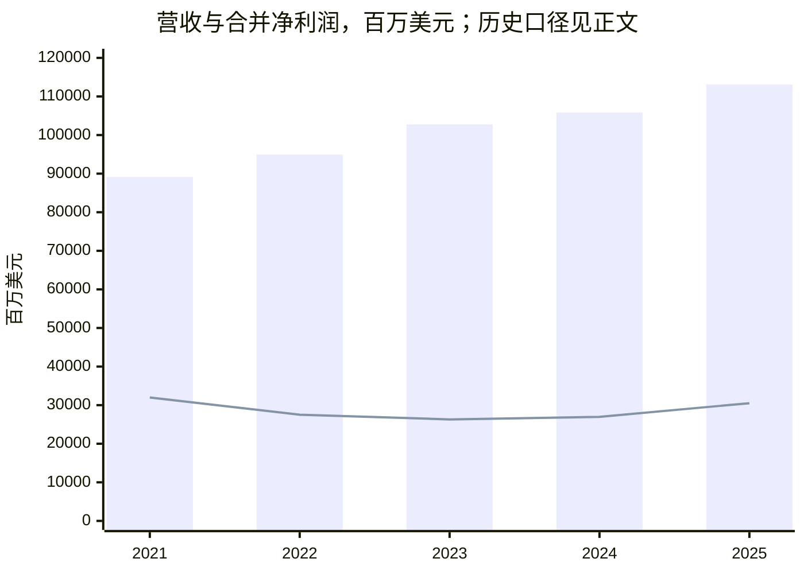

# 美国银行（BAC）研究报告

> 研究日期与信息截止：2026-09-30，北京时间。行情采用美国时间2026-09-29收盘价54.96美元；最新已发布财报为2026年第二季度。估算普通股市值3843.21亿美元，TTM PE 12.69倍，PB 1.40倍，P/TBV 1.87倍。本文只用于学习与研究。
>
> 研究主线：美国银行拥有难以复制的客户账户和金融服务网络，但股东回报还取决于这些低成本负债被投向什么资产，以及买入时支付的价格。

股价由[StockAnalysis](https://stockanalysis.com/stocks/bac/statistics/)与[FinanceCharts](https://www.financecharts.com/stocks/BAC/summary/price)交叉核对。市值以7月30日已披露流通股乘收盘价估算，不能视作9月29日实时股本；季度末净资产口径截至6月30日。金额表格除特别说明外均为**百万美元**。

## AI研究偏见自觉

信息丰富度评级：A。BAC覆盖充分，资料易得，最大的陷阱是把知名品牌、巴菲特历史持仓和近期盈利回升一起当成“便宜”的证据。

本研究主动检查三件事：资料数量是否掩盖资产负债表复杂性；近期交易收入和信用质量能否跨周期延续；是否把证券摊余成本误认为随时可变现的经济价值。

AI研究局限性：公开报表无法逐笔核验贷款质量、衍生品对手方或存款客户行为。分部数据主要依赖公司披露；两家转载同一报表只能验证转录和口径，不能成为对资产真实性的两次独立审计。以下增长、资本回报率、估值倍数和价格区间均为分析假设。

---

## 第一步：核心数据总览

### 五年盈利轨迹

| 指标 | 2021 | 2022 | 2023 | 2024 | 2025 |
|---|---:|---:|---:|---:|---:|
| 营收：扣利息费用、未扣信用拨备 | 89,113 | 94,950 | 102,769 | 105,856 | 113,097 |
| 合并净利润 | 31,978 | 27,528 | 26,305 | 26,973 | 30,509 |
| 普通股股东净利润 | 30,557 | 26,015 | 24,656 | 25,344 | 29,055 |
| 稀释EPS，美元 | 3.57 | 3.19 | 3.05 | 3.19 | 3.81 |

来源：[2025年10-K](https://www.sec.gov/Archives/edgar/data/70858/000007085826000157/bac-20251231.htm)、[2022年报](https://www.sec.gov/Archives/edgar/data/70858/000007085823000121/a2022bankofamericaannualre.pdf)、[StockAnalysis完整损益表](https://stockanalysis.com/stocks/bac/financials/income-statement/)。2023—2024采用2025年报追溯后的数字；2021—2022为历史报表口径，并未出现在本次三年追溯表中，因此五年趋势只作方向观察，不据此推导精确同口径CAGR。2025年更改税收相关权益投资会计方法，[变更披露](https://investor.bankofamerica.com/regulatory-and-other-filings/select-sec-filings/content/0000070858-26-000011/bac-20260106.htm)解释了部分历史数据差异。



图中柱为营收，线为合并净利润。利润并非平滑复利：信用拨备释放、利率变化、市场业务和监管费用会共同改变当年收益。

### 近四季度：业务组合比“存贷银行”更复杂

| 分部营收，FTE口径 | 2025Q3 | 2025Q4 | 2026Q1 | 2026Q2 |
|---|---:|---:|---:|---:|
| 消费银行 | 11,166 | 11,201 | 11,049 | 11,336 |
| 全球财富与投资管理 | 6,312 | 6,618 | 6,712 | 6,871 |
| 全球银行 | 6,189 | 6,238 | 6,287 | 6,236 |
| 全球市场 | 6,225 | 5,304 | 7,109 | 8,022 |
| 其他 | -698 | -829 | -723 | -744 |

分部收入采用完全应税等价口径（FTE），含免税收入的税收调整，不能直接当作合并GAAP收入。[2026Q2补充财务资料，分部表](https://investor.bankofamerica.com/regulatory-and-other-filings/select-sec-filings/content/0000070858-26-000353/bac-06302026ex993.htm)。

| 2026Q2分部 | 净利润 | 盈利机制与弱点 |
|---|---:|---|
| 消费银行 | 3,281 | 日常账户、存贷与银行卡；账户稳定，信用卡损失敏感 |
| 财富管理 | 1,413 | 管理费、经纪费与客户贷款；资产价格下跌会影响收费基数 |
| 全球银行 | 2,046 | 企业贷款、现金管理与承销顾问；受贷款需求和融资周期影响 |
| 全球市场 | 2,626 | 做市、交易和融资；当前强劲表现不能机械年化 |
| 其他 | -292 | 资产负债管理及未分配项目，不能在估值时忽略 |

来源：[2026Q2业绩发布](https://investor.bankofamerica.com/regulatory-and-other-filings/select-sec-filings/content/0000070858-26-000353/bac06302026ex991.htm)。全球市场的强势表现提醒我们：BAC利润改善并非全部来自零售存款护城河。

### 判断银行安全性与利润质量的指标

| 指标 | 2026Q2 | 解释 |
|---|---:|---|
| 合并GAAP营收 | 31,558 | 扣利息费用，未扣信用拨备 |
| 合并净利润 | 9,074 | 与普通股收益口径区分 |
| 稀释EPS，美元 | 1.21 | 单季表现，不能等同正常全年盈利 |
| 普通股ROE | 12.71% | 普通股权益回报 |
| 有形普通股回报率ROTCE | 17.03% | 非GAAP，剔除商誉等影响 |
| 效率比率 | 59.02% | 非利息费用／收入，越低越好 |
| 净核销率 | 0.47% | 年化净核销／平均贷款 |
| 存款，期末 | 2,025,124 | 负债，也是生意的核心生产要素 |
| 贷款与租赁，期末 | 1,217,619 | 收益资产，同时承担信用风险 |
| CET1比率 | 11.2% | 当前监管最低为10.0%，存在约120bp缓冲 |

指标来源：[Q2补充资料](https://investor.bankofamerica.com/regulatory-and-other-filings/select-sec-filings/content/0000070858-26-000353/bac-06302026ex993.htm)、[Q2 10-Q](https://investor.bankofamerica.com/regulatory-and-other-filings/select-sec-filings/content/0000070858-26-000394/bac-20260630.htm)、[美联储2026资本要求](https://www.federalreserve.gov/publications/files/large-bank-capital-requirements-20260624.pdf)。

SCB维持2.5%不代表全部资本要求保持不变；Q2 10-Q预计2027年起G-SIB附加要求提高。以风险加权资产17930亿美元及当前120bp差额机械计算，CET1超出当前最低约215亿美元，但公司需要经营缓冲，不能把这笔金额全部当作可回购现金。

### 三个必须纠正的数据口径

第一，StockAnalysis摘要2025年“收入”107,422已扣5,675信用拨备；本文采用其完整损益表“Revenues Before Loan Losses”113,097，与年报一致。Macrotrends营收191,567包含更宽泛的利息收入，不能与扣利息费用后的银行营收混比；其标为“gross profit”的113,097才可作该口径核对。银行没有可与消费品公司比较的常规毛利率。[Macrotrends收入](https://www.macrotrends.net/stocks/charts/BAC/bank-of-america/revenue/1000)、[对应净收入口径](https://www.macrotrends.net/stocks/charts/BAC/bank-of-america/gross-profit)。Macrotrends正文访问被403限制，此处来自可检索摘要，核查深度低于完整财报。

第二，2025合并净利润30,509，扣优先股股息及其他项目后普通股净利润29,055。后者才用于普通股收益归属；它与[Macrotrends净利润](https://www.macrotrends.net/stocks/charts/BAC/Bank%20of%20America/net-income)和第三方完整报表一致。

第三，2025期末现金及等价物231,845，可与[FT现金流表](https://markets.ft.markitdigital.com/data/equities/tearsheet/financials?s=BAC%3ASGO&subview=CashFlow)交叉确认。但最新Q2公司229,745与[StockAnalysis余额表](https://stockanalysis.com/stocks/bac/financials/balance-sheet/)222,345相差3.22%，本次未解决。该数字不能标为双源验证通过。平台把回购协议、证券、交易资产与现金进行标准化重分类，可能造成差异，但缺少逐项桥接，不能把“可能”写成事实。

银行的现金、证券和债务是经营资产负债的一部分。不能将所谓“净现金”加回市值，也不能用经营现金流减资本开支直接得到可分配股东现金流。本文不以FCF、EV/收入、PS或PEG作定价依据。

> 段永平式追问：如果暂时不看股价，我是否能解释每一块利润由什么资产、负债和风险产生？

---

## 第二步：生意本质分析

**BAC把个人和企业的日常资金账户转化为持续、相对低成本的融资，再通过放贷、财富管理、支付和资本市场服务赚钱。**

客户留钱并非只为最高利率：工资入账、自动扣款、信用卡、企业收款、薪资支付、外汇和投资账户形成一组重复使用的服务。银行通过利差以及服务费获得回报。存款越便宜，合适收益资产越充足，扣信用损失后的利润越高。


真正影响利润的三类变量是：资产重新定价与负债成本的速度差；贷款信用损失；收入增长能否快于费用。交易和管理费提供多样化收入，也引入资本市场周期。

降息的影响有两面：存款成本可能下降，但浮动贷款收益也会下降；旧低息证券到期再投资可能改善利差，但按揭证券的提前偿付和久期变化会改变实现速度。不能用“降息利好银行”一句话概括。2025年净利息收入60,096、非利息收入53,001，说明手续费业务已足以显著影响公司表现。[全年业绩](https://investor.bankofamerica.com/regulatory-and-other-filings/select-sec-filings/content/0000070858-26-000020/bac12312025ex991.htm)。

经营杠杆也有边界。线下网点与技术平台有固定成本，新增客户可摊薄成本；交易奖金、合规和技术支出却不完全固定。公司披露2025年技术支出约130亿美元，其中新技术项目超过40亿美元。它是维护规模与服务能力的投入，不能等同有独占专利保护的研发收益。[CEO股东信](https://newsroom.bankofamerica.com/content/newsroom/stories/2026/03/a-letter-to-shareholders-from-chair-and-ceo--brian-moynihan.html)。

> 段永平式追问：好在哪里？我的答案是账户与服务关系形成低成本融资；前提是管理层不把这份优势消耗在错误的资产配置上。

---

## 第三步：护城河评估

| 护城河 | 判断 | 证据与可证伪条件 |
|---|---|---|
| 品牌与信任 | 中强 | 客户把日常运营资金交给大行；若安全事件或服务恶化引发持续流失，优势会削弱 |
| 转换成本 | 强 | 工资、支付、企业资金管理与财富账户需要迁移；纯储蓄余额仍可迅速转向高息账户 |
| 网络效应 | 中弱 | 规模有助服务覆盖，但新增客户并不会自动提高每个客户的产品价值 |
| 规模与成本 | 强 | 固定技术、风控、清算和合规成本可在庞大客户群中分摊；必须观察费用与存款成本 |
| 技术／专利 | 中 | 数据、平台和流程有积累；大型同行可以持续投入，不能认定领先无法复制 |
| 监管门槛 | 中强 | 牌照、资本和治理要求阻挡新进入者；对股东同时也是分配约束 |

过去数年的数字化增强了运营能力，但高收益替代产品降低了纯存款余额的黏性。未来护城河更可能体现在“客户保留主要运营账户”，而非“客户愿意把所有现金长期放在低息存款里”。此为机制推理，未取得统一口径五年存款beta序列，不能宣称已证实护城河持续扩大。

相对JPM，BAC依然需要提高跨周期资本效率。JPM在2026Q2披露剔除特定投资收益后的ROTCE为23%，显著高于BAC当季17.03%。两者不能用JPM含一次性收益的29%直接比较。[JPM Q2说明](https://www.jpmorganchase.com/content/dam/jpmc/jpmorgan-chase-and-co/investor-relations/documents/quarterly-earnings/2026/2nd-quarter/9e8f3cef-bd2a-4140-b50f-83c4fba3f23c.pdf)。

> 巴菲特式追问：十年后客户账户还会在，但这是否保证股东获得超额回报？只有当账户优势转化为跨周期资本回报时才成立。

---

## 第四步：逆向思考与风险清单

最强反方论点是：你买到一家具备优质融资来源、却曾承担过大证券久期风险的银行；此时付出接近两倍有形净资产，仍可能高估盈利改善的持久性。

### HTM账面稳定不代表经济价值稳定

| 持有至到期证券，HTM | 2025年末 | 2026Q2末 |
|---|---:|---:|
| 摊余成本 | 522,685 | 505,828 |
| 公允价值 | 442,430 | 423,734 |
| 未实现总损失 | 80,257 | 82,095 |

来源：[Q2债券补充表](https://investor.bankofamerica.com/regulatory-and-other-filings/select-sec-filings/content/0000070858-26-000353/bac-06302026ex993.htm)，年末参照[Q2 10-Q](https://investor.bankofamerica.com/regulatory-and-other-filings/select-sec-filings/content/0000070858-26-000394/bac-20260630.htm)。

这不是应立即从当季利润中扣除的信用损失，也不能机械从TBV再减一遍作为唯一估值。但它体现机会成本：资金被锁在低收益、长久期资产中。若被迫出售，损失可转为已实现；若利率上升且提前偿付放缓，经济价值与再投资节奏可能进一步恶化。证券规模下降而未实现损失增加，本身就反驳了“到期会自动消除问题”的简单叙事。

| 失败或低回报路径 | 可能性判断 | 影响 | 观察信号 |
|---|---|---|---|
| 信用周期反转 | 中，未赋精确概率 | 拨备上升、利润下降 | 核销与拖欠率同时恶化，商业贷款风险评级下降 |
| 长端利率上升／久期延长 | 中 | 证券经济价值下降、再投资推迟 | HTM损失扩大，净利息收入弱于预期 |
| 存款竞争持续加剧 | 中高 | 低成本融资优势变弱 | 运营账户减少，高成本定存替代活期 |
| 资本要求上升 | 中高 | 回购减速，EPS增长承压 | CET1接近监管底线，资本分配下降 |
| 市场业务回落 | 中高 | 近期利润不可持续 | 交易与投行业务回落、成本仍高 |
| 存款危机或严重操作事件 | 低，但不能忽略 | 流动性紧张，极端情形下稀释股权 | 存款与流动性同步下降、融资利差跳升 |

“低／中／高”是研究判断，缺少可靠频率样本；没有将它们包装成统计概率。普通盈利波动进入经营情景；严重流动性危机另作尾部风险，不能认为三情景已覆盖全部损失。

压力测试示例：若全年新增信用损失相当于期末贷款的50bp，取当季税率21.5%及期末股数估算，每股利润可能减少约0.68美元。这是固定资产规模的机械敏感性，不是信用损失预测，也未模拟收入收缩、拨备时点与递延税。[输入来自Q2业绩](https://investor.bankofamerica.com/regulatory-and-other-filings/select-sec-filings/content/0000070858-26-000353/bac06302026ex991.htm)，结果由Decimal计算。

2023年银行业事件提供的机制类比是：会计上未兑现的久期损失，遇到快速提款可转化为流动性问题。BAC客户、业务和流动性更分散，不能据此推断它会重复小型集中银行的结局。大型银行也可能因错误定价而成为低回报投资，而无需发生破产。

> 芒格式追问：最可能犯什么错？把当季17%的ROTCE、温和信用损失与交易收入高点，组合成永远成立的正常盈利。

---

## 第五步：管理层评估

Brian Moynihan是职业经理人，优势在大型组织、风控与整合经营，评估重点应是资本配置纪律。

| 决策或行为 | 可观察结果 | 研究评价 |
|---|---|---|
| 疫情时期增加长期固定收益证券风险暴露 | 当前仍存在显著HTM公允价值折价 | 对资产负债管理能力的重要扣分；不能只归因于外部加息 |
| 持续技术和运营投入 | 建立数字服务与数据流程，技术成本持续较高 | 方向合理；缺少可独立测量的项目ROI |
| 2025及2026继续资本返还 | Q2返还80亿美元，其中普通股回购60亿美元 | 有益于每股收益，但高于内在价值回购会损害留存股东 |
| 2026提高普通股季度分红 | 从0.28美元提高至0.32美元 | 表明分配意愿；仍受未来资本和盈利约束 |

回购数据见[Q2发布](https://investor.bankofamerica.com/regulatory-and-other-filings/select-sec-filings/content/0000070858-26-000353/bac06302026ex991.htm)，分红见[7月24日董事会公告](https://investor.bankofamerica.com/regulatory-and-other-filings/select-sec-filings/content/0000070858-26-000364/exhibit991.htm)。授权剩余额度不是回购承诺。

2026代理文件披露，3月13日Moynihan实益持有普通股2,803,195股，另有未归属股票单位1,724,434；合计4,527,629不能全部当作当前投票股份。以接近该时点的3月末股数近似，已持普通股约0.039%，是近似值而非当天精确比例。第三方“内部人士合计0.16%”涵盖更多人且定义不同，不能作为CEO持股比例的第二证据。BAC不存在用A/B股超级投票权控制公司的同类问题。[2026代理文件](https://www.sec.gov/Archives/edgar/data/70858/000119312526118929/d43888ddef14a.htm)、[内部人士统计](https://stockanalysis.com/stocks/bac/statistics/)。

薪酬包含延期和绩效股权，能提供一定一致性，但持股比例低，不能将其等同创始人承担集中财富风险。CEO退休后的竞争力应由组织延续，当前公开信息不足以验证接班团队的独立资本配置能力。

> 段永平与巴菲特式追问：管理层能否把不适合再投资的钱归还股东，并对过去的久期决策承担责任？这是比盈利增长口号更重要的检验。

---

## 第六步：行业与文明趋势

支付数字化、个人财富积累和企业资金管理需求具有长期基础。银行的利润池来自资金配置、服务和承担风险；并不因支付次数增加就自动等比例增厚。

AI可以改善客服、反欺诈、开发效率和流程处理，但同行也可取得技术，节约可能通过更高存款利率、更低费用返还客户。受监管的风控与合规责任不会因为使用AI而消失。本报告没有给“AI TAM”额外估值溢价。

BAC在价值链中的优势是账户入口、资产负债表和企业关系。证券平台与金融科技可以抢走交易或收益更高的余额，大行则仍有综合服务和资本支持能力。公司客户分散不等于风险分散：许多客户会同时受到美国就业、利率和房地产周期影响。

行业空间更适合以存款份额、贷款需求、财富资产、企业钱包份额和单位服务成本跟踪，而非套一个缺乏同口径边界的全球金融TAM。本次没有取得统一日期的FDIC存款份额与完整同业市场份额，不给出伪精确占比。

> 李录式追问：二十年后仍需要银行，但利润会更多流向客户、股东还是监管要求？公司生存的确定性，远高于超额股东回报的确定性。

---

## 第七步：估值与安全边际

### 当前定价

| 指标 | 验算结果 | 注意事项 |
|---|---:|---|
| 参考股价，美元 | 54.96 | 9月29日收盘 |
| 披露普通股流通股数，十亿股 | 6.992748365 | 7月30日，并非最新交易日股数 |
| 估算市值，十亿美元 | 384.32145 | 股价乘披露股数 |
| TTM稀释EPS，美元 | 4.33 | 第三方滚动计算，季度四舍五入相加会有微差 |
| TTM PE | 12.69倍 | 当前价／TTM EPS |
| 2025全年EPS口径PE | 14.43倍 | 当前价／3.81 |
| 每股账面净资产，美元 | 39.34 | 6月末 |
| 每股有形净资产，美元 | 29.37 | 6月末，非GAAP |
| PB | 1.40倍 | 普通股净资产口径 |
| P/TBV | 1.87倍 | 当前价／TBVPS |
| 年化普通股分红，美元 | 1.28 | 当前季度0.32乘四，不代表未来承诺 |
| 年化股息率 | 2.33% | 未扣税 |

来源：[StockAnalysis统计](https://stockanalysis.com/stocks/bac/statistics/)、[Q2 10-Q](https://investor.bankofamerica.com/regulatory-and-other-filings/select-sec-filings/content/0000070858-26-000394/bac-20260630.htm)、[分红公告](https://investor.bankofamerica.com/regulatory-and-other-filings/select-sec-filings/content/0000070858-26-000364/exhibit991.htm)。不能用当前流通股乘历史EPS反推年度净利润：历史EPS采用年度加权稀释股数，当前股本已受回购影响。

历史参照中，第三方年末PE显示2021—2025约10—14倍。该平台历史倍数可能使用日历TTM及调整后数据，不能当作精确分位。JPM目前第三方PE约14.45倍、PB约2.53倍；其更高ROTCE解释了部分溢价。BAC相对更便宜，并不单独证明它有安全边际。[BAC历史指标](https://stockanalysis.com/stocks/bac/financials/)、[JPM统计](https://stockanalysis.com/stocks/jpm/statistics/)。同行数字为网页不同抓取时点的近似比较，未做同一收盘时点的估值验算，禁止用于终值定价。

### 反向估值：1.87倍TBV已经要求什么？

银行可以用简化稳态公式 P/TBV=(ROTCE−g)/(r−g) 检查市场隐含要求。取美元权益成本10%、永续增速2.5%，当前倍数隐含稳态ROTCE约16.53%。这与近期单季17.03%接近，却明显高于2025全年14.22%。[全年ROTCE来源](https://investor.bankofamerica.com/regulatory-and-other-filings/select-sec-filings/content/0000070858-26-000020/bac12312025ex991.htm)。

该公式假设稳定资本口径、稳定派息与账面价值增长，不模拟HTM重估、资本政策变化和回购溢价。因此它回答的是“当前价格已经押注了什么”，不是完整内在价值。

### 三年情景：退出价格与持有回报

以4.33美元TTM EPS为基点，增长和倍数均为主观假设；三年模型不把当季EPS直接年化。

| 情景 | EPS年增长假设 | 第三年EPS，美元 | 退出PE假设 | 第三年价格，美元 | 含分红总回报 | 年化回报 |
|---|---:|---:|---:|---:|---:|---:|
| 悲观 | -3% | 3.95 | 9倍 | 35.57 | -28.30% | -10.50% |
| 基准 | +6% | 5.16 | 12倍 | 61.89 | +19.59% | +6.14% |
| 乐观 | +10% | 5.76 | 14倍 | 80.69 | +53.79% | +15.43% |

分红固定取每年1.28美元，三年累计3.84美元、期末汇总、不做再投资；悲观情景未降分红，存在偏乐观的限制。EPS增长已经包含可能回购作用，不能再将回购收益率加到回报上。三年退出PE是短期交易情景假设，不是十年终值倍数的来源。低概率危机可能显著差于悲观档。

### 十年折现：银行采用权益模型

银行债务和存款是经营投入，不能用工业企业ROIC与WACC。本文将工具中的“ROIC”输入解释为**稳态增量有形普通股资本回报率**，r为普通股权益成本；这是对通用技能的必要行业适配。

终值倍数只由永续模型得到：PE=(1−g／稳态增量权益回报率)／(r−g)，没有用同行当前倍数指定十年退出PE。

主口径r=10%，币种USD，永续g上限4%。参考9月29日10年美债约5.25%，取beta=1的规范化假设，加4.75个百分点风险溢价得到10%；beta不是平台实测波动系数。无风险利率来自[AP市场收盘报道](https://apnews.com/article/69778ade7a033a10cb44b9078b6bb15d)，本次财政部页面读取失败，需视为可靠新闻参考、未完成官方双源确认。r敏感性用9%与11%，g保持不变。

| 十年情景假设 | 悲观 | 基准 | 乐观 |
|---|---:|---:|---:|
| 前十年EPS增速 | +3% | +6% | +9% |
| 终值增量权益回报率 | 12% | 14% | 16% |
| 第十年之后永续增速g | 1.0% | 2.5% | 3.5% |
| 主口径r−g | 9.0个百分点 | 7.5个百分点 | 6.5个百分点 |
| 永续模型退出PE | 10.19倍 | 10.95倍 | 12.02倍 |
| 第十年EPS，美元 | 5.82 | 7.75 | 10.25 |
| 折现现值，美元／股 | 32.06 | 43.40 | 59.86 |
| 当前价买入现金流IRR | +3.44% | +7.12% | +11.04% |

输入理由：悲观假设融资优势仍在但信用、资本约束拖累回报；基准假设资本回报在2025全年水平附近长期稳定，盈利改善后转为中等增长；乐观假设效率与综合服务使资本回报接近近期高位，但仍不直接外推单季17%。永续增速低于前十年增速，且均不超过美元名义长期增长上限。它们是有据判断，未经过完整贷款周期实证校准。

现值计算逐年现金分红为当年EPS的30%，加第十年退出价值折现。EPS路径可含股份减少，30%现金分红之外的利润可支持资本增长和回购；没有将回购再次加成现金分红。终值假设转入稳态资本留存比例g／权益回报率。该模型未逐年建立CET1、贷款、分部和股数联动，属于简化权益模型。

主表IRR由实际十个年度分红和终值现金流求根，税前且未扣费用。通用terminal_value工具将几何资本回报加固定股息率所得近似回报分别为+3.09%、+6.78%、+10.74%；不是严格现金流IRR，留在附件用于复核，主表采用求根结果。

| r敏感性 | 悲观现值，美元 | 基准现值，美元 | 乐观现值，美元 | 基准现金流IRR |
|---|---:|---:|---:|---:|
| 9% | 37.81 | 52.57 | 74.50 | +8.46% |
| 10% | 32.06 | 43.40 | 59.86 | +7.12% |
| 11% | 27.60 | 36.56 | 49.38 | +5.97% |

全部r−g至少5.5个百分点，满足模型稳定性下限。情景价值排序保持乐观＞基准＞悲观；本报告只研究一家公司，不存在公司间排序检验。即使采用9%权益成本，基准现值仍低于参考股价。**“现在不重仓”的结论较稳定，精确买点对折现率仍敏感。**

限制：未建立证券强制出售、严重提款、重大网络安全事故和尾部稀释的完整概率现金流；没有将这些风险通过提高r隐蔽处理。报告的价格区间只适用于未出现危机、核心资产质量仍可信的条件。

> 巴菲特与段永平式追问：如果市场关门五年，以54.96美元持有是否足够划算？在基准增长和资本回报假设下，我更愿意等待价格给出保护。

---

## 第八步：最终决策与行动清单

| 维度 | 结论 | 信心度 |
|---|---|---|
| 生意质量 | 良好的综合金融服务生意，经营账户是关键资产 | 中高 |
| 护城河 | 账户转换成本与规模有优势，无法保证每次资产配置正确 | 中高 |
| 管理层 | 组织经营经验充分，久期管理与回购价格仍需审视 | 中 |
| 最大风险 | 证券经济价值、信用周期与资本要求共同压低可分配盈利 | 中高 |
| 文明趋势 | 金融服务长期存在，AI增益尚不应单独资本化 | 中 |
| 估值 | 约55美元缺少基准安全边际；近期高收益延续已被部分定价 | 中 |

**研究结论：空仓者观望，现价不建议重仓；既有持仓可有条件持有，基本面不恶化时等待更好的买入价格。**

| 股价区间，美元 | 研究行动 | 适用条件 |
|---|---|---|
| 34—38 | 有吸引力的分批建仓观察区 | 信用、存款与资本稳定，价格下跌不是资产真实性危机 |
| 38—43 | 可考虑小仓位，回报要求较高者继续等待 | 能接受银行周期与尾部风险，盈利路径符合基准 |
| 43—53 | 对折现率和执行结果敏感，空仓者偏观望 | 该区跨越不同r下的基准估值，不是统一“便宜区” |
| 53—60 | 缺少基准安全边际，持仓者复核集中度 | 需持续改善资本回报支持价格 |
| 高于60 | 假设未上调时可考虑减仓 | 必须对乐观增长与高资本回报有持续证据 |

34—38是围绕主口径基准价值43.40设置的判断性安全边际区间，并非精确技术支撑位。低价格只能弥补定价风险，不能修复存款外逃、不可控资产损失或治理失效。

| 投资者／信号 | 行动 |
|---|---|
| 空仓者 | 当前观望；达到价格区间时再核对财报，而非挂一个无需条件的买单 |
| 持仓者 | 核心关系与资本未恶化可持有；若已集中持有金融股，应考虑行业相关风险 |
| 加仓信号 | 价格改善，同时存款稳定、信用指标无持续恶化、跨周期ROTCE可信 |
| 卖出或减仓信号 | 存款与流动性同时恶化；资本分配被明显约束；贷款损失趋势破坏正常盈利；或价格要求的回报超过可实现水平 |
| 下一次复核 | Q3已排期10月14日，优先检查净利息收入、信用损失、HTM与CET1，不只看EPS是否超预期 |

财报排期来自[公司季度财报页面](https://investor.bankofamerica.com/quarterly-earnings)。尚未发布的Q3不写成已实现业绩。

机会成本：主口径基准十年IRR约7.12%，对承担银行周期与尾部风险的股东不构成很宽的回报补偿；将其与同期限美元债券比较时还要承认股票现金流更不确定。本次未建立个人税务、币种和组合模型，因此价格行动属于一般研究框架。

以下是方法论模拟，**不是四位投资者的真实发言，也不代表他们当前持仓观点**：

> 巴菲特式：账户关系值得研究，买入倍数和正常资本回报同样重要。
>
> 芒格式：先解释证券久期和资本约束如何损害你，再讨论盈利增长。
>
> 段永平式：懂得它怎么赚钱，还要懂得什么时候会少赚，价格要留余地。
>
> 李录式：长期金融需求存在，研究重点是公司能留下多少价值给股东。

---

## AI分析置信度与投资确定性

报表核心收入、净利及当前市值口径的分析置信度较高；存款护城河机制的判断为中高；长期增长、增量资本回报和尾部风险概率的置信度为中低。最新现金重分类差异、CEO持股精确比例第二源、动态利率官方双源核对仍存在缺口。

实际投资确定性只属中等：信用、利率、资本监管和管理层资产配置会共同改变股东现金流。A类信息丰富不能变成A类投资确定性。最值得验证的不是“银行还会不会存在”，而是正常化ROTCE能否持续、资本能否分配以及当前价格有没有保护。

## 数据来源与审计记录

关键数据交叉验证原始工具输出保存在[validation-log.txt](G:/code/ai-berkshire-copy/reports/BAC-美国银行/validation-log.txt)，全部估值计算保存在[calculations.json](G:/code/ai-berkshire-copy/reports/BAC-美国银行/calculations.json)，复现脚本为[research_calculations.py](G:/code/ai-berkshire-copy/reports/BAC-美国银行/research_calculations.py)。

| 验证项目 | 公司／主来源 | 交叉来源 | 结论 |
|---|---|---|---|
| 2025拨备前银行营收 | 113,097 | StockAnalysis 113,097；Macrotrends对应口径113,097 | 一致；不能使用摘要的扣拨备收入 |
| 2025普通股净利 | 29,055 | StockAnalysis 29,055；Macrotrends 29,055 | 一致 |
| 2025期末现金 | 231,845 | FT 231,845 | 一致，FT全文读取失败，使用检索表格摘要 |
| 最新股本 | 6,992,748,365 | StockAnalysis约6.99十亿股 | 四舍五入一致；真实截至7月30日 |
| 9月29日收盘 | 54.96 | FinanceCharts 54.96 | 一致；行情历史页存在盘中缓存，采用收盘标签 |
| 最新现金 | 229,745 | StockAnalysis 222,345 | 相差3.22%，未解决，不作为估值输入 |
| 管理层持股 | 代理文件个人持股 | 平台仅有内部人士合计 | 定义不同，不能标成个人比例双源通过 |

终值工具C1／C2／C3结构检查已通过。工具内置无风险利率固定为2026年8月的4.70%，传入9月参考5.25%会因静态相等检查打回。本报告不修改共享工具，也不把旧值冒充最新值；结构audit省略可选rf参数，币种、r、g和离散风险归属仍按最终参数检查。动态利率核对及其数据缺口单独披露，结构通过不等于利率来源已验证。

抽检随机种子42：共识别141个候选数据点，抽取22项，其中15项为来源事实、5项为模型输入或计算、2项为提取器将CET1中的数字与月份误识别为财务数据。15项事实核对均与已读取信源一致，但只有6项完成独立机构／第三方来源交叉，其余9项仍主要依赖同一公司披露。模型与误提取项目单独记录，没有冒充外部取数。

工具原始摘要如下（颜色控制字符略）：

```text
市值验算：偏差 0.00%
所有来源偏差 ≤ 1.0%, 数据一致 [2025营收、普通股净利、年末现金]
抽检总数: 15 | 通过: 15 | 警告: 0 | 不通过: 0
【准出】三条硬约束全部通过，可以把估值写进报告。
⚠ C3: 「网络安全事件」未建模，必须写进报告的「限制」章节
```

抽检工具只判断数值偏差，无法识别来源机构是否独立；其自动“报告可发布”文案不能替代技能要求的双源标准。本报告状态为**已完成的研究报告，保留数据缺口，未获得全数据双源发布准出**。详见[audit-results.json](G:/code/ai-berkshire-copy/reports/BAC-美国银行/audit-results.json)与[audit-verdict.txt](G:/code/ai-berkshire-copy/reports/BAC-美国银行/audit-verdict.txt)。最新现金、季度分部独立来源和其他已披露缺口均需后续补足，不能对它们宣称验证通过。
