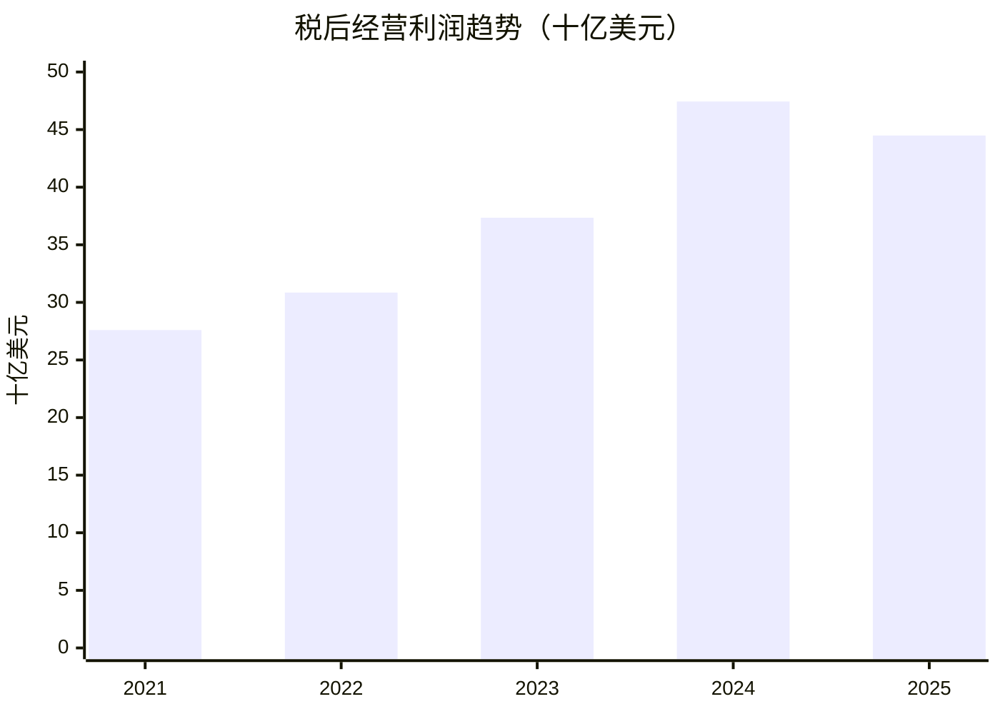
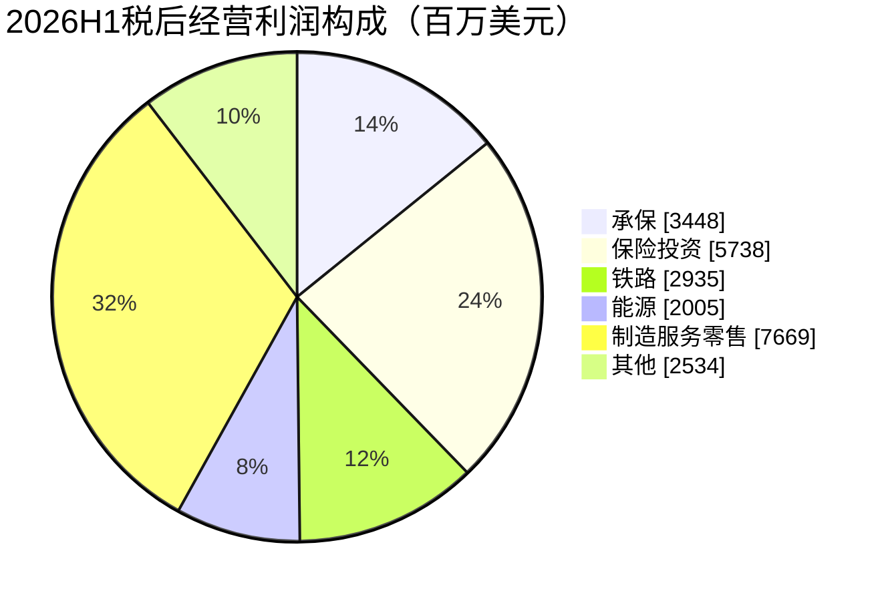

# 伯克希尔哈撒韦（BRK-B）研究报告

研究截止日：2026 年 9 月 10 日（北京时间）。行情采用 9 月 9 日美股收盘；财务截至 2026 年 6 月 30 日。金额除特别注明外为**百万美元**，价格为每股 B 股美元。

参考股价 **506.72 美元**；按最新披露股本计算市值 **1.08474 万亿美元**；以六月末账面价值计算 PB **1.455 倍**。核心判断：伯克希尔仍有优质的长期资本配置体系，但投资者现在需要为未来资金部署的成功预先付费。[行情](https://stockanalysis.com/stocks/brk.b/history/)、[最新股本及财务](https://www.berkshirehathaway.com/qtrly/2ndqtr26.pdf)。

## AI研究偏见自觉

信息丰富度评级：**A级**。最大偏见是把巴菲特的声誉、历史收益和现金规模一起当作买入理由。Greg Abel 已于今年接任 CEO，本次研究必须检验体系的延续能力，而不能默认个人投资纪录可以复制。

- [x] 区分“信息多”与“未来回报确定”。
- [x] 检查经营利润、投资浮盈、净现金和 A/B 股单位。
- [x] 提出理性的拒绝买入理由，不以大师光环替代估值。
- [x] 将模型假设与公司披露分开；不把假设通过算术检查称为预测被验证。

AI研究局限性声明：无法核实保险逐笔准备金、全部子公司的维护性资本开支、尚未披露的第三季度资金部署，也没有管理层或客户访谈。季度分部及管理层精确持股有单源限制，见附录。本报告供学习研究，不构成个性化投资建议。

---

## 第一步：核心数据总览

### 五年变化：经营业务比净利润曲线稳定

| 指标 | 2021年 | 2022年 | 2023年 | 2024年 | 2025年 |
|---|---:|---:|---:|---:|---:|
| 收入，不含投资资本利得 | 276,185 | 302,020 | 364,482 | 371,433 | 371,444 |
| GAAP归母净利润 | 89,937 | -22,759 | 96,223 | 88,995 | 66,968 |
| 税后经营利润 | 27,597 | 30,853 | 37,350 | 47,437 | 44,486 |
| 合并经营现金流 | 39,427 | 37,350 | 49,196 | 30,592 | 45,969 |
| 购置固定资产及出租设备 | 13,276 | 15,464 | 19,409 | 18,976 | 20,927 |
| 上述现金流减资本开支 | 26,151 | 21,886 | 29,787 | 11,616 | 25,042 |
| 归母股东权益 | 506,199 | 473,424 | 561,273 | 649,368 | 717,419 |
| 现金与短期国库券 | 146,719 | 128,585 | 167,641 | 334,201 | 373,311 |
| 税后经营利润/收入 | 9.99% | 10.22% | 10.25% | 12.77% | 11.98% |

来源：[2025年报](https://www.berkshirehathaway.com/2025ar/2025ar.pdf)、[2023年报及重述数据](https://www.berkshirehathaway.com/2023ar/2023ar.pdf)、[StockAnalysis利润表](https://stockanalysis.com/stocks/brk.b/financials/)、[现金流量表](https://stockanalysis.com/stocks/brk.b/financials/cash-flow/)。经营利润使用公司定义，不等于第三方网站 Operating Income；最后一行是研究用比率，不是会计营业利润率。经营现金流含保险负债变化，因此表中现金差额不是可直接分红的所有者收益。



2022 年的会计亏损不代表铁路、保险和制造业整体亏损。反过来，股票上涨带来的巨额 GAAP 利润也不是每年可以重复获得的经营现金。2023 年收入跃升还包含 Pilot 首次纳入合并，不能全部看成自然增长。

### 收入的规模与利润的重要性并不相同

| 2025年业务 | 分部收入 | 业务中的实际驱动因素 |
|---|---:|---|
| GEICO | 44,481 | 保单数量、费率、出险率和赔付严重度 |
| 其他初级保险 | 18,713 | 细分风险定价与经纪渠道 |
| 再保险 | 25,708 | 承担大额或长期风险的资本能力 |
| BNSF | 23,533 | 运量、单位运价、运力利用率 |
| BHE | 26,297 | 监管认可的资产、费率与融资成本 |
| Pilot | 42,198 | 燃料销售量、每加仑利润及非油销售 |
| 制造业 | 78,487 | 工业零件、建筑材料和消费产品需求 |
| McLane | 50,998 | 配送量与极薄的单位分销利润 |
| 服务与零售 | 42,647 | 各行业客户需求与成本纪律 |

分部口径见[年报](https://www.berkshirehathaway.com/2025ar/2025ar.pdf)，本次按官方单源采用。这些分部数字尚含内部交易等差异，保险投资收入另列，**不能直接相加后当作合并收入或计算饼图占比**。燃料和批发带来大量流水，却不相应带来大量利润；合并毛利率不足以判断整个公司的护城河。

### 最近四季业务收入

| 分部收入 | 2025Q3 | 2025Q4 | 2026Q1 | 2026Q2 |
|---|---:|---:|---:|---:|
| GEICO | 11,264 | 11,401 | 11,186 | 11,291 |
| 其他初级保险 | 4,711 | 4,748 | 4,591 | 4,673 |
| 再保险 | 6,470 | 6,309 | 6,228 | 6,511 |
| 保险投资收入 | 3,736 | 3,950 | 3,307 | 3,701 |
| BNSF | 6,039 | 6,005 | 5,994 | 6,601 |
| BHE | 7,304 | 6,219 | 6,661 | 6,735 |
| 制造 | 20,047 | 19,705 | 20,672 | 22,568 |
| 服务与零售 | 10,593 | 11,229 | 10,989 | 11,884 |
| McLane | 13,191 | 13,031 | 11,936 | 12,118 |
| Pilot | 10,882 | 10,777 | 11,245 | 14,932 |
| 合并收入 | 94,972 | 94,232 | 93,675 | 101,808 |
| 总税后经营利润 | 13,485 | 10,200 | 11,346 | 12,983 |

来源为[2025Q3报告](https://www.berkshirehathaway.com/qtrly/3rdqtr25.pdf)、[2025年报](https://www.berkshirehathaway.com/2025ar/2025ar.pdf)、[2026Q2报告](https://www.berkshirehathaway.com/qtrly/2ndqtr26.pdf)；Q4由全年减九个月、Q1由半年减Q2得到。分部均为官方单源或同源推导，独立双源未完成。季度分部毛利率未有一致可比披露，保留缺口，不把网站GAAP混合指标充当毛利率。四季更细的税后利润表及推导口径见同目录资料底稿。

### 最新半年：真实改善存在，汇兑也在帮忙

| 税后利润分项 | 2026Q2 | 2025Q2 | 2026H1 | 2025H1 |
|---|---:|---:|---:|---:|
| 保险承保 | 1,731 | 1,992 | 3,448 | 3,328 |
| 保险投资收益 | 3,059 | 3,367 | 5,738 | 6,260 |
| BNSF | 1,558 | 1,466 | 2,935 | 2,680 |
| BHE | 891 | 702 | 2,005 | 1,799 |
| 制造、服务、零售 | 4,470 | 3,601 | 7,669 | 6,661 |
| 其他 | 1,274 | 32 | 2,534 | 73 |
| 总经营利润 | 12,983 | 11,160 | 24,329 | 20,801 |
| 其中非美元债务汇兑 | 326 | -877 | 575 | -1,590 |

来源：[公司业绩发布](https://www.berkshirehathaway.com/news/aug0826.pdf)。季度经营利润同比 **+16.34%**；仅剔除上表汇兑后为 **+5.15%**。半年相应为 **+16.96%**、**+6.09%**。这仍不是完全的“有机增长”：收购、税率及其他项目尚未全部调整。保险投资收益下降还受资金从保险子公司转至母公司、收益改列其他项目影响，不能全归因于利率。滚动四季税后经营利润为 48,014，但下文用 45,000 作为偏谨慎的正常化起点。



### 现金很多，但不等于可全部拿走

| 2026年6月末指标 | 金额 |
|---|---:|
| 合并现金与短期国库券 | 365,514 |
| 借款，不含经营租赁 | 128,599 |
| 现金与国库券减借款 | 236,915 |
| 股票证券投资 | 323,779 |
| 固定期限证券 | 17,034 |
| 权益法投资 | 19,948 |
| 保险浮存金，约数 | 177,500 |
| 归母权益 | 747,910 |

来源：[季度报告](https://www.berkshirehathaway.com/qtrly/2ndqtr26.pdf)、[第三方资产负债表](https://stockanalysis.com/stocks/brk.b/financials/balance-sheet/)。现金口径包含铁路能源现金，未扣国库券未交割应付款 771；不能与“保险及其他、扣未交割款”的更小现金数字直接对比。铁路能源债务主要由各子公司经营资产支撑，也不能因此认为全部现金都可用于母公司回购。

浮存金是承保业务形成的负债资金。若承保长期盈利，其融资成本可以很低；若错误定价，低成本资金可能变成巨额索赔。不能一方面把浮存金当免费股权，另一方面把以浮存金形成的证券资产再完整加到经营业务估值上。

> 段永平式追问：如果不看股价和浮盈，这些业务明年还能靠什么收到钱？

---

## 第二步：生意本质分析

**客户为风险保障、运输、能源和商品服务不断付钱；伯克希尔把其中能留下来的资本，在企业、证券和现金之间长期配置。**

它有两层经济结构。底层企业面对真实客户竞争：车险客户会比价，铁路客户关注准点和总运费，电力客户依赖当地电网，制造业客户要求产品可靠。上层总部决定一美元利润应该继续投资、收购别的生意、买上市股票，还是回购自身。这种内部资本分配减少了每家子公司独立寻找资金的摩擦，但并不会自动把普通企业变成优秀企业。

| 客户与收费机制 | 重复付费来源 | 成本及资本约束 |
|---|---|---|
| 投保人定期缴纳保费 | 风险持续存在、续保 | 理赔、获客、准备金与监管资本 |
| 货主按运输合同付费 | 货流与线路需求持续 | 线路维护、机车、人工及燃料；低运量时固定成本难降 |
| 用电用气客户按费率付费 | 基础生活生产需求 | 建设先花钱，回报要等监管认可，资本开支不能省略 |
| 工业、建筑及零售客户采购 | 消耗、替换、售后及新增需求 | 材料、库存、信用及产能利用率；住宅有周期性 |

利润最重要的三个变量是：承保纪律与赔付成本；现金及股票资本的实际回报；铁路能源制造业务投入资本后的剩余收益。收入增长不一定带来价值增长，尤其是燃料价格上涨或低利润配送扩张。

研发没有集团统一、可比且可用于估值的披露口径。技术投资主要应在保险风险定价、理赔自动化、铁路调度、工业制造工艺层面观察。不能给这个混合集团套软件公司的毛利率或网络效应估值。

> 段永平式追问：好在可以长久收钱，还是好在每多投入一美元能赚到足够回报？两者必须同时检验。

---

## 第三步：护城河评估

| 来源 | 判断与机制 | 五年方向判断 | 可推翻判断的证据 |
|---|---|---|---|
| 品牌与信任 | 强于大额保险交易及企业出售方信任；普通零售不统一 | 总体稳定，继任后待检验 | 优质卖方不再给予成交优先权，承保只能靠降价 |
| 转换成本 | 铁路接轨、电网连接与认证工业零件较强；车险较弱 | 混合 | 客户转向替代运输、工业认证优势消失 |
| 网络效应 | 铁路网络有密度效益；集团本身没有互联网式用户网络效应 | 稳定 | 新物流格局削弱线路位置价值 |
| 规模与成本 | 保险资本容量、融资韧性和集中配置能力较强 | 资本容量变强，部署难度也上升 | 大额投资无法改变每股盈利，规模只带来现金堆积 |
| 技术与专利 | 部分工业业务有工艺和认证壁垒；非全集团统一壁垒 | 业务间分化 | 定价技术落后、份额靠牺牲利润维持 |
| 稀缺资产与监管 | 铁路路权、电网及服务区域难复制 | 物理壁垒强，回报保障更不确定 | 监管不认可成本、巨灾责任使资本回报失衡 |

以上方向是基于业务机制的研究判断，非评级机构评分。[业务与风险披露](https://www.berkshirehathaway.com/2025ar/2025ar.pdf)。BNSF 的线路复制难，不代表客户完全没有议价权；BHE 的需求稳定，不代表股东回报稳定。这是最容易被“永久持有”叙事掩盖的区别。

> 巴菲特式追问：十年后路权和电网仍然存在，但留下来的经济收益是否仍属于股东？

---

## 第四步：逆向思考与风险清单

最强的反方论点是：投资者可能用较高价格买进一个资本回报逐渐接近经济平均值的巨大集团。大量现金减少生存风险，却拖累上涨市场中的资本效率；便宜的 GAAP PE 部分来自股票浮盈；Abel 的经营管理能力不能直接证明未来股票投资和大型收购也会成功。

| 失败或回报不足路径 | 主观发生可能性 | 影响 | 观察指标 |
|---|---|---|---|
| 现金长期闲置，或降息使收益下降 | 较高 | 每股价值增长变慢，未必发生经营危机 | 现金占比、税后利息及新增部署收益 |
| 承保周期转弱、赔付通胀和准备金不足 | 中等 | 同时损害利润与浮存金质量 | 综合成本率、旧年度准备金发展、保单增长是否靠降价 |
| 电力山火赔偿、监管成本回收失败 | 中等；极端尾部无法可靠量化 | 子公司资本损失及融资困难 | 判决、担保要求、追加准备金、允许回报 |
| 股权资产下跌且经济衰退 | 中等 | 账面与经营利润同时下降 | 权益集中度、运输量、住宅订单及工业需求 |
| 接班后高价并购或回购失误 | 中等 | 永久损失与资本配置溢价消失 | 收购后的投入资本回报、减值及每股价值 |
| 战争或关联巨灾突破历史分散规律 | 低频但无法标概率 | 超出普通悲观模型 | 保险累计风险、跨业务共同暴露 |

概率用定性判断，不伪装成统计测算；情景不互斥，因此不加总。最新季度继续披露 PacifiCorp 诉讼及损失估计的不确定性，不应把已经计提的金额当作损失上限。[最新或有事项](https://www.berkshirehathaway.com/qtrly/2ndqtr26.pdf)。

简单利率敏感性：假设全部 365,514 现金及国库券最终重定价，利率下降一个百分点、边际税率假设为 21%，税后年度收益减少约 **2,888**。这是静态上限式测算，未模拟不同资产久期、资金配置和母子公司税务，不能当作公司指引。

历史类比更应看伯克希尔自己的 2022 年会计亏损和 Kraft Heinz 相关减值：优秀资本配置者也会受到市场重估和错误投资影响。用集团的成功历史排除未来失败，属于幸存者偏差。

最可能的研究错误：把正常化经营利润看得太稳，同时对现金未来再投资回报太乐观。若两者同向出错，本报告的基准估值仍可能偏高。

> 芒格式追问：聪明人不买，可能只是因为机会成本更好；不必先证明伯克希尔是一家坏公司。

---

## 第五步：管理层评估

Abel 于 2026 年 1 月 1 日接任 CEO，Buffett 留任董事长。Abel 的优势是对能源及非保险子公司的经营管理熟悉，公开的独立资本配置成绩仍不足以覆盖完整周期。[2026代理声明](https://www.berkshirehathaway.com/meet01/2026proxystatement.pdf)。

| 决策 | 已知事实 | 本报告评价 |
|---|---|---|
| 现金积累与配置等待 | 流动性保持很强 | 风险纪律良好；是否创造超额回报要看后续部署 |
| OxyChem收购 | 年初完成；官方季度口径约9,400，含交割调整 | 可以扩大工业资产，但化工周期与再投资回报待验证 |
| Taylor Morrison收购 | 7月24日完成；股权对价约6,800，企业价值约8,500 | 与现有住宅平台有关联；协同和周期风险都是真实变量 |
| 2026Q2回购 | 权益变动口径4,527 | 表明管理层愿意部署资本，不等于给市场价格提供保底 |
| 对历史错误的处理 | Kraft Heinz等投资发生减值 | 应奖励如实确认损失，不应据此免除决策责任 |

来源：[OxyChem原始交易公告](https://www.oxy.com/news/news-releases/berkshire-hathaway-inc.-to-acquire-oxychem)、[交割后调整口径](https://www.berkshirehathaway.com/qtrly/2ndqtr26.pdf)、[住宅收购完成公告](https://www.berkshirehathaway.com/news/jul2426.pdf)。OxyChem最初公布对价与最终调整对价不同；住宅收购的企业价值也不能冒充现金支付金额。

治理不能只看 Buffett 的低工资。代理声明列示 Abel 2025 年工资 22,000,000 美元，包含其他报酬后的总额为 22,017,500 美元；总部高管报酬并非简单按股价机械挂钩。对子公司适用差异化激励，更应追踪其资本回报及风险承担。[薪酬披露](https://www.berkshirehathaway.com/meet01/2026proxystatement.pdf)。

持股必须区分经济权益与投票权：3月4日代理声明中 Buffett 的经济权益为 13.7%，表格投票权为 30.2%；七月另一份监管披露已更新为约 13.2% 与 29.7%，不能把三月数字叫作当前值。Abel 在三月表格持有 249 股 A 股及 2,363 股 B 股，其经济权益远低于 Buffett；精确持股缺少独立第三方同日复核，不用于估值。[代理声明](https://www.berkshirehathaway.com/meet01/2026proxystatement.pdf)、[七月SEC持股披露](https://www.sec.gov/Archives/edgar/data/315090/000119312526304838/xslSCHEDULE_13D_X02/primary_doc.xml)。

体系能够继续运行的理由是子公司经营并不依赖总部日常指挥。尚未证明的部分是：没有 Buffett 的最终判断时，集团能否维持高质量卖方关系、股票判断和逆周期大额部署。

> 段永平式追问：CEO更换后业务照常，不等于资本配置的超额收益照常。

---

## 第六步：行业与文明趋势

伯克希尔没有一个有意义的集团 TAM：把车险、铁路、电网、制造、住宅及证券市场相加，会产生一个巨大但无法对应利润的数字。更好的做法是分别观察保费与风险成本、实际货运需求、监管认可的电网投资，以及制造和住宅资产回报。

AI 与电气化可能增加能源需求，且改善内部定价和调度效率，但股东能否获益取决于谁出钱、谁承担过剩容量、监管允许什么回报。Abel 在股东信中强调数据中心配套建设应由相关客户承担合理成本与风险，这比简单追逐用电增速更重要。[股东信](https://www.berkshirehathaway.com/2025ar/2025ar.pdf)。

| 变化 | 价值可能流向哪里 | 伯克希尔需要做到什么 |
|---|---|---|
| AI与用电增长 | 发电、电网、设备及大型客户之间分配 | 获得合理合同与成本回收，不能用低回报资本开支换收入 |
| 保险数字化 | 更准确的风险定价者和更低成本的分销者 | 检验GEICO定价竞争力，而不是默认规模领先 |
| 基础设施与物流 | 高效率的运输网络 | 提高可靠性及利用率，控制新增资本强度 |
| 住宅长期需求 | 土地、建筑、融资与购房者之间分配 | 控制土地和库存风险，不能将人口需求直接等同高利润 |

集团客户广泛，但证券持仓及某些业务的经济驱动并不分散：住房、建材和信贷共同暴露于利率；公用事业和保险可能共同遭遇灾害。没有核验出统一集团客户/供应商集中度指标，故不填写虚假精确比例。

> 李录式追问：二十年后的社会仍需要保险、能源和运输；问题是为这种确定需求支付多少资本才合理。

---

## 第七步：估值与安全边际

### 市场价格到底包含什么

| 指标 | 本报告验算 | 解释 |
|---|---:|---|
| B股等价总股数，7月29日 | 2,140,710,161 | A股数乘1500后加B股数；并非实际流通B股数 |
| 估算市值，百万美元 | 1,084,740.65 | 股价乘上述股数；九月实际股数尚未披露 |
| 六月末B股每股净资产 | 348.264 | 六月末权益除同日等价股数 |
| 对六月末账面的PB | 1.455倍 | 不是九月实时PB |
| GAAP PE，TTM EPS口径 | 12.74倍 | 506.72除39.77；含投资收益 |
| 正常化经营利润PE | 24.11倍 | 假设年度正常化经营利润45,000 |
| PS，滚动收入口径 | 2.82倍 | 低利润流水使该指标解释力有限 |
| 2025现金流减资本开支收益率 | 2.31% | 不是纯股东可分配收益率 |

来源：[行情和EPS](https://stockanalysis.com/stocks/brk.b/)、[季度股数](https://www.berkshirehathaway.com/qtrly/2ndqtr26.pdf)。第三方页面显示 PE 12.64，与同页股价/EPS算得的 12.74 不一致，本报告保留自算值，不机械照抄。工具打印的 EPS/BVPS 也不是平均权益口径 ROE，不能直接拿作历史资本回报。

正常化 45,000 是研究假设：接近 2025 年 44,486，低于滚动经营利润 48,014，为汇兑、承保周期及利率留余量；它不是管理层预测。经营利润已经包含现金利息和部分投资收益，下文不再把全部现金、证券市值额外叠加。

EV/收入按第三方标准化口径约 2.21，PEG无可靠适用值。对保险控股公司，把全部现金从市值扣掉而不处理承保负债，会让EV看上去过低；这两个指标不进入买入决策。[第三方估值口径](https://stockanalysis.com/stocks/brk.b/statistics/)。

自身历史PB在第三方年末序列中约为 1.30、1.42、1.36、1.50、1.51（2021—2025）。当前不处于明显历史低位；这些数值仅作单源背景，不将小数差异当作买点。[历史比率](https://stockanalysis.com/stocks/brk.b/financials/ratios/)。

同行也不能直接定价整个集团：Progressive 的TTM PE约10.78、PB约3.64；Union Pacific约23.35、8.29，均为本次查询快照、未做双源核验。保险周期、回购、杠杆和业务结构差异很大。它们说明“低PB”不自动等于便宜；**不用于推导终值倍数**。[PGR](https://stockanalysis.com/stocks/pgr/statistics/)、[UNP](https://stockanalysis.com/stocks/unp/statistics/)。

### 三年价格情景：用经营利润检验市场倍数风险

起点为正常化每股经营利润 21.021 美元，假设股数不变、无股息。三年倍数是市场重新定价假设，不是永久内在价值倍数。

| 情景 | 年度经营利润增速假设 | 三年后经营PE假设 | 三年后价格 | 累计价格回报 | 年化价格回报 |
|---|---:|---:|---:|---:|---:|
| 悲观 | 0% | 18倍 | 378.38 | -25.33% | -9.28% |
| 基准 | +5% | 22倍 | 535.36 | +5.65% | +1.85% |
| 乐观 | +9% | 26倍 | 707.79 | +39.68% | +11.78% |

悲观对应降息或周期抵消经营改善，市场降低资本配置溢价；基准对应温和改善但倍数回落；乐观要求改善、资本部署和估值溢价同时支持。回购的每股增益未另加，避免对不确定资本用途重复计益。此表说明：即使盈利增长，只要买入倍数偏高，三年回报也可能一般。

### 十年折现：采用适合金融控股公司的股权模型

直接把工业企业ROIC模型套到保险集团会混淆债务与经营资金，因此本报告把永续模型明确改写为股权口径：

`终值前瞻PE = (1 − g / 稳态增量ROE) / (r − g)`

计算工具中的ROIC输入槽承载这里的**稳态增量ROE假设**，不声称它是实测集团ROIC。现金、证券、子公司和全部已确认负债已包含在起始归母权益中；不再单独加净现金，也不再次扣浮存金。账面价值可能低估部分成熟企业、也包含商誉，因此该模型是资本效率的约束性检查，并非逐资产清算估值。

以六月末同日股数计算的每股账面 348.263759 为起点。未来十年无股息、股数恒定，设每股净资产复合增速h；十年后的净资产为 `B0×(1+h)^10`。终值估值使用随后一年的正常化盈利 `ROE×B10`，故PE是前瞻口径，而非混用当年盈利。随后永久增长为g，剩余收益视作可分配；前十年的留存盈利已进入账面，不能再作为额外现金分红加入。

| 判断输入 | 悲观 | 基准 | 乐观 |
|---|---:|---:|---:|
| 前十年每股净资产年增速h | +7% | +10% | +13% |
| 第十年后稳态增量ROE | 10% | 12% | 14% |
| 永续增速g | +2% | +3% | +4% |
| 美元要求回报率r | 10% | 10% | 10% |
| r−g宽度 | 8个百分点 | 7个百分点 | 6个百分点 |
| 模型终值前瞻PE | 10.000倍 | 10.714倍 | 11.905倍 |
| 终值采用的每股前瞻盈利 | 68.509 | 108.397 | 165.509 |
| 十年后价格 | 685.09 | 1,161.39 | 1,970.34 |
| 折现至今天的价值 | **264.13** | **447.77** | **759.65** |
| 以506.72买入的十年年化回报 | +3.06% | +8.65% | +14.55% |

输入理由：7%的账面增长对应资本闲置和成熟业务缓慢改善；10%需要经营留存、证券长期收益和有效资本部署共同贡献，绝不是仅凭短债利息就能实现；13%属于成功部署且少犯重大错误的强上行情景。稳态ROE高于现金回报，但受资产规模和资本密集业务约束；基准12%本身已要求相当好的配置结果。该模型没有对单只投资穿透盈利逐一预测，h和稳态ROE属于中低置信度假设。

r采用美元股权要求回报10%，参考最新可取得的9月8日美国十年期国债4.80%，加假设股权风险溢价5.20个百分点、β取1。β不采用短期低波动机械外推；g基准3%、最高4%，均与美元名义增长配对。极端法律、战争等离散风险不塞进折现率。[美联储H.15，9月9日发布](https://www.federalreserve.gov/releases/h15/)。

### 要求回报率敏感性

只改r，保持各档h、ROE及g不变。

| r假设 | 悲观现值 | 基准现值 | 乐观现值 | 三档r−g宽度 |
|---|---:|---:|---:|---|
| 9.5% | 294.87 | 504.69 | 867.34 | 7.5／6.5／5.5个百分点 |
| 10.0% | 264.13 | 447.77 | 759.65 | 8.0／7.0／6.0个百分点 |
| 11.5% | 194.25 | 322.04 | 530.74 | 9.5／8.5／7.5个百分点 |

全部分母超过五个百分点；三档排序稳定，绝对价值不稳定。把要求回报从9.5%提高至11.5%，基准价值从约505降至322，**“接近合理价格”会变成“偏贵”**。这直接说明当前不能声称估值具有高度确定性。

### 反向估值与价格区间

按基准稳态ROE12%、g3%、r10%的同一模型，当前506.72要求前十年每股净资产年增约 **11.37%**，高于本报告10%的基准假设。市场并没有只要求“现金别亏掉”，而是要求资本连续投入并产生较好的收益。

基准现值约448；对其打八至八五折，买入观察区间为 **358—381 美元**，实际行动可取 **360—380 美元**。约 **440—505 美元**可视为在较温和要求回报下的价值观察区，不是置信区间。悲观现值远低于买入区，说明安全边际也不能覆盖所有失败路径。

三年基准535是未来市场价假设，十年基准448是今天的折现值，二者回答不同问题，不能拿535直接证明506有安全边际。十年基准8.65%是条件年化回报，也不是确定承诺；美元现金短债的机会成本应同时考虑，跨币种投资者还承担汇率变化。

> 巴菲特式追问：要求回报率改变后结论会翻转，就不能把单一估值点当作事实。
>
> 段永平式追问：股市关闭五年，我愿意持有这门生意；但新资金不必因此接受任何价格。

---

## 第八步：最终决策与行动清单

**结论：现价以持有／等待更好价格为主，不作为有明显安全边际的新重仓机会。**

| 维度 | 判断 | 信心 |
|---|---|---|
| 生意质量 | 经常性需求、多类资产及资本配置平台有价值 | 较高 |
| 护城河 | 铁路、电网、保险资本与信任较强，业务间不均匀 | 较高 |
| 管理层 | 经营接班有基础，独立资本配置回报仍待证明 | 中等 |
| 最大风险 | 资本效率不足，叠加保险与能源尾部风险 | 中等 |
| 长期趋势 | 有持续需求和再投资机会，利润归属受监管与竞争限制 | 中高 |
| 估值 | 主模型基准约448，现价缺乏充分折价 | 中等偏低 |

| 投资者或情形 | 行动 |
|---|---|
| 空仓、目标年化回报约10%或以上 | 现价等待；将360—380列为重新核验后的分批买入区 |
| 空仓、接受较低回报且重视多业务配置 | 可将其作为长期备选；现价接近9.5%要求回报下的基准价值，没有大折价 |
| 已持仓、期限长且仓位合理 | 可以继续持有；不因季度浮盈或汇兑波动交易 |
| 已持仓、要求回报很高或仓位集中 | 比较机会成本和税费，适度再平衡；不把持有惯性当作投资论点 |
| 加仓信号 | 价格进入折价区且承保、资本纪律未恶化；或持续经营数据支持提高估值而价格未跟随 |
| 减仓或卖出信号 | 反复准备金不利发展、高价收购减值、监管无法回收资本成本；或价格超过约600而基准盈利及资本回报假设未改善 |

600是复核仓位的纪律阈值，不是精确内在价值或自动卖单。持有者和空仓者的结论可以不同：税费、替代资产、已有配置和持有期限会影响行动；本报告未获取用户这些信息，因此不提供仓位百分比。

接下来跟踪三条主线：剔除汇兑后的经营利润能否持续改善；新增配置能否提高每股价值而不牺牲资产质量；能源和承保尾部负债是否侵蚀资本。只看现金余额下降或回购金额变大，不足以证明价值创造。

以下为方法论模拟，**不是四位投资者的原话或本人对BRK-B的建议**：

> 巴菲特视角：理解经营和负债，再判断买入价格是否留有余地。
>
> 芒格视角：最应防范的是把自己敬佩的人当作无需验证的投资论证。
>
> 段永平视角：好生意、合适的人和合适的价格，是三个都需要回答的问题。
>
> 李录视角：长期社会需求很重要，最终仍要落实到股东资本的复利效率。

---

## AI分析置信度与投资确定性

历史收入、归母净利、账面资本和股数的算术关系置信度较高；经营护城河与组织延续判断为中高；正常化利润、十年h、稳态ROE及法律尾部风险为中低。资料越丰富，越容易验证过去，不能因此消除未来不确定性。

未建模风险包括超历史相关性的巨灾、重大法律制度变化、战争损失，以及未披露的第三季度资金部署。六月账面不能冒充九月净资产。也没有把单次回购、并购商誉或不可量化协同直接当作新增价值。

## 数据来源与审计记录

主要取数采用公司原始报告和StockAnalysis；本次Macrotrends收入页返回403，未完成其独立核验。官方报告在SEC和公司官网的副本属于同一来源，不能冒充独立双源。经营利润等公司自定义指标以一手原文为准，来源不足处保留标记。五年收入、归母净利、现金流、资本开支、权益及现金完成官方与StockAnalysis交叉；分部及自定义经营利润保留单源标记。

关键验证工具已执行：市值、收入、净利、现金、股数与估值比率交叉检查；三年情景使用financial_rigor，十年终值使用terminal_value并以Decimal独立复算。源数据核验通过不等于模型假设被验证。

附带资料与计算文件位于本报告同目录：BRK-B-sources-20260910.md、BRK-B-calculations-20260910.json、BRK-B-validation-20260910.txt、BRK-B-audit-results-20260910.json。

抽检采用固定随机种子，工具从207个可识别点抽取30个；其中两项实际为误抓的日期而排除，十九项为事实观察或历史衍生值，九项为模型算术或明确假设。事实中十项有独立双源、九项仅有官方单源；全部已核对项误差在一个百分点以内，模型输入只检验一致性，不作事实认证。工具输出“准出”，但其程序允许单源及跳过值，**本报告不据此宣称达到全量双源发布标准**。季度分部、部分经营利润及管理层持股仍保留来源覆盖限制。

十年模型全部正式参数均经过最终C1/C2/C3复检，无分母宽度失败；极端法律和战争损失仍列为未建模。工具的内置币种说明含旧利率及中国ERP文字，不作为本报告参数依据；本报告实际采用的美元无风险利率来自所引H.15，股权风险溢价为研究假设。ROIC字段在本金融股权模型中对应增量ROE，已在正文说明。


### 关键数据交叉验证记录（工具原始输出节选）

字段FY25采用百万美元；股数为股、价格为美元。现金及借款采用六月末同口径。来源的具体日期和链接见资料底稿。以下ROE为工具用EPS/期末BVPS的简化输出，不是平均权益ROE；第二次PE输出使用正常化假设，而非TTM。

```text
市值验算 (Market Cap Verification)
============================================================
  股价 (Price):       506.72 USD
  总股本 (Shares):    2.14B
  计算市值:           1.08T USD
  报告市值:           1.08T USD
  偏差:               0.04%

  ✅ 验证通过, 偏差仅 0.04%
============================================================
交叉验证: FY25 revenue (Cross-Validation)
============================================================
  数据来源数: 2
  参考中位数: 371,444.00 USD million, shares or USD as labelled

  ✅ filing_or_StockAnalysis: 371,444.00 USD million, shares or USD as labelled  (偏差 0.00%)
  ✅ StockAnalysis_or_Yahoo: 371,444.00 USD million, shares or USD as labelled  (偏差 0.00%)

  ✅ 所有来源偏差 ≤ 1%, 数据一致

  共识值 (加权中位数): 371,444.00 USD million, shares or USD as labelled
============================================================
交叉验证: FY25 net income (Cross-Validation)
============================================================
  数据来源数: 2
  参考中位数: 66,968.00 USD million, shares or USD as labelled

  ✅ filing_or_StockAnalysis: 66,968.00 USD million, shares or USD as labelled  (偏差 0.00%)
  ✅ StockAnalysis_or_Yahoo: 66,968.00 USD million, shares or USD as labelled  (偏差 0.00%)

  ✅ 所有来源偏差 ≤ 1%, 数据一致

  共识值 (加权中位数): 66,968.00 USD million, shares or USD as labelled
============================================================
交叉验证: Q2 cash plus bills (Cross-Validation)
============================================================
  数据来源数: 2
  参考中位数: 365,514.00 USD million, shares or USD as labelled

  ✅ filing_or_StockAnalysis: 365,514.00 USD million, shares or USD as labelled  (偏差 0.00%)
  ✅ StockAnalysis_or_Yahoo: 365,514.00 USD million, shares or USD as labelled  (偏差 0.00%)

  ✅ 所有来源偏差 ≤ 1%, 数据一致

  共识值 (加权中位数): 365,514.00 USD million, shares or USD as labelled
============================================================
交叉验证: Q2 equity (Cross-Validation)
============================================================
  数据来源数: 2
  参考中位数: 747,910.00 USD million, shares or USD as labelled

  ✅ filing_or_StockAnalysis: 747,910.00 USD million, shares or USD as labelled  (偏差 0.00%)
  ✅ StockAnalysis_or_Yahoo: 747,910.00 USD million, shares or USD as labelled  (偏差 0.00%)

  ✅ 所有来源偏差 ≤ 1%, 数据一致

  共识值 (加权中位数): 747,910.00 USD million, shares or USD as labelled
============================================================
交叉验证: Q2 borrowings (Cross-Validation)
============================================================
  数据来源数: 2
  参考中位数: 128,599.00 USD million, shares or USD as labelled

  ✅ filing_or_StockAnalysis: 128,599.00 USD million, shares or USD as labelled  (偏差 0.00%)
  ✅ StockAnalysis_or_Yahoo: 128,599.00 USD million, shares or USD as labelled  (偏差 0.00%)

  ✅ 所有来源偏差 ≤ 1%, 数据一致

  共识值 (加权中位数): 128,599.00 USD million, shares or USD as labelled
============================================================
交叉验证: July shares (Cross-Validation)
============================================================
  数据来源数: 2
  参考中位数: 2.14B USD million, shares or USD as labelled

  ✅ filing_or_StockAnalysis: 2.14B USD million, shares or USD as labelled  (偏差 0.02%)
  ✅ StockAnalysis_or_Yahoo: 2.14B USD million, shares or USD as labelled  (偏差 0.02%)

  ✅ 所有来源偏差 ≤ 1%, 数据一致

  共识值 (加权中位数): 2.14B USD million, shares or USD as labelled
============================================================
交叉验证: Sep9 price (Cross-Validation)
============================================================
  数据来源数: 2
  参考中位数: 506.72 USD million, shares or USD as labelled

  ✅ filing_or_StockAnalysis: 506.72 USD million, shares or USD as labelled  (偏差 0.00%)
  ✅ StockAnalysis_or_Yahoo: 506.72 USD million, shares or USD as labelled  (偏差 0.00%)

  ✅ 所有来源偏差 ≤ 1%, 数据一致

  共识值 (加权中位数): 506.72 USD million, shares or USD as labelled
============================================================
估值指标验算 (Valuation Verification)
============================================================
  当前股价: 506.72

  PE (TTM):  506.72 / 39.77 = 12.74x
  盈利收益率: 7.85%
  PB:        506.72 / 348.2637593879413366681868812119314710424 = 1.45x
  ROE:       39.77 / 348.2637593879413366681868812119314710424 = 11.42%
  P/FCF:     506.72 / 11.69798717090314217460287002393501508680 = 43.32x
  FCF Yield: 2.31%
  股息率:    0 / 506.72 = 0.00%

  ✅ 以上指标均使用精确十进制计算, 无浮点误差
============================================================
估值指标验算 (Valuation Verification)
============================================================
  当前股价: 506.72

  PE (TTM):  506.72 / 21.02106152426489089757723628612234162231 = 24.11x
  盈利收益率: 4.15%

  ✅ 以上指标均使用精确十进制计算, 无浮点误差
============================================================
```
