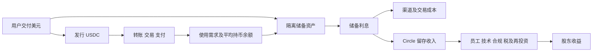

# Circle（CRCL）研究报告

研究日：2026-09-13｜财务截止：2026-06-30｜价格基准：2026-09-11 收盘。

股价 **90.60 美元**；核算市值 **230.01 亿美元**；TTM 市销率 **7.92 倍**；市值/TTM 归属普通股股东利润 **50.97 倍**。

核心判断：Circle 已建立有价值的数字美元网络，但股东能留下多少利润，取决于利率、渠道分润和直接客户关系。当前价格要求它从稳定币发行商成长为利润更厚的金融基础设施平台。

价格由 [StockAnalysis](https://stockanalysis.com/stocks/crcl/statistics/) 与 [Investing 历史行情](https://ca.investing.com/equities/circle-internet-group-inc-historical-data)核对；股数采用 [ChartExchange](https://chartexchange.com/symbol/nyse-crcl/) 的 253,875,881 股，与 StockAnalysis 的 253.88 百万股一致。全部金额为美元。

## AI研究偏见自觉

**信息丰富度：B，财务披露接近 A。** 上市历史短，财报可核实，但分润合同的边际经济、新网络的收费能力和稳定币穿越利率周期的表现还不充分。

AI研究局限性：本报告能检验公开账目，无法验证机构客户真实迁移意愿、未披露合同及收购回报。管理层目标、模型假设和已发生事实分开呈现；不把“链上交易额很大”直接推导为收费收入很大。

- [x] 反向检验稳定币增长是否一定使 CRCL 股东受益。
- [x] 对照原始财报，排查普通股利润、总净利润与调整后利润混用。
- [x] 将尚未完成的 Arc 上线和 Tazapay 收购保留为待验证事项。
- [x] 不用行业故事补齐未来利润，也不把研究资料多误认为投资确定性高。

---

## 第一步：核心数据总览

### 收入与盈利趋势

下表单位：百万美元。2021—2022 为上市前历史，业务组合不同；2023—2025 收入采用持续经营口径，净利润含终止经营，不把跨期比较当作同一业务的有机增长。

| 年度 | 收入及储备收益 | 总净利润 | 持续经营营业利润 | 经营现金流 | 网站口径 FCF |
|---|---:|---:|---:|---:|---:|
| 2021 | 84.88 | -508.21 | 未独立复核 | -92.33 | -93.38 |
| 2022 | 772.05 | -768.85 | 未独立复核 | -72.69 | -75.74 |
| 2023 | 1,450.47 | 267.56 | 247.89 | 139.57 | 138.91 |
| 2024 | 1,676.25 | 155.67 | 167.16 | 344.58 | 326.45 |
| 2025 | 2,746.64 | -69.52 | -96.44 | 542.13 | 529.70 |

收入与现金流历史见 [StockAnalysis 财务汇总](https://stockanalysis.com/stocks/crcl/financials/)及[现金流表](https://stockanalysis.com/stocks/crcl/financials/cash-flow-statement/)。2023—2025 利润与 [Macrotrends](https://www.macrotrends.net/stocks/charts/CRCL/circle-internet/net-income)、[公司年度业绩表](https://s206.q4cdn.com/265218871/files/doc_earnings/2025/q4/earnings-result/4Q25-Earnings-Release.pdf)对照；早两年只取得网站历史序列，置信度较低。

网站汇总将 2024 年净利润列为 18.11 百万美元，而现金流表起点为 155.67 百万美元；2023 年也有类似差异。前者反映普通股分配相关口径，不能替代公司的总净利润。跨上市前后用每股收益直接外推同样危险。[2025 10-K](https://www.sec.gov/Archives/edgar/data/1876042/000187604226000062/crcl-20251231.htm)

### 最近四季度

单位：百万美元；分润后收入 RLDC = 总收入及储备收益 − 分销、交易及其他成本。它还没有扣员工、技术、管理等费用。

| 季度 | 储备收益 | 其他收入 | 总收入 | RLDC，约数 | 归属普通股股东净利润 |
|---|---:|---:|---:|---:|---:|
| 2025 Q3 | 711 | 29 | 739.76 | 292 | 214.38 |
| 2025 Q4 | 733 | 37 | 770.23 | 309 | 133.42 |
| 2026 Q1 | 653 | 42 | 694.13 | 287 | 55.25 |
| 2026 Q2 | 668 | 34 | 701.32 | 289 | 48.22 |

公司表内四舍五入会使分项与合计略有不同。来源：[Q2 原始业绩表](https://www.sec.gov/Archives/edgar/data/1876042/000187604226000246/augustepr-circle_q22026f.htm)、[Google Finance 季度表](https://www.google.com/finance/beta/quote/CRCL%3ANYSE?hl=en)。Google 的 EPS 展示存在口径问题，本报告不用其 EPS。

Q2 的储备收益占收入 **95.21%**，RLDC 留存率 **41.19%**。因此，把它按订阅软件的总收入倍数估值，容易忽略分销成本。Q2 期末 USDC 为 733 亿美元，较 Q1 的 770 亿美元下降 **4.81%**；链上交易额也从 21.5 万亿美元降至 14.8 万亿美元，环比 **-31.16%**。同比仍增长，环比却表明市场并非单向加速。[Q1 公告](https://www.circle.com/pressroom/circle-reports-first-quarter-2026-results)、[Q2 公告](https://www.circle.com/pressroom/circle-reports-second-quarter-2026-results)

### 利润和现金的三个陷阱

第一，2025 年亏损不能直接证明商业模式失败，上市触发的股权激励显著影响费用；但也不能把以后每年的股权激励全部加回。它是获得员工服务的真实代价。

第二，TTM 利润较高并不等于当前盈利能力很强。2025 下半年包含税务收益及金融工具公允价值收益。2026 上半年归属普通股股东利润年化仅约 2.07 亿美元，对当前市值约 **111.14 倍**；这是季节性未调整的警示性年化，不能当作全年预测。[公司季度利润调节表](https://www.sec.gov/Archives/edgar/data/1876042/000187604226000246/augustepr-circle_q22026f.htm)

第三，FCF 要扣软件等无形资产投资。网站 2025 年 FCF 为 529.70 百万美元，再扣无形资产净投入 56.20 百万美元，降至 **473.50 百万美元**；TTM 相应从 761.52 降至 **694.41 百万美元**。再按网站现金流口径扣 SBC 后为 **469.97 百万美元**，但仍受营运资本、预收款等影响，不能直接定为正常股东收益。[现金流明细](https://stockanalysis.com/stocks/crcl/financials/cash-flow-statement/)

Q2 非客户储备现金及现金等价物为 17.30126 亿美元。扣网站包含租赁等项目的债务口径 0.1595 亿美元，保守净现金为 **17.14176 亿美元**。公司自身持有稳定币对应的隔离现金另有 8.89311 亿美元，本模型暂不额外加回；客户储备金则对应赎回义务，绝不能整个加给股票价值。净现金估值也尚未扣除 Tazapay 最终收购支出。[Q2 资产负债表](https://www.sec.gov/Archives/edgar/data/1876042/000187604226000246/augustepr-circle_q22026f.htm)、[独立资产负债表](https://stockanalysis.com/stocks/crcl/financials/balance-sheet/)

> 段永平式追问：拿掉股价和链上交易量，只看持续能分给股东的钱，这门生意现在值多少？

---

## 第二步：生意本质分析

**用户用美元换取可在链上流通的 USDC；Circle 赚取储备利息，再向提供用户和流动性的渠道分账。**

用户得到可编程、跨平台转移的美元工具，直接收入的主要付款者却是储备资产的利息来源。这种“使用者与收入来源分离”的结构，使利润受短期利率影响很大。交易频次不是主要计费器，平均余额才是关键。

简化年度经营公式：

`税前经营利润 ≈ 平均 USDC × 储备收益率 × 储备净留存率 + 经常性服务贡献 − 完整经营费用。`

三个最重要的变量是平均余额、收益率及净留存率。以 Q2 平均余额 765 亿美元和约 39% 留存率为静态示例，利率下降 1 个百分点，年度分润后收入约减少 **2.9835 亿美元**，尚未考虑余额增长、合同变化和费用调整。收益率从 3.5% 降至 2.5%，余额需增 **40%** 才能维持储备毛收入。该计算是敏感性分析，不是降息预测。

Coinbase 的经济权利不能简单写成所有收入五五分。协议先处理管理费、发行方留存、平台余额等，再对部分生态收益分成。双方共同创造网络，Circle 不独占利润池。原协议也含自动续期安排，不能仅因初始期限结束就认定合作终止；本次未查到修改后条款的独立确认。[合作协议](https://www.sec.gov/Archives/edgar/data/1876042/000187604226000062/coinbasecollaborationagree.htm)

经营杠杆真实存在：新增余额不需要同比增加员工。反方向也成立：利率下降会迅速压缩收入，而合规、工程和上市公司成本较难同步下降。它兼具平台扩张潜力和利差周期性。

> 段永平式追问：用户愿意长期留下无息余额的原因，是否足以抵消利率和渠道议价的不确定性？

---

## 第三步：护城河评估

以下为分析判断，不是客观评分。

| 来源 | 判断 | 机制及可证伪条件 |
|---|---|---|
| 品牌与信任 | 中强 | 可靠赎回及机构接受度有价值；一次严重储备事件即可破坏 |
| 定价权 | 中弱 | 稳定币面值固定，利润需与渠道分享；分润条件恶化即证伪 |
| 转换成本 | 中等 | 企业系统整合迁移有成本，个人换币相对容易 |
| 网络效应 | 中强 | 流动性、抵押品接受度、钱包支持相互加强；多币并用削弱排他性 |
| 规模经济 | 中强 | 合规及基础设施可摊薄，但渠道补贴可能吞掉收益 |
| 技术壁垒 | 中弱 | 发行代币不难，可靠运营难；专利数量不等于可收费能力 |
| 监管先发优势 | 中强但非独占 | 牌照与运营经验有价值，新进入者也能申请 |

过去数年，Circle 的机构接入与合规地位改善；但利润分配权仍受渠道制约。未来护城河是否变宽，要观察 Circle 能否直接拥有客户关系，而不只是增加别人平台上的 USDC。

聪明的竞争者不必复制全部网络，可以让客户同时支持多种稳定币，并用收益或返佣转移新增余额。多归属网络通常比“赢家通吃”叙事更符合这里的竞争机制。

> 巴菲特式追问：十年后 USDC 仍被广泛使用，但更多收益归渠道和用户，今天的股东会得到什么？

---

## 第四步：逆向思考与风险清单

**最强空方论点：市场用未来支付平台的倍数，购买今天主要依赖短债利息、且必须重度分润的发行商。** 行业成功、USDC 成功与 CRCL 股东成功，是三个需要分别证明的命题。

概率采用未来三至五年的定性判断，无统计基础，不编造精确概率。

| 失败路径 | 主观发生可能性 | 影响 | 先行信号 |
|---|---|---|---|
| 降息快于余额扩张 | 中高 | 利润增长落后收入叙事 | 平均余额增速不足以抵消收益率下降 |
| 渠道提高分润要求 | 中 | 单位余额盈利下降 | 净储备留存率连续下降 |
| 有息代币产品替代闲置余额 | 中 | 缩小可盈利储备基础 | USDC 使用增长但持币余额不增长 |
| 新平台投入大、收费弱 | 中高 | 费用上升、自由现金流变差 | 交易量增长却无经常性服务贡献 |
| 激励、并购稀释 | 中 | 每股价值落后公司规模 | 稀释股数增长快于正常利润 |
| 储备、赎回或重大网络事故 | 低但不可量化 | 极高，可能永久损害信任 | 脱锚持续、赎回受阻、审验异常 |
| 监管限制经营或分润 | 无法可靠量化 | 高至极高 | 最终规则改变产品、合作合法性 |

类比价值在机制而非结局：支付网络说明连接成本如何产生优势；货币基金说明利率收益为什么可能向分销端和持有人转移。Circle 究竟更接近哪一类，要由收费及留存数据回答，不能用 Visa 的估值直接证明它便宜。

本报告最可能犯的错有两个方向：低估新平台建立直接收费关系的速度；或高估未来余额增长能转化为每股利润的比例。前者会错过上涨，后者会造成永久损失。估值必须容纳两者。

> 芒格式追问：如果链上支付普及而股票仍然亏钱，最可能是哪一个环节拿走了价值？

---

## 第五步：管理层评估

Jeremy Allaire 的优势是长期推动数字美元基础设施，并愿意投入监管和分销建设。对股东而言，下一阶段更难的考题是资本配置：平台建设的新增利润能否覆盖激励、研发及收购成本。

| 决策 | 可见结果 | 判断 |
|---|---|---|
| 与 Coinbase 建立深度合作 | 获得渠道，同时分享经济利益 | 有效扩张，但让渡利润不能忽略 |
| 上市及后续融资 | 增强企业资本 | 应分别看公司融资和老股东出售，不能混为公司现金流 |
| Arc、CPN 建设 | 扩展直接服务客户的可能性 | 战略合理，回报尚未证实 |
| 收购 IBM 区块链专利 | 扩大知识产权组合 | 尚无法按专利数推断资本回报 |
| 签署 Tazapay 收购 | 获取跨境支付通道 | 交割、价格及每股增益需继续核实 |

Tazapay 收购在 2026-09-08 宣布签约，预计 2027 年完成，并非已并表业务。本次不把其支付量当作 Circle 收入，也不把未核实的协同利润加进基准情景。[收购公告](https://investor.circle.com/news/news-details/2026/Circle-Expands-Global-Payments-Infrastructure-with-Agreement-to-Acquire-Singapore-Based-Cross-Border-Payments-Platform-Tazapay/default.aspx)、[IBM 专利公告](https://www.circle.com/pressroom/circle-acquires-ibm-blockchain-patent-portfolio)

治理方面，2026 Proxy 披露 Allaire 投票权为 **23.9%**，管理层与董事合计受益所有权对应投票权 **31.4%**；这是三月基准日口径，不是九月实时持仓。B 股享多倍投票权。受益所有权包含部分近期可行权或归属奖励，因此不能直接当作实际经济权益。本次没有完成截至研究日全部 Form 4 的滚动核对，管理层最新经济持股比例与主动减持结论保留为空缺。[2026 Proxy](https://www.sec.gov/Archives/edgar/data/1876042/000187604226000112/crcl-20260401.htm)

我的评价是“产业判断力有证据，上市后长期资本回报仍待观察”。不能因创始人愿景强，就自动给予管理层诚信或资本配置满分。也不能把员工税款代扣形成的股份回收全部解读为主动回购。

> 段永平式追问：如果创始人退休，合规、客户关系和产品体系能否继续运作？如果可以，新增资本为何仍能获得好回报？

---

## 第六步：行业与文明趋势

数字美元可以改善跨境结算时间、可编程支付及机器支付。这是真实的长期需求方向。可是全球支付金额不是 Circle 的收入市场；同一美元可以反复周转，不能直接对全部支付额套一个收费率。

本报告用“可持续平均余额 × 单位余额净收益 + 可收费服务”估算机会，不引用未经核实的万亿美元 TAM 预测。市场份额也应注明分母：公司 Q2 披露的 27% 是其定义的合规审验美元法币支持稳定币集合，不是全部数字资产市场份额。[Q2 公告](https://www.circle.com/pressroom/circle-reports-second-quarter-2026-results)

| 竞争对象 | 争夺什么 | 对 Circle 的含义 |
|---|---|---|
| Tether | 美元稳定币余额与流动性 | 规模与用户习惯不能靠合规叙事自动取代 |
| 银行及支付渠道 | 客户入口与结算关系 | 既可能分销 USDC，也可能自建产品 |
| 代币化货币基金 | 闲置美元及其利息 | 支付工具与储值工具可能分工，Circle 不一定拥有全部余额 |
| 其他区块链与支付网络 | 开发者及服务收入 | Arc 的增长需要与用户采用、收费和成本一起评价 |

监管更清晰可扩大市场，也可能降低新发行商进入的不确定性。OCC 与财政部 2026 年仍发布实施规则草案，不能把草案当作最终规则，也不能把信托牌照等同于拥有所有银行业务权限。[OCC 草案公告](https://www.occ.treas.gov/news-issuances/news-releases/2026/nr-occ-2026-9.html)、[财政部规则材料](https://home.treasury.gov/news/press-releases/sb0435)

Arc 公开主网计划于 2026-09-16 上线，截至研究日尚未发生。其他收入指引由 1.50—1.70 亿美元提高至 3.10—3.30 亿美元，包含 ARC 代币预售收入；一次性确认不能直接套经常性收入倍数。代币估值也不等于上市公司股东拥有的可分配现金价值。[Q2 指引](https://www.sec.gov/Archives/edgar/data/1876042/000187604226000246/augustepr-circle_q22026f.htm)

> 李录式追问：这家公司能否把社会需要的新基础设施，转化为可持续归属普通股股东的收益？

---

## 第七步：估值与安全边际

### 当前价格买到了什么

TTM 净利润约 4.51 亿美元，市值/利润约 50.97 倍。网站用 EPS 1.80 算出的 PE 为 50.33 倍，两者差异源于当前股数与历史加权股数，不能混用。负的 2025 年利润使当年 PE 不具解释力；PEG 同样不适合跨 IPO、税务收益和代币收入变化的时期。

上市时间短，历史估值分位意义有限。与 Coinbase 相比，Circle 更集中于稳定币储备经济；与成熟支付网络相比，经常性收费业务尚小。因此同行倍数只提供竞争参照，不作为内在价值证明。

### 三年经营情景：从变量推利润

以下全部是研究假设，不是公司指引。年度时点约为 2029 年；单位除比例、股数、股价外均为十亿美元。费用包含持续薪酬、股权激励经济成本、折旧、技术及管理费用。其他服务贡献按扣除直接服务成本后的净贡献处理。税率统一假设 25%。

| 输入或结果 | 悲观 | 基准 | 乐观 |
|---|---:|---:|---:|
| 平均 USDC 余额 | 100 | 160 | 240 |
| 储备收益率 | 2.5% | 3.0% | 3.5% |
| 储备净留存率 | 35% | 40% | 45% |
| 经常性其他服务贡献 | 0.10 | 0.25 | 0.50 |
| 完整经营费用 | 0.80 | 1.10 | 1.50 |
| 税后经营利润 | 0.13125 | 0.80250 | 2.08500 |
| 三年退出经营利润倍数 | 15 | 25 | 35 |
| 假设充分稀释股数，百万股 | 280 | 280 | 280 |
| 加保守净现金后的股价，美元 | **13.15** | **77.77** | **266.75** |
| 相对现价三年价格年化 | **-47.44%** | **-4.96%** | **+43.33%** |

公式为 `(平均余额×收益率×留存率 + 服务贡献 − 费用)×(1−税率)`。三年退出倍数只是情景市场定价，绝非永续终值倍数。表内价格未计未来分红，也未另加新留存现金；未来收益与再投资净效应留到十年模型处理。

充分稀释股数假设高于 Q2 稀释加权股数 268.637 百万股，提供既有潜在权益和后续稀释缓冲，但不是准确预测。持续 SBC 已作为费用，不能再无限重复扣除同一激励；未来实际新增发行仍可能超过缓冲。

基准情景已经要求余额显著扩张、留存稳定且费用受到控制。乐观情景要求这些条件同时改善，因此不是轻松达到的“正常情况”。当前价格仍高于基准三年价格。

### 十年折现：不能假设永远享受高倍数

模型起点为假设的正常税后经营收益 **2.50 亿美元**，高于近期持续经营表现所能直接证明的水平，是给未来改善留余地的估值锚，不是已核实的正常利润。前三年按几何路径走向上表结果；此后七年利润增速分别假设 10%、15%、15%。

每年假设利润的 20% 可分配，80% 留作增长，避免把支持增长的全部利润同时分走。这是经济分配能力假设，并非公司股息承诺。股数固定为 2.80 亿股，现有保守净现金单列，企业现金利息不再计入经营利润。

美元折现率 r 主用 **10%**，敏感性为 9% 和 11%；可理解为正常化无风险回报假设 4% 加权益溢价假设 6%、β=1。这里的 4% 不是研究日国债报价，β也不是短期交易 beta。稳态新增 ROIC 假设 **25%**，来自轻资产但需要持续合规、分销与技术投入的判断，未经历史因果验证。

永续 g 分别为 **1%、2.5%、3.5%**，均为美元口径，基准不超过美元长期名义增长约束。退出 PE 严格采用技能公式 `(1−g/ROIC)/(r−g)`，按第十年利润计价；该约定未另乘下一年增长因子。

| 十年结果，r=10% | 悲观 | 基准 | 乐观 |
|---|---:|---:|---:|
| 第十年经营利润，十亿美元 | 0.256 | 2.135 | 5.546 |
| 永续退出 PE | 10.67 | 12.00 | 13.23 |
| r−g，百分点 | 9.0 | 7.5 | 6.5 |
| 今日每股折现价值，美元 | **10.67** | **46.00** | **118.61** |
| 从 90.60 买入的情景 IRR | **-15.60%** | **+1.64%** | **+12.75%** |

IRR 包含假设的逐年分配，并将原有净现金在期末返还；估值则将现有净现金按今日价值加回。这两个口径刻意区分，不能把 IRR 当作已承诺股息回报。未分配利润支持假设增长，不再作为现金重复加回。

| 折现率敏感性 | 悲观价值 | 基准价值 | 乐观价值 |
|---|---:|---:|---:|
| 9% | 11.58 | 55.58 | 149.08 |
| 10% | 10.67 | 46.00 | 118.61 |
| 11% | 9.97 | 38.91 | 96.93 |

三个折现率下，悲观、基准、乐观排序不变；基准价值均低于现价。九个 r−g 分母为：9% 档 8、6.5、5.5 个百分点；10% 档 9、7.5、6.5；11% 档 10、8.5、7.5，均通过至少五个百分点的约束。

反向检验：即使前三年利润先升至基准的 8.025 亿美元，之后七年仍需约 **28.70%** 年复合增长，才能在其他基准参数下支撑 90.60 美元。现价需要相当强的兑现路径。

模型没有为储备事故、监管重击和 Arc 结构性失败分配概率，也没有核实 Tazapay 最终对价；所以这些不是概率加权公允价值，悲观档也不是最坏结果。离散风险没有藏进折现率。自身持币隔离现金暂不加回偏保守，未扣收购支出及把正常利润锚定为 2.50 亿美元则可能偏乐观。

> 巴菲特式追问：折现率改变两个百分点，结论是否翻转？本模型的基准“现价缺少安全边际”没有翻转，但价值区间明显变化。
>
> 段永平式追问：如果市场关闭五年，我更愿意等待价格或盈利证据改善，而不是按当前价格重仓押注平台转型。

---

## 第八步：最终决策与行动清单

**结论：当前 90.60 美元，价值投资立场为观望，不适合作为高确定性重仓。** 好的增长方向尚未等于足够便宜的每股现金流。

| 维度 | 结论 | 置信度 |
|---|---|---|
| 生意质量 | 有平台潜力，当前利率与渠道依赖高 | 中高 |
| 护城河 | 合规、信任与网络有价值，独占利润能力不足 | 中 |
| 管理层 | 战略执行有证据，长期每股资本回报待验证 | 中 |
| 最大风险 | 把流通量增长误当作股东收益增长 | 高 |
| 文明趋势 | 数字美元使用有长期空间 | 中高 |
| 估值 | 现价已要求较强经营兑现 | 中，依赖模型 |

价格区间是依据上述假设的研究纪律，不是短期股价预测：

| 投资者或价格条件 | 建议 |
|---|---|
| 空仓，当前约 90.60 美元 | 观察，不追涨；先看剔除预售后的服务收入与完整成本 |
| 低于约 35 美元 | 相对基准价值留出明显折扣；确认储备与经营无损后才考虑小额分批 |
| 35—45 美元 | 可进入重点买入研究区，但仍需核实余额增长与分润质量 |
| 45—60 美元 | 接近基准敏感性区间；需要经营好于基准才有吸引力 |
| 60—90 美元 | 不属于本报告的安全边际区，避免仅因较历史高点下跌而买入 |
| 超过 90 美元 | 需要接近乐观路径的证据；超过约 120 美元且盈利假设未上调，可考虑减仓 |
| 已持有者 | 小仓且可接受高波动者按经营指标跟踪；若持仓来自“低风险收息”理解，应重新评估或减仓 |

加仓应同时看到：平均 USDC 持续增长、净储备留存率至少稳定、剔除代币预售后服务贡献增长，以及完整费用和稀释受控。上涨本身不是加仓证据。

论文重审或卖出信号：赎回可信度受损；渠道条件显著恶化；连续多个季度余额增长而正常每股收益不增长；新业务长期靠一次性收入掩盖费用；收购对价或稀释明显破坏原每股价值模型。不要只等股价跌到某个比例才处理基本面变化。

机会成本方面，若承担的是早期金融网络及转型风险，基准情景的低个位数回报不足以补偿。没有用户的组合、税务和成本资料，本报告不设个性化仓位比例。

以下是方法论模拟，不是四位投资者对 CRCL 的真实表态：

> 巴菲特式：网络有价值，但要看能否长期留下利润，以及付出的价格。
>
> 芒格式：先找出行业繁荣而股东不赚钱的路径。
>
> 段永平式：生意、管理层和价格，任何一项没想清楚都可以不买。
>
> 李录式：基础设施改变生活的空间很大，资本回报仍取决于竞争与价值分配。

## AI分析置信度与投资确定性

已核实的主要结论是收入依赖储备利息、渠道分润重大、股数与市值匹配，以及账面利润不宜直接外推。对新业务可持续收入、未来利润留存和长期估值的判断，属于有限信息推理。

因此：**AI分析置信度中高，投资确定性中低。** 后续应优先验证 Coinbase 最新经济条款、Arc 经常性收费与代币权益归属、CPN 客户留存、Tazapay 对价与盈利，以及管理层最新实际经济持股。资料更多可以提高研究置信度，只有这些商业事实改善才能提高投资确定性。

## 数据来源与审计记录

关键来源均随文链接。年度数据采用公司原始财报与独立数据网站交叉核对，Macrotrends 季度页滞后于 Q2，因此未用于最新季度确认。2021—2022 历史及治理最新经济权益未达到完整双源标准，明确保留缺口，不用于定价。

程序已完成十进制市值验算、关键数据交叉核验、估值计算和三个折现率下的终值约束检查。具体记录见 [核验输出](/C:/Users/Liang/Documents/AI-berkshire/CRCL研究核验记录-20260913.txt)、[模型结果](/C:/Users/Liang/Documents/AI-berkshire/CRCL研究计算-20260913.json)、[计算脚本](/C:/Users/Liang/Documents/AI-berkshire/tools/crcl_research_20260913.py)。三年通用工具不自动加净现金，正文价格已在独立计算中加回；十年通用 IRR 输出为不含逐年分配的交叉检查，正文采用完整现金流 IRR。终值工具输出中的预置国债及风险溢价说明是工具内置参考，并非本报告采用的当日行情；实际输入以正文为准。

固定随机种子的八项抽样均为模型参数或推算，因此另加八项真实行情、财报双源核验，共十六项通过，无超阈值警告。见 [抽检记录](/C:/Users/Liang/Documents/AI-berkshire/CRCL报告抽检-20260913.txt)。参数一致性不等于事实验证，算术通过不代表模型假设或投资结论已获验证。
