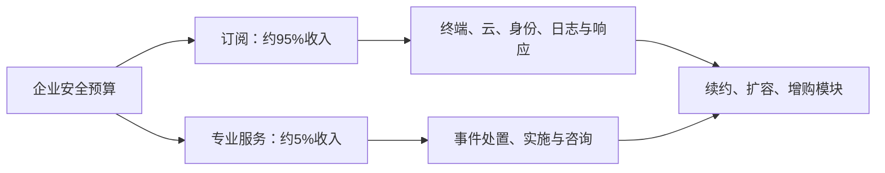
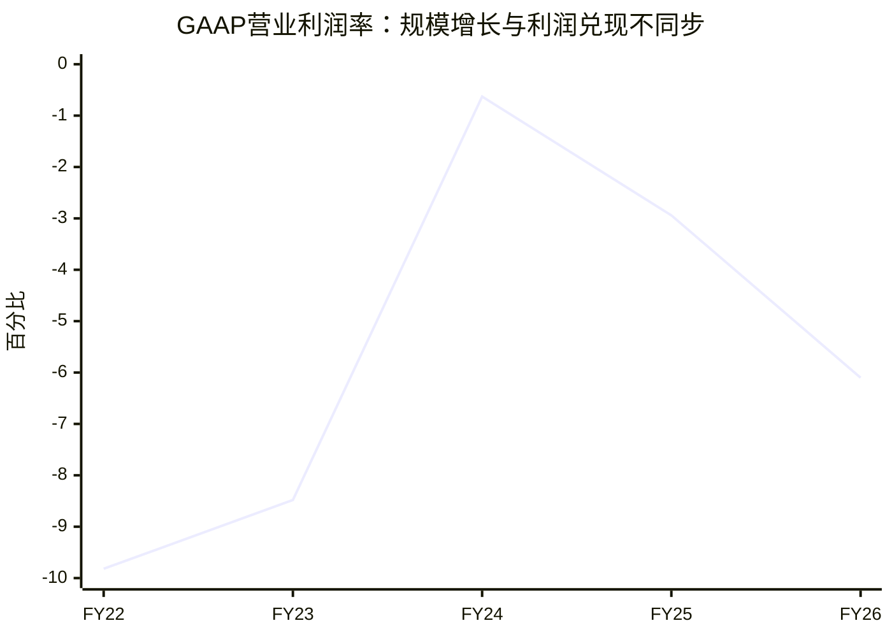

# CrowdStrike（CRWD）研究报告

**研究日期：2026年9月14日（美国东部时间）｜财务截止：2026年7月31日，Q2 FY2027。**

**参考价格：235.38美元，9月14日正常交易收盘；估算市值：2,410.14亿美元；TTM市销率：44.66倍；FY2027指引收入对应EV/收入：39.45倍。** 全文价格为2026年4拆1后的美元价格。市值以最新10-Q披露的流通股数估算，不代表9月14日实时精确股本。[收盘行情](https://stockanalysis.com/stocks/crwd/)；[第二季10-Q](https://ir.crowdstrike.com/node/17391/html)。

核心判断：CrowdStrike正在把终端防护入口扩展成企业安全平台，增长恢复有证据；但当前价格要求的长期成果，远高于“维持一家优秀安全软件公司”本身。

## AI研究偏见自觉

信息丰富度评级：**A级**。公司披露充分、分析师覆盖广，最大的研究陷阱是把“AI增加安全需求—平台扩张—收入增长”直接等同于股东会赚到钱。

AI研究局限性声明：本报告基于公开资料，没有客户访谈、采购合同抽查、产品压力测试或法律调查。产品优劣的判断不能替代客户实际使用效果；公司给出的市场空间不是独立预测。以下价格是模型条件下的决策边界，不是精确可观察的内在价值。

- [x] 把资料充裕与经营确定性分开。
- [x] 检查做多共识的反面：好产品是否已被高估值透支。
- [x] 区分ARR、确认收入、自由现金流与股东经济收益。
- [x] 对拆股、历史修订及第三方标准化财务口径逐项核对。

---

## 第一步：核心数据总览

### 先理解财年与收入结构

FY2027截至2027年1月31日；最新季度结束于2026年7月31日。公司按一个经营分部管理，订阅与专业服务是收入类型，不能把云安全、身份保护、SIEM等模块擅自拆成独立利润分部。

金额单位为百万美元；毛利率均为GAAP。最近四季如下：

| 季度 | 总收入 | 同比 | 订阅 | 专业服务 | 综合毛利率 |
|---|---:|---:|---:|---:|---:|
| Q3 FY2026 | 1,234.244 | +22.18% | 1,168.705 | 65.539 | 75.16% |
| Q4 FY2026 | 1,305.375 | +23.32% | 1,242.265 | 63.110 | 75.80% |
| Q1 FY2027 | 1,385.629 | +25.57% | 1,320.853 | 64.776 | 75.30% |
| Q2 FY2027 | 1,470.897 | +25.83% | 1,400.291 | 70.606 | 74.57% |

FY2026全年订阅收入4,564.683，专业服务247.322。最新季度订阅贡献95.20%的收入。专业服务提供调查、响应和实施支持，有助于获客与客户关系，但不能按订阅软件的利润率估算。[公司季度补充表，第2、8页](https://ir.crowdstrike.com/static-files/ca6983fc-8732-451a-ba26-f32a0b019a34)；[第三方收入拆分](https://stockanalysis.com/stocks/crwd/financials/)。

### 五年趋势：规模扩张没有等比例变成GAAP利润

单位：百万美元。现金栏包括短期投资；FCF采用公司定义。

| 财年 | 收入 | GAAP营业利润 | GAAP归母净利 | 公司FCF | 纯股权激励费用 | 现金及短投 |
|---|---:|---:|---:|---:|---:|---:|
| FY2022 | 1,451.594 | -142.548 | -234.802 | 441.775 | 309.952 | 1,996.633 |
| FY2023 | 2,241.236 | -190.112 | -183.245 | 676.829 | 526.504 | 2,705.369 |
| FY2024 | 3,055.555 | -19.141 | +72.181 | 938.190 | 648.665 | 3,474.660 |
| FY2025 | 3,953.624 | -116.400 | -15.241 | 1,065.079 | 861.391 | 4,323.295 |
| FY2026 | 4,812.005 | -293.292 | -162.502 | 1,235.274 | 1,097.668 | 5,230.125 |

五年FCF利润率依次为30.43%、30.20%、30.70%、26.94%、25.67%。FY2026股权激励费用占收入22.81%。FY2024—2026盈利数据采用最新年报修订值；早年收入与现金流来自对应业绩稿。[FY2023及FY2022比较数](https://ir.crowdstrike.com/news-releases/news-release-details/crowdstrike-reports-fourth-quarter-and-fiscal-year-2023)；[FY2024业绩](https://ir.crowdstrike.com/news-releases/news-release-details/crowdstrike-reports-fourth-quarter-and-fiscal-year-2024)；[FY2026年报](https://www.sec.gov/Archives/edgar/data/1535527/000153552726000010/crwd-20260131.htm)；[FY2026现金流调节表](https://www.sec.gov/Archives/edgar/data/1535527/000153552726000007/crwd-20260303xex991.htm)；[独立现金流数据](https://stockanalysis.com/stocks/crwd/financials/cash-flow-statement/)。

### 最新经营状态

Q2期末ARR为58.41亿美元，同比增长约25%；单季新增ARR为3.328亿美元。采用Falcon Flex的客户群ARR超过22.9亿美元，同比增长101%，这个数字是相关客户群的ARR，不是额外收入，也不能与总ARR相加。使用六个及以上模块的订阅客户占51%，七个及以上35%，八个及以上26%。FY2027收入指引为59.911亿—60.111亿美元，Non-GAAP每股收益指引1.25—1.26美元。[Q2业绩公告](https://www.sec.gov/Archives/edgar/data/1535527/000153552726000029/crwd-20260826xex991.htm)。

数据说明增长在恢复、交叉销售在继续；但公司最新10-Q仅称净收入留存率环比改善，不能把过去的留存率数字当成今天的精确值。

> 段永平式追问：客户多买了产品之后，每一股对应的长期现金创造能力有没有同步提高？

---

## 第二步：生意本质分析

**一句话：企业持续付费，把分散在设备、云和身份系统中的安全信号交给Falcon统一检测与处置，以降低入侵损失和安全团队的工作负担。**

客户支付的不是一份静态软件拷贝，而是持续更新的防护、威胁情报、工作流与响应能力。合同通常覆盖持续订阅；终端数量、工作负载、模块数量及服务范围推动客户支出。不能给全平台套用统一“每台设备单价”，尤其日志和云产品的采购单位不同。

Falcon Flex将采购变成预先商定的支出承诺，客户可以随需求变化选择或更换模块。这降低了每次增购的审批阻力，也让公司更容易争取一揽子预算；反面是合同承诺、产品使用和当期收入之间可能出现时间差。[Falcon Flex官方条款介绍](https://www.crowdstrike.com/en-us/pricing/falcon-flex/)。

真正驱动利润的三个变量：

1. **原有客户扩张是否超过流失和折扣。** 多模块渗透率上升是正面证据，仍需观察新合同转化和下一轮续约。
2. **增量模块的成本。** 共享销售渠道与控制台可以节省获客、部署成本；日志存储、数据处理、AI推理和人工响应却会消耗实际资源。
3. **员工报酬最终由谁承担。** 高技能研发与销售不能停止，股票支付只改变付钱方式，不消除成本。

### 盈利质量的三道检查

| 检查项 | 事实或计算 | 投资含义 |
|---|---|---|
| 现金流与股票报酬 | Q2公司FCF377.407，纯SBC376.914，机械相减仅0.493百万美元 | 不能把全部FCF视为原股东可无成本取走的钱 |
| 避免单季夸张 | 上半年FCF减纯SBC约171.253百万美元；FY2026约137.606百万美元 | 单季相减不是常态盈利预测，但年度差距也值得重视 |
| 佣金摊销 | FY2027起受益期从四年延至五年；Q2费用减少25.5百万美元 | 约贡献1.73个百分点收入利润率；并非全部来自经营效率 |

恢复旧佣金摊销假设后，Q2营业亏损会从33.232扩大至约58.732百万美元。这是单因素调整，不是完整重编报表。[最新10-Q，会计估计及股权激励附注](https://ir.crowdstrike.com/node/17391/html)。

“FCF−SBC”只是保守的经济收益检查：SBC按授予时估值确认，和当前回购成本不相同；递延收入、资本化开发费用、税收与一次性费用也会影响结果。因此长期模型直接假设扣除股票报酬后的利润率，并且不再重复扣一次股数稀释。

毛利率高说明软件与规模效应存在，不能单凭毛利率认定利润已经成熟。与微软比较，微软的安全产品没有独立可比利润表；与同时销售网络设备的PANW比较，收入结构又不同。可比的核心是完整客户服务成本和每股收益，而非机械毛利率排名。

> 段永平式追问：如果员工明天都要求现金工资，这门生意还剩下多少可以分给股东的钱？

---

## 第三步：护城河评估

| 来源 | 判断 | 可验证的机制 | 什么会削弱它 |
|---|---|---|---|
| 转换成本 | 较强 | 迁移检测规则、响应流程、日志、权限与团队培训需要投入 | 竞争者免费迁移；客户主动推动多供应商架构 |
| 品牌与信任 | 较强但受损过 | 企业对安全失误容忍度低，采购倾向已有验证的平台 | 再次出现重大可用性事故 |
| 数据规模 | 中等偏强 | 跨客户遥测与威胁研究有助于发现攻击模式 | 边际数据价值下降；其他大厂也拥有大量信号 |
| 销售及研发规模 | 较强 | 同一客户增购模块，可复用采购关系和平台基础设施 | 新模块集成差、存储与计算费用增长过快 |
| 技术壁垒 | 动态优势 | 检测、低误报、响应速度和系统工程共同决定效果 | 开源、AI、操作系统变化降低差异化 |
| 纯提价能力 | 尚未充分证明 | 模块渗透提升支持增购能力 | 不能把增购或捆绑合同直接解释成同产品涨价 |

这里的“数据效应”弱于支付网络的双边网络效应：客户并不因为别的客户加入而自动获得交易对手；价值来自公司能否把新增信号转成更准确的检测。微软同样拥有庞大数据入口，规模本身不构成排他性壁垒。

过去五年，平台覆盖与客户流程嵌入加深，护城河总体扩大；2024年事故表明，统一平台同时集中运营风险。未来五年能否继续扩大，要看新增模块的独立竞争力，而不是模块数量。

IDC对安全平台的研究强调跨产品控制协同，而非简单把产品放在一起；这支持平台整合的方向，不能据此宣布某家公司必胜。[IDC平台研究](https://www.idc.com/resource-center/blog/when-pinocchio-became-a-real-boy-security-platforms-have-grown-up/)。最新精确市占率没有取得可交叉复核的原始付费数据，因此不填写未经验证的百分比。

> 巴菲特式追问：十年后客户是因为产品仍然最好而留下，还是只是今天更换麻烦？

---

## 第四步：逆向思考与风险清单

最强空方论点：CrowdStrike完全可能成为更大的公司，却让今天的股东获得很低的回报。市场在用高倍数购买未来利润，而工资、客户激励、云成本和竞争决定了其中多少能留给每一股。

以下概率为定性判断，非统计估计；风险可能同时发生，不能相加。

| 失败路径 | 未来数年可能性判断 | 影响 | 观察指标 |
|---|---|---|---|
| 增长不错，估值倍数下降 | 中高 | 股价长期落后于收入增长 | 每股收益增长能否超过倍数收缩 |
| 微软或其他平台压价 | 中 | 新客与续约利润下降 | 折扣、净留存、销售周期、竞争输单 |
| 股权激励吞噬经营杠杆 | 中高 | 公司FCF增长，原股东收益改善有限 | SBC/收入、每股FCF、回购后净股数 |
| Flex提前锁定预算，后续消化较慢 | 中 | ARR与收入兑现脱节 | 续约质量、合同激励、应收与现金转化 |
| 再次发生大规模更新事故 | 低但不可可靠量化 | 信任、赔偿、监管及续约共同受损 | 灰度发布、回滚能力、客户部署控制 |
| 收入/ARR披露或诉讼出现重大不利结果 | 概率未知 | 估值与业务信誉受损 | SEC/司法部信息要求、会计修订、法律进展 |

截至最新10-Q，Delta诉讼仍在证据开示阶段；公司披露收到美国司法部和SEC针对部分客户交易收入确认、ARR及2024年事故相关事项的信息要求。部分其他案件已经被驳回，不能概括成“所有法律问题已解决”，也不能把信息要求描述成已确认违法。[最新法律事项附注](https://ir.crowdstrike.com/node/17391/html)。

竞争者中，微软将Defender纳入部分Microsoft 365套餐，这让采购讨论从“谁的功能更好”变成“额外付费是否值得”。CrowdStrike必须持续证明降低损失、减少误报或节约人员投入的增量价值。[微软官方定价与套餐说明](https://www.microsoft.com/en-us/security/microsoft-defender-pricing)。

历史类比更适合提醒我们：技术产品的领先地位会重新洗牌；如要对Cisco、Symantec等具体历史回报作定量比较，必须统一复权和估值时点，本报告不以未经核验的旧股价证明今天必跌。

最可能的分析错误有两个方向：低估AI安全和SIEM带来的新增长曲线；或高估新增ARR最终能留下的经济利润。为降低后一种错误，估值不用公司Non-GAAP利润直接充当股东现金收益。

> 芒格式追问：如果公司一直增长、我却赔了钱，最可能是业务判断错了，还是买入时对价格太宽容？

---

## 第五步：管理层评估

创始人George Kurtz仍负责领导公司，行业经验和客户关系是优势。评价管理层的重点应是产品扩张的回报、客户信任与报酬纪律。

| 时间/行动 | 已观察结果 | 评价 |
|---|---|---|
| 从终端向统一平台扩张 | 多模块采用率与ARR持续提升 | 战略执行较强；模块投资回报不能逐项验证 |
| 2024年更新事故及恢复 | 业务恢复增长，但法律影响仍在 | 商业修复有进展，工程治理不能免于追问 |
| FY2027收购SGNL和Seraphic | 上半年收购带来886.587百万美元商誉 | 扩展身份和浏览器能力；协同回报仍待兑现 |
| FY2027上半年回购 | 支出175.622百万美元 | 有资本回报动作，但不足以仅凭金额判定创造价值 |
| 调整佣金受益年限 | 利润表费用减少 | 有经济理由的可能性，须持续检验客户寿命；不可当作现金改善 |
| FY2026历史SBC修订 | FY2024、FY2025等比较期利润发生变化 | 修订需透明披露；盈利趋势必须使用修订数 |

并购与回购数字来自[最新10-Q](https://ir.crowdstrike.com/node/17391/html)，历史修订见[FY2026年报](https://www.sec.gov/Archives/edgar/data/1535527/000153552726000010/crwd-20260131.htm)。不在缺少成交价和后续现金回报时给并购打精确分数。

### 持股与治理：旧的双重股权叙事已过时

2026年代理声明披露，4月3日Kurtz实益持有2,384,082股，表内标为不足1%；其中包括特定期权和奖励，不能直接当作全部已发行现金权益。简单除以当日已发行股本为约0.936%，不是严格重算后的SEC实益比例，也不是今天的持股比例。该人数与[初步代理声明](https://ir.crowdstrike.com/static-files/b1f18b5c-fe02-49fe-81b2-bcb259552c02)一致，但两者同源，并非独立核验。[正式代理声明](https://ir.crowdstrike.com/static-files/d352245b-edd1-436e-8a3c-7914c660089e)。

所有原B类股已于2024年12月转换为A类股，因此不能沿用“创始人凭B股保有超额投票控制”的旧描述。经济持股、实益持股、即时投票权仍需区分。[年报股权章节](https://www.sec.gov/Archives/edgar/data/1535527/000153552726000010/crwd-20260131.htm)。

综合评价：产品与销售能力较强；股东利益一致性为中等，股票报酬和并购纪律仍需验证。公司已具备平台与组织资产，但创始人离任后的创新效率没有直接证据可以保证。

> 段永平式追问：如果创始人退休，客户关系、产品质量和资本配置能否继续依靠制度运行？

---

## 第六步：行业与文明趋势

AI与云计算增加了代码、机器身份、自动执行流程和攻击面。企业安全预算有长期需求基础，但需求增加不保证供应商利润同比例增加：攻击与防御都能使用AI，自动化也可能压低某些人工服务的收费。

CrowdStrike处于企业运行时数据与响应的交汇处，潜在获利路径是把设备入口扩展为云、身份与日志的统一处置系统。研发、遥测管道与客户分发能力共同决定能否拿到利润。

公司估算可服务市场由2026自然年的1,400亿美元，扩大至2029年的2,600亿美元及2034年的5,650亿美元。这个口径包含新产品类别和公司未来能力，**不能将它理解为现有终端安全市场自然增长，也不能把每个厂商的TAM相加**。[公司TAM展示页](https://ir.crowdstrike.com/static-files/4be75a83-d8be-45d8-98bc-423c3b3fb84f)。

| 竞争方向 | CrowdStrike的机会 | 利润被分走的方式 |
|---|---|---|
| 微软的操作系统及办公入口 | 跨平台与独立安全厂商定位 | 套餐折扣、既有采购关系 |
| PANW的平台整合 | 终端与响应入口 | 网络、云、安全运营交叉销售 |
| SentinelOne等专业厂商 | 平台规模与渠道 | 功能竞争和价格竞争 |
| 云平台及AI原生工具 | 联合部署与威胁可见性 | 基础设施厂商内建功能，计算成本上升 |

公司最新材料显示收入覆盖多个地区；单一客户依赖不能仅凭渠道应收分散就排除。更值得注意的是基础云设施、系统权限和第三方接口依赖：操作系统安全架构变化可能改变产品的部署方式与竞争成本。本报告没有可靠资料对单一云供应商采购依赖作精确量化。

> 李录式追问：数字化越深入越需要安全，但最终利润会留在独立安全平台，还是被操作系统与云平台吸收？

---

## 第七步：估值与安全边际

### 现价已经在支付什么

股本采用2026年8月20日10-Q披露的1,023,934,842股；当前报价乘这个股本得到约2,410.14亿美元。第三方报告市值2,415.30亿美元，差约0.21%，主要为股数时点/数据供应商口径差异，精确原因未确认。本文保持单一股本，不反推股数来强行匹配。

| 指标 | 本文口径与结果 |
|---|---|
| TTM收入 | 53.96145亿美元 |
| 公司口径TTM FCF | 15.18113亿美元 |
| 现金及等价物 | 50.13847亿美元；不加入受限现金 |
| 债务本金 | 7.50亿美元；经营租赁成本留在经营预测中 |
| 净现金 | 42.63847亿美元 |
| 企业价值EV | 2,367.50亿美元 |
| TTM P/S | 44.66倍 |
| TTM EV/收入 | 43.87倍 |
| FY2027收入指引中点对应EV/收入 | 39.45倍 |
| TTM公司FCF收益率 | 0.63% |
| FY2027 Non-GAAP EPS指引中点对应PE | 187.55倍 |

第三方“Forward PE”约166.88倍，使用不同前瞻盈利预测期；不能拿它替代FY2027管理层指引的计算。TTM GAAP净利很小，PE极高，PEG也会被盈利基数和增长口径扭曲，均不适合做核心定价锚。[行情及估值口径](https://stockanalysis.com/stocks/crwd/)；[公司最新指引](https://www.sec.gov/Archives/edgar/data/1535527/000153552726000029/crwd-20260826xex991.htm)。

历史上，财年末P/S在FY2023、FY2024、FY2025、FY2026分别约10.50、22.09、24.80、23.13倍，现在约44.66倍。不同日期收入基数与成长性不同，但“它以前也贵”不能证明今天合理。[历史估值](https://stockanalysis.com/stocks/crwd/financials/ratios/)。

第三方同期快照中PANW EV/Sales约26.85倍、SentinelOne约6.56倍。前者业务组合及并购口径、后者规模和盈利成熟度都不同；这里只说明CRWD溢价很大，不用同业今天的高倍数生成十年终值。[PANW](https://stockanalysis.com/stocks/panw/statistics/)；[SentinelOne](https://stockanalysis.com/stocks/s/statistics/)。

### 三年情景：市场继续给高倍数，也未必有好回报

以FY2027 Non-GAAP EPS中点1.255美元作为已知前瞻起点，向后三年得到FY2030 EPS。为便于压力测试，估值时间近似三年；不是精确到日的持有期预测。股权激励已在Non-GAAP中被剔除，因此这张表是市场交易定价情景，不能代替经济价值模型。

| 情景 | EPS年增长假设 | 三年后PE假设 | 三年后价格 | 相对235.38美元的年化价格回报 |
|---|---:|---:|---:|---:|
| 悲观 | +15% | 40倍 | 76.35美元 | -31.29% |
| 基准 | +25% | 60倍 | 147.07美元 | -14.51% |
| 乐观 | +35% | 80倍 | 247.02美元 | +1.62% |

没有股息假设。三年PE是明确的市场情绪假设；下方十年模型的终值倍数完全由永续增长公式生成。这里没有给各情景附上伪精确概率，也不将它们加权为目标价。

### 十年折现：把员工成本和再投资放回来

模型采用美元权益价值框架。以下全部为研究假设：

- 资本成本r主用10%，敏感性9%与11%；对应长期正常化无风险利率4.7%、β为1、权益风险溢价5.3%的判断，**4.7%不是声称当日国债收益率**。
- 终值稳态增量ROIC为25%。理由是成熟软件资本效率较高，但竞争、算力和维持技术优势的投入会降低新增资本回报；这是估计，不能由当前GAAP ROIC直接推出。
- 永续增长g分别为2%、3%、3.5%，均为美元名义口径，独立于r；不是前十年的增长率。
- 第一年以FY2027收入指引中点60.011亿美元入模，之后九次增长到FY2036；将这一预测窗口近似为十年，不做月份精细折现。
- 第一年正常化税后利润率假设8%，线性上升到情景终点；利润已扣股票报酬及维持性研发，显著高于目前GAAP水平，意味着未来成本纪律改善。
- 预测期利润的40%用于净再投资，60%视为可供股东分配的现金。不是预测实际派息。该再投资比例能否支撑假设增长尚未验证，若需要更多资本，价值下降。
- 固定当前股本，假设股票报酬的经济成本已充分计入利润并覆盖维持每股权益的成本，不再重复扣稀释；若实际股票报酬低估了所需回购成本，模型仍偏乐观。
- 当前净现金一次性加入；经营利润假设不包含该笔净现金的投资收益。未把客户全部递延收入当作可自由分配的超额现金。

终值采用研究工具的统一约定：终值倍数 = (1−g/ROIC)/(r−g)，直接乘终值年利润，未再乘一次(1+g)。与以次年利润为分子的标准永续增长表达相比，这一约定略保守。现金流全部在年末折现。

| 十年情景 | 第2—10年收入增长 | 终点净利率 | FY2036收入（十亿美元） | FY2036利润（十亿美元） | g | r−g | 终值倍数 | 现值/股 |
|---|---:|---:|---:|---:|---:|---:|---:|---:|
| 悲观 | +15% | 18% | 21.11 | 3.80 | 2% | 8个百分点 | 11.50倍 | 25.90美元 |
| 基准 | +22% | 25% | 35.93 | 8.98 | 3% | 7个百分点 | 12.57倍 | 56.31美元 |
| 乐观 | +30% | 30% | 63.64 | 19.09 | 3.5% | 6.5个百分点 | 13.23倍 | 116.13美元 |

上述价格是严格成熟化模型的结果。十年后立即进入低增长稳态，会压低仍在高速扩张公司的价值；尤其乐观情景下该跳变较大。这不是“股票一定跌到56美元”的预测，而是在问：若不依赖十年后仍有人支付高成长倍数，今天是否有安全边际？

| 折现率 | 悲观价值 | 基准价值 | 乐观价值 | 三档r−g分母宽度 |
|---|---:|---:|---:|---|
| 9% | 30.37美元 | 68.79美元 | 145.39美元 | 7、6、5.5个百分点 |
| 10% | 25.90美元 | 56.31美元 | 116.13美元 | 8、7、6.5个百分点 |
| 11% | 22.50美元 | 47.17美元 | 95.20美元 | 9、8、7.5个百分点 |

三种资本成本下，情景排序一致，价格均低于235.38美元。基准估值约75.51%来自终值折现，说明结果仍高度依赖远期假设，不能把小数位当作精度。

按r=10%对应终值和预测期可分配现金计算，三情景从现价出发的十年模型IRR分别约-14.24%、-5.78%、+2.07%。为处理现有净现金，IRR假设净现金在起点可释放，故初始净投入为市值减净现金；实际公司没有承诺这种分配。工具另核验了不含中间现金的终值回报，未将两种IRR混用。

### 反向DCF：现价隐含的门槛

固定基准终点25%净利率、40%再投资、g=3%、r=10%及其余假设，反解需第2—10年收入年增约44.98%，FY2036收入约1,697.92亿美元，才能支持235.38美元。

这个反解不是唯一的市场预期，也不是公司必须实际达到的增长率：更长的高速增长期、更高利润率、更低资本需求或更低资本成本都能改变结果。它揭示的是现价与“未来增长优秀但会成熟”之间的距离。反解的再投资效率也可能不现实，不能把它当作可执行经营计划。

> 巴菲特式追问：即使利润十年后大幅增加，如果届时只按成熟公司的现金创造能力定价，今天还值得买吗？
>
> 段永平式追问：若股市关闭五年，你能否仅凭经营现金收益，对235.38美元这个价格感到安心？

---

## 第八步：最终决策与行动清单

**结论：以价值投资和资本保全为标准，现价回避新买入，保留研究跟踪。** 公司质量值得研究，价格尚不提供足够安全边际。

| 维度 | 结论 | 信心 |
|---|---|---|
| 生意质量 | 高续费需求、跨模块销售、轻于硬件的资本结构 | 中高 |
| 护城河 | 流程嵌入较强，技术和品牌优势需要持续维护 | 中高 |
| 管理层 | 产品扩张强，报酬和资本配置仍需检验 | 中 |
| 最大风险 | 高估值与经济利润兑现不足叠加 | 高 |
| 行业趋势 | 需求长期增长，但价值捕获存在竞争 | 中高 |
| 估值 | 现价缺乏安全边际；精确合理价不确定 | 方向中高、点估计低 |

### 价格区间如何使用

以下均为拆股后价格，适用于当前假设，基本面变化后必须重算。

| 区间 | 行动判断 | 对应依据 |
|---|---|---|
| 高于150美元 | 空仓者回避追买；持仓者重新评估机会成本 | 超过本模型低折现率乐观价值约145美元 |
| 95—150美元 | 仅在增长与经济利润显著超预期时考虑 | 接近乐观情景价值，非基准安全边际 |
| 60—95美元 | 进入重点复核范围，仍需偏乐观判断 | 位于基准与乐观价值之间 |
| 45—60美元 | 可重新讨论小额分批配置 | 接近基准价值带，未必足够补偿全部尾部风险 |
| 低于45美元 | 基本面完好时，才出现较清晰的基准安全边际 | 低于主模型56.31美元与高折现率基准47.17美元 |

区间很低反映本报告对十年后成熟化和股票报酬的严格处理。可以接受长期等不到这个价格，也不应因为等不到就把模型调到现价。

| 投资者/信号 | 建议 |
|---|---|
| 空仓者 | 现价不买；将资本留给回报门槛更容易满足的机会 |
| 普通持仓者 | 不因成本低就忽略现价机会成本；若今天不会以现价买入，考虑减持至能承受长期估值收缩的规模 |
| 集中或杠杆持仓者 | 优先降低集中度与杠杆；不把业务增长等同于股价安全 |
| 加仓信号 | 价格进入价值区间，同时GAAP经营利润、扣SBC后的现金质量、客户续约共同改善 |
| 卖出/重审信号 | 重大可靠性事故；监管披露实质恶化；收入与ARR质量出现问题；长期股票报酬不收敛 |

建议跟踪的研究阈值（人为设定，非公司承诺）：连续数季收入增长保持约25%或更高；SBC/收入逐步降至20%以下；扣除佣金估计变化后GAAP经营利润转正；公司FCF与每股经济收益同步改善。价格下降若源于护城河破坏，不构成加仓理由。

未获得你的持仓、成本、税务和资金用途，所以没有给出个人卖出股数或仓位百分比。上表是条件式决策框架。

以下仅为方法论模拟，不是四位投资人的真实发言或持仓观点：

> 巴菲特式：客户离不开它，不等于任何价格买它都有好回报。
>
> 芒格式：先想清楚公司成功、股东仍然失败的路径。
>
> 段永平式：把员工报酬、再投资和价格都算进去，再说这是不是对的投资。
>
> 李录式：数字文明需要安全，但需求增长最终归谁，要看竞争与制度。

---

## AI分析置信度与投资确定性

数据置信度较高：最新收入、现金、拆股、GAAP与Non-GAAP区别、历史修订均有公开一手文件。商业判断置信度中等：客户迁移成本与平台协同有机制支持，但缺少独立客户样本。估值点位置信度低于方向判断：增长持续期、未来SBC、终点利润率、资本需求和成熟化时点都是假设。

实际投资确定性为中等偏低，原因是竞争与技术不断变化，现价又要求很高的经营成果。信息丰富不能补上安全边际。

未建模的离散风险包括再次发生大规模事故、超预期诉讼赔偿、监管处罚及相关客户连锁流失；没有偷偷把它们塞入折现率。这意味着估值不含全部尾部损失。管理层当前精确经济权益、独立市占率、客户合同激励分布及各模块盈利能力仍有数据缺口。

## 数据来源与审计记录

原始资料优先级为最新SEC/IR文件，其次独立财务数据供应商。Macrotrends收入页本次返回403，因此不能宣称已经完成Macrotrends双源核验；实际使用SEC与Stockanalysis交叉。公司IR与SEC转载同一公告不算两个独立来源。

### 关键数据交叉验证

| 字段 | 一手值 | 独立来源值 | 处理 |
|---|---:|---:|---|
| FY2026收入，百万美元 | 4,812.005 | 4,812 | 舍入差，程序核验通过 |
| FY2026归母净利，百万美元 | -162.502 | -162.50 | 舍入差，通过 |
| FY2026现金及短投，百万美元 | 5,230.125 | 5,230 | 舍入差，通过 |
| Q2现金，百万美元 | 5,013.847 | 5,014 | 舍入差，通过 |
| 披露日总股数，百万股 | 1,023.934842 | 1,024 | 舍入差，通过；行情页1.03B粒度较粗 |
| FY2026营业利润，百万美元 | -293.292 | -248.52 | 差异超过1%，采用GAAP；第三方标准化重分类，不当作GAAP |
| FY2026 FCF，百万美元 | 1,235.274 | 约1,310 | 口径差；后者未扣全部资本化软件及递延薪酬投资 |

FY2026的FCF桥接为经营现金流1,612.349，减固定资产支出302.108、资本化内部软件68.751、递延薪酬净投资6.216，得1,235.274。第三方单扣固定资产约得1,310.241，两者并非相同定义。FY2026 GAAP营业亏损与标准化值的差异接近重组相关费用规模，但未取得供应商逐项重分类文件，不能宣称已完整对账。

历史FY2024净利旧稿89.327百万美元，本报告采用修订后72.181；FY2025及部分季度也有修订。管理层实益持股的两份代理材料同源，独立交叉验证尚不充分，已明确保留限制。

精确计算、市值与关键数据核验由financial_rigor.py完成，十年终值审计由terminal_value.py完成。计算文件保留全部假设、逐年现金流和敏感性。数据抽检将事实、模型假设及算术分别标记；抽检通过只说明被抽到的数据或计算一致，不证明未来假设成立。

本次随机抽到十九项，其中一项是将“Q2”误识别为数字的解析项，已单列排除；其余十八项的事实取数或模型算术一致。部分公司定义指标只有一手来源，已在抽检文件逐项标明；不能称为全部指标独立双源通过。三档折现率的最终终值参数检查均通过。

- [完整计算结果](C:/Users/Liang/Documents/AI-berkshire/CRWD研究计算-20260914.json)
- [关键核验工具记录](C:/Users/Liang/Documents/AI-berkshire/CRWD研究核验记录-20260914.txt)
- [报告抽检记录](C:/Users/Liang/Documents/AI-berkshire/CRWD报告抽检-20260914.txt)

研究结论有效性的核心条件：公司仍能保住客户信任、交叉销售保持经济价值，且股票报酬及竞争成本最终让位于真实的每股盈利增长。
