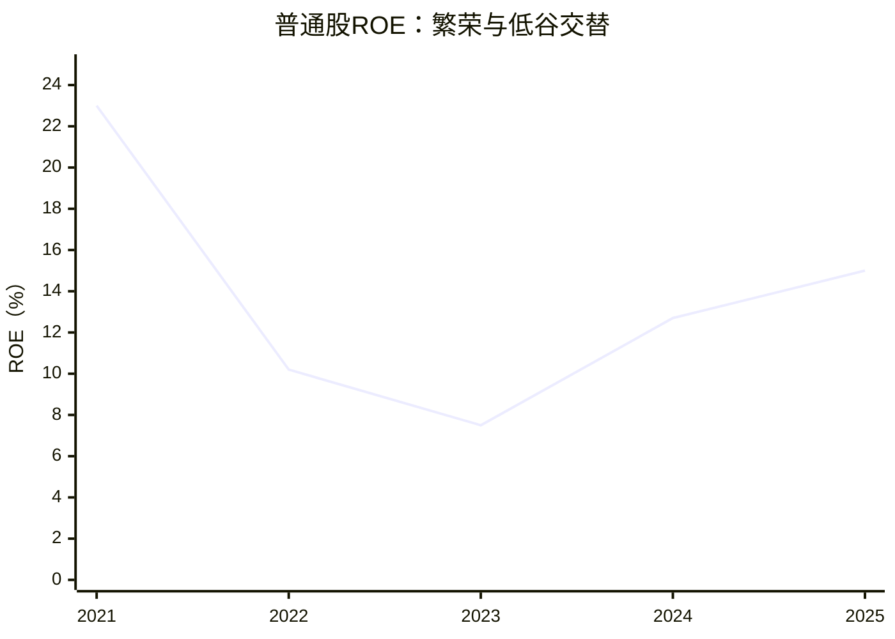
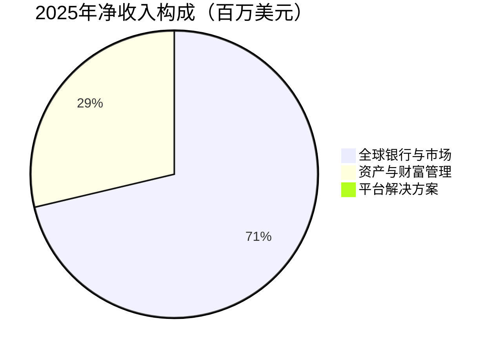

# 高盛（GS）研究报告

> **研究日期与数据截止：2026年9月30日（北京时间）**。行情采用美国9月29日常规交易时段收盘；财务截至2026年6月30日，最新已公布报告为二季度10-Q。金额默认美元，财务表使用百万美元。
>
> **价格：916.24美元；参考市值：2,667.83亿美元；TTM PE：14.15倍；PB：2.49倍；P/TBV：2.72倍。** 市值采用7月17日最后已核实的实股数，属于滞后股本估算，不能当作9月29日精确实时市值。
>
> 研究主线：高盛拥有强大的机构客户业务，但本轮盈利繁荣已经获得较高的权益估值；决定投资回报的关键，是景气回落后还能保留多少盈利。

行情由[StockAnalysis](https://stockanalysis.com/stocks/gs/)与[Schwab](https://www.schwab.wallst.com/research/Public/Stocks/Summary?symbol=GS)交叉确认；每股净资产来自[二季度官方业绩材料](https://d3cobg6h0snvt3.cloudfront.net/pressroom/press-releases/current/pdfs/2026-q2-earnings-results-presentation.pdf)。本报告供学习与研究。

---

## AI研究偏见自觉

**信息丰富度评级：A级。** 高盛披露完善，研究覆盖密集，AI容易把品牌、交易排名和近期盈利一起读成“确定性”。资料丰富并不消除金融机构资产负债表的复杂性。

AI研究局限：无法直接验证交易对手穿透风险、未公开头寸、真实客户流失与内部风险文化。正常化盈利、增量权益回报及长期增长均为分析假设。没有持仓成本、投资期限与组合约束，行动建议以寻求长期安全边际的投资者为对象。

- [x] 确定性来自客户关系和业务机制，而不能来自资料数量。
- [x] 反面检验：当前低PE是否来自高周期盈利？
- [x] 不把资产管理业务增长等同于整个集团已经转成稳定收费公司。
- [x] 对股本、拨备、普通股利润和合并利润分别核查口径。

---

## 第一步：核心数据总览

### 五年盈利：品牌很稳定，利润并不稳定

| 指标 | 2021 | 2022 | 2023 | 2024 | 2025 |
|---|---:|---:|---:|---:|---:|
| 净收入 | 59,339 | 47,365 | 46,254 | 53,512 | 58,283 |
| 合并净利润 | 21,635 | 11,261 | 8,516 | 14,276 | 17,176 |
| 普通股归属净利润 | 21,151 | 10,764 | 7,907 | 13,525 | 16,300 |
| 稀释EPS（美元） | 59.45 | 30.06 | 22.87 | 40.54 | 51.32 |
| 普通股ROE | 23.0% | 10.2% | 7.5% | 12.7% | 15.0% |
| BVPS（美元） | 284.39 | 303.55 | 313.56 | 336.77 | 357.60 |
| 现金及等价物 | 261,036 | 241,825 | 241,577 | 182,092 | 164,259 |
| 经营现金流 | 6,298 | 8,708 | -12,587 | -13,212 | -45,154 |
| 机械口径FCF | 1,631 | 4,960 | -14,903 | -15,303 | -47,218 |

一手来源：[2023年10-K](https://www.sec.gov/Archives/edgar/data/886982/000088698224000006/gs-20231231.htm)、[2025年报](https://d3cobg6h0snvt3.cloudfront.net/investor-relations/financials/current/annual-reports/2025/annual-report.pdf)。净收入分部合计与EPS五年均与[StockAnalysis财务表](https://stockanalysis.com/stocks/gs/financials/)一致；现金、现金流另参考[资产负债表](https://stockanalysis.com/stocks/gs/financials/balance-sheet/)与[MarketBeat现金流年表](https://www.marketbeat.com/stocks/NYSE/GS/financials/)。现金流五年有两个第三方来源支持，后三年已核对原始年报现金流表；前两年尚未完成原表逐行复核。



FCF在这里仅展示传统“经营现金流减资本开支”结果，不进入估值。交易资产、回购融资与客户款项的增减会显著影响现金流；负FCF并不自动说明金融业务没有创造价值。[公司现金流说明](https://www.sec.gov/Archives/edgar/data/886982/000088698226000091/gs-20251231.htm)也强调传统现金流分析对其流动性评价的局限。

### 收入来源：集团仍以资本市场业务为主

| 业务 | 2025净收入 | 收入占比（计算） | 客户为什么付钱 |
|---|---:|---:|---|
| 全球银行与市场GBM | 41,453 | 71.12% | 并购咨询、发行融资、交易执行、风险对冲、主经纪融资 |
| 资产与财富管理AWM | 16,679 | 28.62% | 委托投资、私人财富服务、另类资产配置 |
| 平台解决方案 | 151 | 0.26% | 消费金融及伙伴平台业务，正在调整退出 |

分部收入由[StockAnalysis分部表](https://stockanalysis.com/stocks/gs/financials/)与2025年报核对。占比由程序计算。



| 季度指标 | 2025Q3 | 2025Q4 | 2026Q1 | 2026Q2 |
|---|---:|---:|---:|---:|
| 集团净收入 | 15,184 | 13,454 | 17,227 | 20,338 |
| GBM | 10,168 | 10,411 | 12,738 | 15,520 |
| AWM | 4,418 | 4,719 | 4,078 | 4,597 |
| 平台解决方案 | 598 | -1,676 | 411 | 221 |
| 投行业务手续费（GBM内） | 2,657 | 2,577 | 2,840 | 3,395 |
| FICC（GBM内） | 3,493 | 3,107 | 4,011 | 4,592 |
| 股票业务（GBM内） | 3,736 | 4,306 | 5,326 | 7,416 |
| 合并净利润 | 4,098 | 4,617 | 5,630 | 6,628 |
| 稀释EPS（美元） | 12.25 | 14.01 | 17.55 | 20.98 |

来源：[2025全年及第四季度业绩](https://d3cobg6h0snvt3.cloudfront.net/pressroom/press-releases/current/pdfs/2025-q4-results.pdf)、[2026Q1业绩](https://www.goldmansachs.com/pressroom/press-releases/current/pdfs/2026-q1-results.pdf)、[2026Q2业绩](https://www.sec.gov/Archives/edgar/data/886982/000088698226000294/a2q26gsearningsresults.htm)。第三季度数据采用随后第四季度材料中的比较列，部分分部数字与第三季度初发材料不同；不混用初发与后续比较口径。季度分部多数仅有公司一手资料，未全部取得独立源复核。GBM内三项为子业务，不可与GBM再加总。

### 资本与数据口径

| 最新已核实指标 | 数值 | 含义 |
|---|---:|---|
| 2026Q2现金及等价物 | 187,266 | 经营流动性，不能全部分给股东 |
| 2026Q2普通股权益 | 109,714 | 排除优先股权益 |
| 2026Q2 BVPS（美元） | 367.67 | 官方含特定RSU的基本股数口径 |
| 2026Q2 TBVPS（美元） | 336.61 | 扣商誉及无形资产 |
| 标准法CET1 | 12.9% | 风险加权资本充足指标 |
| 高级法CET1 | 13.6% | 正式10-Q修订后的数字 |
| 上半年年化ROE | 21.7% | 包含税收收益，不能直接外推 |

来源：[正式2026Q2 10-Q](https://www.sec.gov/Archives/edgar/data/886982/000088698226000297/gs-20260630.htm)与官方业绩展示材料。展示材料原先高级法CET1为13.7%，这里采用正式10-Q的13.6%。BVPS/TBVPS已核对展示材料，但未完成正式10-Q全文第二次核查。

必须区分四组数字：

1. StockAnalysis的2025收入主表59,396，比官方净收入58,283大，原因是其使用拨备后口径：58,283−（-1,113）=59,396；采用其分部总收入才与官方一致。
2. 官方普通股利润16,300与第三方16,244相差0.34%。可能与两类法下未归属奖励的利润分配有关，尚未完成精确桥接；本报告采用官方利润，不宣称二者完全同口径。
3. SEC披露7月17日实际流通普通股291,171,408股，Schwab约291.2百万股；StockAnalysis302.77百万股无法与同期实股完整桥接，其市值277.41十亿美元高于本报告估算。Macrotrends二季度约305百万股是季度稀释加权平均数，不能用于实股市值计算。差异主要是日期及奖励/稀释口径，尚未确认全部细节。
4. 第三方把证券及融资资产加入“现金与投资”，得到巨大“净现金”。这些资产承担客户业务、抵押及融资功能，本报告不将其加到股票价值。净现金、EV/Revenue、PEG和工业毛利率均不作为买入依据。

> 段永平式追问：如果只看利润低谷的2023年，这仍是一门我愿意长期拥有的生意吗？

---

## 第二步：生意本质分析

**这门生意的本质：企业和机构为稀缺的资本撮合、复杂风险处理与可信执行付费，高盛通过客户关系、人才和资产负债表反复承接这些需求。**

投行业务按交易收取咨询及承销费用，客户关系可以持续，但项目何时完成不能保证。做市赚执行、价差和风险管理收入；融资业务用权益及资金支持客户头寸。财富管理按管理资产规模收费，另类策略还可能获得业绩费。三者相互引流，但相关性并不低：行情下跌会同时影响交易风险、管理资产和发行活动。

真正决定利润的是客户活动量、每单位收入需要的风险资本，以及员工/交易成本分走多少。薪酬随业绩变化提供一定缓冲，却也限制股东拿走全部规模红利。公司2025费用率64.4%，2024为63.1%，2023为74.6%，反映成本与收入周期的共同作用；没有可比的工业“毛利率”。[年报经营费用分析](https://d3cobg6h0snvt3.cloudfront.net/investor-relations/financials/current/annual-reports/2025/annual-report.pdf)

2026Q2股票、FICC与投行业务均很强，这是客户活动旺盛的证据。上半年股权奖励相关税惠约965百万美元，贡献EPS约3.15美元、年化ROE约1.7个百分点。把含税惠的单季盈利年化后当常态，会低估真实PE。[二季度业绩脚注](https://www.sec.gov/Archives/edgar/data/886982/000088698226000294/a2q26gsearningsresults.htm)

> 段永平式追问：复购来自持续创造价值，还是仅仅来自一个交易活跃的年份？

---

## 第三步：护城河评估

| 来源 | 判断 | 机制与可证伪条件 |
|---|---|---|
| 品牌与执行信誉 | 强 | 董事会和大机构愿为复杂交易的执行确定性付费；重大合规事故会破坏它 |
| 转换成本 | 中 | 主经纪、交易接口和财富关系黏性较高；大机构仍可同时使用多家银行 |
| 网络效应 | 中 | 买卖双方与发行投资需求互相吸引；客户规模并非垄断式网络锁定 |
| 规模与资本 | 强 | 全球覆盖、风险系统及融资能力需要长期投入；低资本要求的精品投行仍能竞争咨询业务 |
| 技术壁垒 | 中 | 数据、风控、执行系统重要；不应假设AI能力有独占专利或永久优势 |

以上为分析判断，不是公司披露的定量评分。全球机构覆盖的机制见[公司业务介绍](https://www.goldmansachs.com/investor-relations)。

过去五年的正面变化是业务更集中、历史自有投资减少、资产管理收费基础扩大。管理层在2025股东信中称历史自有投资较2020年大幅降低；这个方向降低资本强度，但不能据此认为全部风险已经轻资产化。[2025股东信](https://www.goldmansachs.com/investor-relations/financials/current/annual-reports/2025-annual-report)

未来五年更可能是护城河延续且局部加深，而不是消灭竞争。拿巨额资本可以招聘团队，却难以立即复制客户信任；同样，足够优秀的团队离职也能带走一部分业务。利润分配在客户、员工、监管资本与股东之间持续竞争。

> 巴菲特式追问：十年后客户还需要它，是否等于十年后股东还能得到今天这么高的ROE？

---

## 第四步：逆向思考与风险清单

最有力的空方论点是：投资者正用繁荣期利润计算PE，却用稳定收费平台的倍数为权益定价。高盛可能持续优秀，但股票仍可能因盈利回归与估值收缩带来长期低回报。

| 失败路径 | 主观发生可能性 | 股东影响 | 可观察信号 |
|---|---|---|---|
| 交易、发行与并购降温 | 中高 | 利润回落与PE压缩叠加 | 投行积压转化率、股票/FICC收入、费用率 |
| 私募信贷或融资客户集中损失 | 中 | 拨备、资产减值、资本消耗 | 不良迁移、净核销、基金赎回、抵押折扣 |
| 资本要求抬升 | 中 | 分配能力下降 | CET1要求、缓冲与实际比率之差、回购放缓 |
| 重大违规、客户信任损失 | 低但不可忽略 | 罚款加长期业务损失 | 监管执法、客户流失、人才离职 |
| 融资信心突然恶化 | 低、尾部事件 | 被迫去杠杆乃至权益永久损失 | 融资利差、流动性、抵押品追缴 |
| AI压低执行/研究收费 | 中，长期 | 技术收益被竞争让给客户 | 费用下降、收入增速弱于活动量 |

概率为定性研究判断，没有可信频率数据支撑精确百分比。这些路径可能同时发生，不可简单相加。正常信用损失纳入悲观情景；严重流动性事故及重大违规为额外尾部档，未纳入平均回报计算。

历史反例就在公司自身：强品牌没有阻止2023年的低ROE，也没有阻止消费业务退出成本。更早的1MDB案说明业务能力与风险文化需要分开评估。[美国司法部2020年处置公告](https://www.justice.gov/archives/opa/pr/goldman-sachs-charged-foreign-bribery-case-and-agrees-pay-over-29-billion)记录了超过29亿美元的协调处置金额及内部警示被忽视的问题；历史事件不能机械预测下一次违规，却足以反驳“名牌金融机构无需审查治理”。

最可能的分析错误：把本轮交易繁荣、拨备释放和税惠解释为永久利润阶跃。逆向检验应问：没有强市场、没有特殊税惠、没有资本放松，股东回报还剩多少？

> 芒格式追问：如果客户活动、融资成本和风险资产价格一起恶化，我认为彼此独立的优势是否会一起失效？

---

## 第五步：管理层评估

David Solomon是现任董事长兼CEO，John Waldron为总裁兼COO，Denis Coleman为CFO。执行能力可由核心业务改善观察，资本配置记录则需要同时记住消费扩张的代价。[官方股东信](https://www.goldmansachs.com/investor-relations/financials/current/annual-reports/2025-annual-report)

| 时间/决策 | 已观察到的结果 | 判断 |
|---|---|---|
| 2023年前后消费扩张转为收缩 | GreenSky及平台业务产生减值与退出成本 | 扩张判断失误，纠错有价值，不能抹去原损失 |
| 削减历史自有投资、发展收费业务 | 收入结构向较低资本强度业务调整 | 方向正确，需以跨周期回报验证 |
| 2025回购与分红 | 回购12,360、普通股股息4,420；回购平均价654.45美元 | 回购需比较内在价值；股价随后上涨不等于自动证明决策正确 |
| 2026Q2继续回购 | 回购4,000、平均价984.57美元；股息1,360 | 当前价格已低于回购均价，更应审查是否高估周期盈利 |
| OneGS 3.0与AI部署 | 提升效率为管理层目标，尚缺可独立分离的AI投资回报 | 不预先给AI额外估值溢价 |

金额为百万美元。依据[年报资本管理/股本注释](https://d3cobg6h0snvt3.cloudfront.net/investor-relations/financials/current/annual-reports/2025/annual-report.pdf)及二季度业绩“Other Matters”。

截至2026年3月2日的代理声明，Solomon实益持股143,146股、Waldron106,268股；二者均不是控制性持有人。董事与高管持股表包含部分已归属奖励，不能与行情网站“insider ownership”直接比较。[2026代理声明持股表](https://www.sec.gov/Archives/edgar/data/886982/000119312526117433/gs-20260319.htm)

**持股核查缺口：** 未逐笔合并此后Form 4，不报告9月30日实时经济持股比例；尚缺第二个独立来源对该持股定义的完整复核。薪酬与股权奖励使管理层与业绩相关，但员工可分享收入上行，普通股东承担最终资本损失，利益一致性并非完美。

公司是机构体系驱动，CEO退休不应令客户业务消失；继任质量与核心团队稳定性仍很重要。未经正式公告的接班或并购报道，不作为已完成事实纳入估值。

> 段永平式追问：管理层愿不愿意在昂贵时停止回购，并在客户融资最容易增长时拒绝低质量风险？

---

## 第六步：行业与文明趋势

AI、能源与基础设施投资扩大融资需求，私募市场和全球财富增长扩大管理需求。高盛位于资金从投资者流向企业的接口，既能收取咨询和发行费用，也可能承担融资风险。融资规模扩大不保证费率与资本回报同步扩大。

本报告不使用一个笼统“全球金融TAM”来预测收入。可服务市场由并购费池、股债发行费池、机构交易与融资需求、可收费管理资产构成，它们周期不同，也会互相重叠。尚未获得同一时点、同一统计定义的全球费池及公司份额，不能给出可靠精确市占率或TAM增长预测。

技术革命的历史类比是金融基础设施持续适应新的融资对象，而不是所有金融中介自动获得软件式垄断。AI能改善内部效率，也能降低客户购买传统研究及执行服务的意愿。年报披露通信与技术费用，不等于可单独识别的研发投入；没有足够证据计算AI研发ROI。

上半年末管理资产AUS约4.041万亿美元，但必须区分净流入、市场升值、收购带入资产和实际费率；AUS不是收入。公司季度材料披露收购、出售业务会影响净流入，因此不能把全部规模增加当作有机客户增长。[二季度AUS表及脚注](https://www.sec.gov/Archives/edgar/data/886982/000088698226000294/a2q26gsearningsresults.htm)

客户数量多并不消除行业共同因子的集中度。科技融资、私募资产和对冲基金可能在压力期同时缩表。没有完成按行业和交易对手穿透的集中度核查，这是长期投资确定性的一个主要上限。

> 李录式追问：资本市场会继续扩大，但最终价值被高盛股东、客户还是高盛员工拿走？

---

## 第七步：估值与安全边际

### 当前价格隐含什么

| 指标 | 本报告验算 | 解读 |
|---|---:|---|
| TTM稀释EPS | 64.76美元 | 51.32＋38.51−25.07；季度报告四舍五入合成口径 |
| TTM PE | 14.15倍 | 强周期盈利下，低倍数不一定便宜 |
| PB | 2.49倍 | 使用官方普通股BVPS |
| P/TBV | 2.72倍 | 使用官方TBVPS |
| 正常化EPS假设 | 55美元 | 略高于2025，低于当前TTM；不是公司指引 |
| 正常化PE | 16.66倍 | 对正常盈利的支付并不低 |
| 年化股息 | 20美元 | 新季度股息5美元乘四，不保证未来维持 |
| 指示股息率 | 2.18% | 不含回购与税费 |

StockAnalysis TTM EPS为64.63，与本报告64.76存在小幅差异，可能由季度精度及EPS加总口径造成，未完全桥接。工具验算中“EPS/BVPS=17.61%”只是时点比值，**不是公司正式ROE**；公司ROE使用平均普通股权益。

同日同行网站快照：MS的TTM PE约15.58、PB约2.84；JPM约14.38、2.52。来源：[MS](https://stockanalysis.com/stocks/ms/statistics/)、[JPM](https://stockanalysis.com/stocks/jpm/statistics/)。同行指标仅单源、标准化口径，仅作背景，不拿它们给十年后的高盛设倍数。财富管理结构和存款特许权不同，PE相近不意味着风险和价格同样合适。

自身历史也不能给出“平均PE一定会回归”的答案。[Macrotrends历史PE](https://www.macrotrends.net/stocks/charts/GS/goldman-sachs-group/pe-ratio)曾显示2022年末约10.54倍、2024年末约13.77倍，历史价格采用其复权序列。周期低点利润减少时PE反而可能升高，本报告不计算未经同口径核查的历史分位。

简化稳态权益模型为PB=(ROE−g)/(r−g)。取美元股权成本10.5%、永续增长2.5%，当前2.49倍PB对应稳态ROE约22.44%。这接近本轮高盈利水平，明显高于2025年的15%。**这是恒定ROE、全分配与稳态账面增长下的反向检验，不是说市场唯一隐含预期恰好为22.44%。**

### 三年情景：可能上涨，但基础回报不够宽

从正常化EPS55美元出发，收益增长含业务与每股改善的合并假设，不另加回购收益。终点倍数为三年周期情景假设，区别于下文用永续模型推导的十年终值。

| 情景 | EPS年增长假设 | 三年EPS | 三年PE假设 | 终点价格 | 价格变化 |
|---|---:|---:|---:|---:|---:|
| 乐观 | +12% | 77.27 | 16倍 | 1,236.3美元 | +34.9% |
| 基准 | +6% | 65.51 | 13倍 | 851.6美元 | -7.1% |
| 悲观 | -5% | 47.16 | 9倍 | 424.4美元 | -53.7% |

三年分红若固定20美元/年，累计60美元；这是额外现金流假设，表中价格变化未包含它。未把悲观情景分红保证不变，税费及美元兑人民币变化也未计入。不要把终点目标价当作今天内在价值。

### 十年折现：用权益回报和分配能力估值

金融机构采用普通股权益模型。技能工具的ROIC参数在此明确解释为**稳态增量ROE**，并非网站提供的工业ROIC；折现率r为美元股权成本，非WACC。终值PE仍严格按(1−g/增量ROE)/(r−g)计算。

折现率依据：9月29日美国10年期国债收益率5.26%；采用网站5年beta约1.28、ERP假设4.09%，得到约10.50%。ERP是分析假设，不是已验证市场事实。另取11.5%做系统性风险要求回报的敏感性，不用折现率吸收违规或挤兑等离散事件。[美国财政部利率表](https://home.treasury.gov/resource-center/data-chart-center/interest-rates/TextView?type=daily_treasury_yield_curve&field_tdr_date_value=2026)、[GS beta](https://stockanalysis.com/stocks/gs/statistics/)

| 模型输入 | 悲观 | 基准 | 乐观 |
|---|---:|---:|---:|
| 初始正常化EPS | 45 | 55 | 65 |
| 十年利润年增长 | +2% | +6% | +8% |
| 增量/稳态ROE | 10% | 15% | 18% |
| 前十年可分配比例 | 80% | 60% | 55.56% |
| 第十年EPS（等价固定股数） | 54.85 | 98.50 | 140.33 |
| 终值后永续增长g | 1% | 2.5% | 3% |

前十年分配比例=1−十年增长/增量ROE。这里把普通股盈利的可分配部分视为股息与净回购的总额，在固定等价股数下处理；因此不额外假设回购降低股数、不额外提高EPS。实际投资者个人只收到股息，模型总分配回报不是个人现金到账收益。

基准55美元以2025盈利为锚，并对2026的异常强度保持折扣；15%的增量ROE假设业务改善可以保留但不能无限复制高点。乐观情景要求收费业务增长与资本效率同时改善；悲观假设正常盈利下台阶。g是十年之后的永久增长，与前十年增长分开，美元基准低于技能4%的硬上限。

| 十年结果 | 悲观 | 基准 | 乐观 |
|---|---:|---:|---:|
| r=10.5%的r−g宽度 | 9.5个百分点 | 8.0个百分点 | 7.5个百分点 |
| r=10.5%终值PE | 9.47倍 | 10.42倍 | 11.11倍 |
| r=10.5%折现现值/股 | 429.45美元 | 642.45美元 | 893.59美元 |
| 当前价购买：含分配年化回报 | +0.07% | +5.81% | +10.17% |
| r=11.5%的r−g宽度 | 10.5个百分点 | 9.0个百分点 | 8.5个百分点 |
| r=11.5%终值PE | 8.57倍 | 9.26倍 | 9.80倍 |
| r=11.5%折现现值/股 | 386.19美元 | 559.58美元 | 767.52美元 |
| 当前价购买：含分配年化回报 | -0.61% | +4.88% | +9.12% |

估值使用前十年逐年分配加终值折现，年化回报用逐年现金流求根。所有数字来自附带Decimal计算脚本；terminal_value.py用于终值PE与准出约束，其irr命令只给终值价格年化再加固定股息率，不能精确处理变化的分配，所以报告不把它的简化输出冒充上述含分配IRR。

两个折现率下乐观＞基准＞悲观顺序稳定。基准现值约560—642美元，说明“市价便宜”的结论需要更强的增长/回报假设。当前国债利率只作机会成本背景：股权模型基准回报接近国债利率，风险却明显更大；二者不是可直接等同的税后实际收益。

**安全边际价格判断：** 约500—550美元且论文未恶化，可考虑分批建立长期仓位；550—650美元进入深入验证区；650—800美元依赖盈利能力进一步上修；800美元以上需要持续偏乐观的经营结果。价格带是研究阈值而非交易预测，不保证未来会到达。

严重违规、融资冻结等额外尾部风险没有赋予可信概率，模型也没有反映极端股权稀释。AI相关融资风险缺乏穿透数据，明确列为未建模。只计算常规三情景，不能宣称尾部风险已全部量化。

> 巴菲特式追问：如果资本成本更高、长期ROE更低，我的安全边际还存在吗？
>
> 段永平式追问：股市关闭五年，我能否接受在916美元买入后经历利润回归？

---

## 第八步：最终决策与行动清单

**结论：当前价格观望，不作为有充分安全边际的重仓买入。** 高盛的业务值得跟踪，当前股价却需要较强经营结果持续兑现。TTM PE低于许多优质企业，不能抵消金融周期、杠杆和权益估值的约束。

| 维度 | 判断 | 信心 |
|---|---|---|
| 生意质量 | 强机构业务，盈利波动显著 | 高 |
| 护城河 | 客户、人才、执行与资本的组合优势 | 中高 |
| 管理层 | 核心业务执行较强，消费扩张与回购纪律仍需审视 | 中 |
| 最大风险 | 把高景气盈利当成永久盈利 | 中高 |
| 文明趋势 | 全球资本需求长期增长，公司价值捕获受竞争与资本约束 | 中 |
| 估值 | 基准长期回报不足以补偿当前风险 | 中，依赖假设 |

| 投资者/信号 | 研究行动 |
|---|---|
| 空仓者 | 暂不追买，优先验证正常化盈利；关注500—550美元且基本面完整时的机会 |
| 现有持仓者 | 可以保留与风险承受力相称的仓位；集中度高或只因短期高EPS持有者考虑减仓 |
| 加仓信号 | 价格进入安全边际区；剔除特殊税惠后ROE仍稳定，收费业务增长，资本缓冲未恶化 |
| 论文重审信号 | 正常化ROE持续低于基准、净流入转弱、信用损失上升、资本约束压低分配 |
| 减持/卖出信号 | 价格进一步依赖乐观估值但盈利未上修；重大违规、流动性或风险文化出现实质恶化 |

下一次季报最该看四件事：交易收入能否在高基数后保持、投行订单能否转成手续费、AUS增长中有机净流入占多少、回购后资本缓冲与每股价值是否改善。单季EPS超预期不足以独立触发加仓。

以下为方法论模拟，不是真实发言或对该股票的背书：

> 巴菲特：我更关心跨周期可分配盈利，不能仅因为报价PE低就买。
>
> 芒格：把景气、费用、资本和融资一起恶化的路径想清楚。
>
> 段永平：对的生意还需要对的价格；等待也是决策。
>
> 李录：长期资本市场扩张可以成立，但必须确认股东如何分享它。

---

## AI分析置信度与投资确定性

历史净收入、EPS、现金及当前行情证据较充分；季度分部与资本指标主要依靠一手资料，独立复核并不完整。持股、净利润奖励分配桥接、客户穿透集中度仍有缺口。AI对已披露数据与业务结构的分析置信度较高，对十年盈利预测的置信度中等偏低。

实际投资确定性低于资料丰富度所暗示的水平。高盛有强客户特许权，却仍处在风险资本与市场周期交织的体系中。560—642美元基准现值、500—550美元安全边际区是明确假设下的研究输出，不能冒充已知事实。

## 数据来源与审计记录

原始年报、季报、代理声明及第三方页面已就近链接。Macrotrends部分网页访问受限，仅使用可核查搜索结果及历史表，不虚构完整复核。SEC大型HTML全文受到读取限制，已用官方PDF补充；无法完成的项目均已注明。

详细程序输出见[关键数据交叉验证记录](verification-20260930.txt)，参数与精确结果见[估值数据](valuation-20260930.json)，可复现计算见[计算脚本](valuation-20260930.py)。主要工具输出如下：

```text
市值验算：916.24 × 291,171,408 = 266,782,890,865.92 USD
对照Schwab 266.80B：偏差0.01%，通过（股本日期滞后）
2025净收入：GS 58,283 / StockAnalysis分部58,283，一致
2025普通股利润：GS 16,300 / StockAnalysis 16,244，差异0.34%
2026Q2现金：GS 187,266 / StockAnalysis 187,266，一致
股本：GS 291,171,408 / Schwab约291,200,000，差异约0.01%
PE 14.15；PB 2.49；指示股息率2.18%
terminal_value.py：六组r/增量ROE约束检查通过；AI融资风险未建模警告
```

**工具限制：** terminal_value.py的可选无风险利率检查仍硬编码美元4.70%，拒绝实际核实的5.26%。本报告保留真实5.26%，准出时省略可选rf参数；币种、r/g区间、分母和风险归属检查仍执行，rf/beta/ERP关系用Decimal独立计算。工具默认提示中的利率与国别ERP说明不作为本报告证据。未修改共享工具。

**数据抽检状态：数值与模型一致性检查通过，完整多源准出尚未完成。** 固定种子抽取二十六项，十六项为历史观察，十项为模型假设或衍生计算；没有发现超过容差的数值错误。部分历史项仅取得一手来源，模型项只验证公式与假设一致，不冒充外部取数。详细记录见[抽检样本与证据](audit-sample-20260930.json)及[工具判决](audit-verdict-20260930.txt)。工具的“准出”仅代表所填样本数值通过，它不检查来源独立性。本报告保留为有明确数据缺口的研究版本，不能标为已经满足技能全部双源要求的可发布稿。
