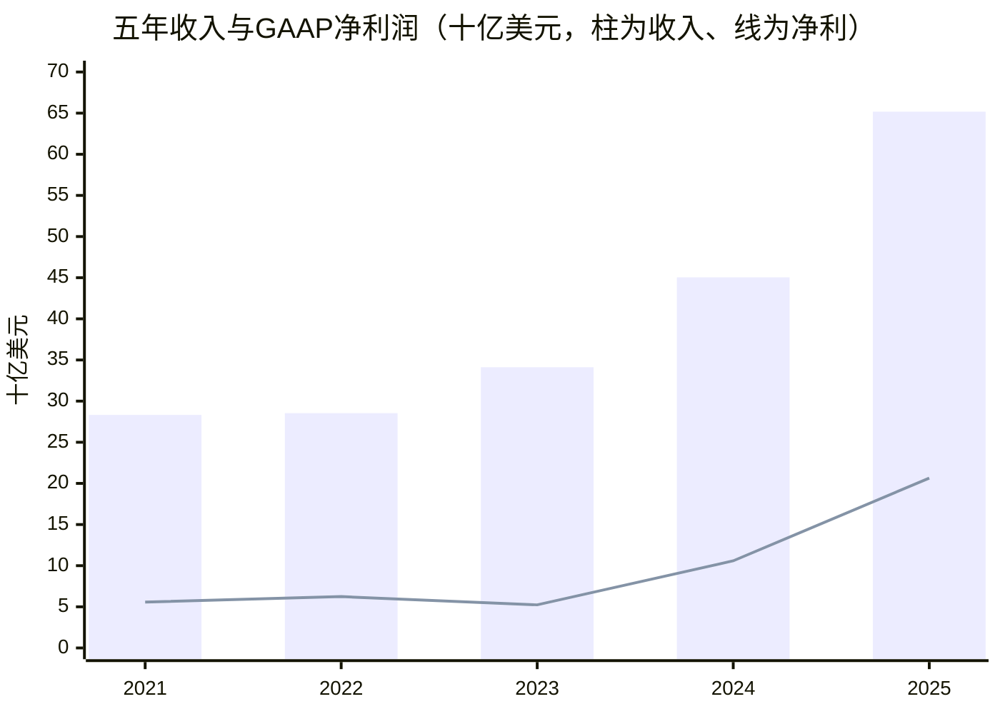
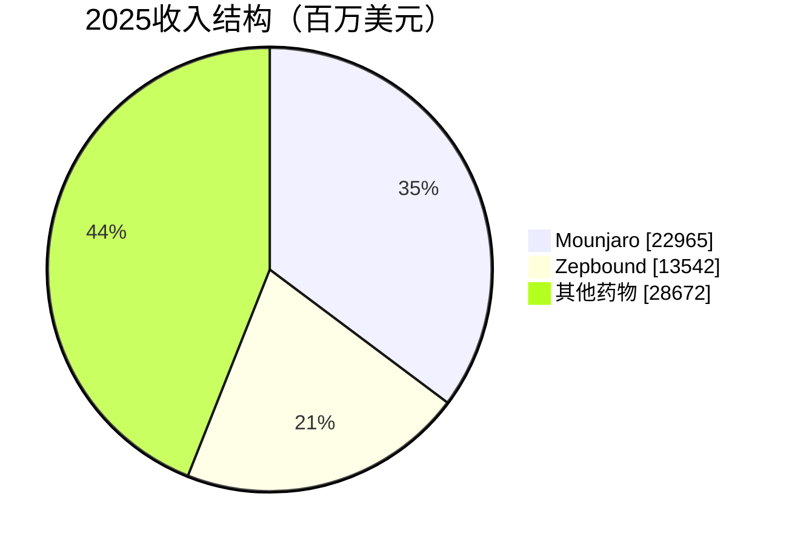

# 礼来（LLY）研究报告

研究日期：2026-09-12，美东时间。财务截至2026年二季度；价格采用9月11日常规交易收盘。除注明外，金额为美元。

| 当前快照 | 数值 | 口径 |
|---|---:|---|
| 股价 | 1,115.70 | StockAnalysis与FinanceCharts一致 |
| 市值，十亿美元 | 994.49 | 扣员工福利信托股份后验算 |
| TTM市盈率 | 37.45倍 | GAAP稀释EPS 29.79 |
| 2026指引市盈率 | 30.99倍 | 非GAAP EPS中点36.00 |
| TTM常规FCF收益率 | 1.83% | 经营现金流减资本开支，未扣并购 |

礼来的核心优势是把临床疗效、规模制造和支付渠道组合成可持续交付的药物；当前价格的核心考验是，这套能力能否在净价下降后仍保持足够久的利润增长。[行情与估值](https://stockanalysis.com/stocks/lly/statistics/)、[收盘交叉来源](https://www.financecharts.com/stocks/LLY/summary/price)。

## AI研究偏见自觉

信息丰富度评级：A级。礼来有大量公开财报和临床数据，市场对减重药的关注也极高。资料丰富能提高事实核对能力，却不构成信息优势。

AI研究局限性：未取得处方级真实留存、支付方合同、工厂单位成本或医生访谈；临床研究中的依从性不等于商业市场长期复购。本文将已披露事实、计算结果和估值假设分别标明；风险概率只作定性判断，不假装掌握精确发生率。

- [x] 把“好药”与“高价买入后的回报”分开。
- [x] 同时检查净价、留存和资本投入，避免只看新增患者。
- [x] 不把三期成功视为必然批准，也不把批准视为商业成功。
- [x] 不假定十年后仍可获得今天的高估值。

---

## 第一步：核心数据总览

### 五年财务：利润拐点真实，现金转化需要调整

金额单位：百万美元。毛利率与营业利润率由原始损益表计算。

| 指标 | 2021 | 2022 | 2023 | 2024 | 2025 |
|---|---:|---:|---:|---:|---:|
| 收入 | 28,318.4 | 28,541.4 | 34,124.1 | 45,043 | 65,179 |
| GAAP净利润 | 5,581.7 | 6,244.8 | 5,240.4 | 10,590 | 20,640 |
| 毛利率 | 74.18% | 76.77% | 79.25% | 81.31% | 83.04% |
| 营业利润率，自算 | 22.45% | 24.97% | 18.92% | 28.64% | 40.35% |
| 经营现金流 | 7,365.9 | 7,585.7 | 4,240.1 | 8,818 | 16,813 |
| 资本开支 | 1,309.8 | 1,854.3 | 3,447.6 | 5,058 | 7,841 |
| 常规自由现金流 | 6,056.1 | 5,731.4 | 792.5 | 3,760 | 8,972 |

来源：[2023年报，含2021—2023比较数](https://www.sec.gov/Archives/edgar/data/59478/000005947824000065/lly-20231231.htm)、[2025年报](https://www.sec.gov/Archives/edgar/data/59478/000005947826000013/lly-20251231.htm)、[第三方财务](https://stockanalysis.com/stocks/lly/financials/)、[第三方现金流](https://stockanalysis.com/stocks/lly/financials/cash-flow-statement/)。

营业利润这里扣除了销售成本、内部研发、销售管理、收购研发和重组减值，未扣Other-net。第三方网站2025年营业利润为29,696，按上述口径应为26,302；不能将前者直接称为GAAP营业利润。2021年第三方毛利也与原表不同，主表采用原表。2021—2022经营现金流采用后续年报重分类后的可比口径。



### 收入结构：两大品牌实际上共享同一核心分子

2025年Mounjaro收入22,965百万、Zepbound收入13,542百万，合计占收入56.01%。前者主要覆盖糖尿病及部分海外肥胖市场，后者覆盖以美国为主的肥胖市场。二者都是tirzepatide，不能当成两条完全独立的药物风险敞口。[产品收入](https://stockanalysis.com/stocks/lly/financials/)。



| 百万美元，全球销售 | 2025Q3 | 2025Q4 | 2026Q1 | 2026Q2 |
|---|---:|---:|---:|---:|
| 总收入 | 17,600.8 | 19,292 | 19,799 | 22,974 |
| Mounjaro | 6,515.1 | 7,409 | 8,662 | 9,943 |
| Zepbound | 3,588.1 | 4,261 | 4,160 | 4,928 |
| Verzenio | 1,470.2 | 1,604 | 1,302 | 1,474 |
| 两款tirzepatide占比 | 57.40% | 60.49% | 64.76% | 64.73% |

来源：[2025Q3](https://www.sec.gov/Archives/edgar/data/59478/000005947825000251/q325lillysalesandearningsp.htm)、[2025Q4](https://investor.lilly.com/news-releases/news-release-details/lilly-reports-fourth-quarter-2025-financial-results-and-provides)、[2026Q2及半年产品表](https://www.sec.gov/Archives/edgar/data/59478/000005947826000081/lly-20260630.htm)。Q1由半年减Q2取得，存在百万美元级四舍五入误差。公司没有公开上述单品独立毛利率，不能拿公司整体毛利率填入各药物。

2026Q2收入同比增长48%，公司披露销量贡献+60%、已实现价格贡献-13%；两项与汇率及取整共同构成收入变化，不应机械相乘。全年收入指引升至850亿—870亿美元，非GAAP EPS指引35.50—36.50。Q2非GAAP EPS仍包含3.03美元收购研发费用，不能误以为“adjusted”就已排除该项目。[Q2业绩公告](https://investor.lilly.com/news-releases/news-release-details/lilly-reports-second-quarter-2026-financial-results-raises-full)。

### 资产负债与现金：增长没有消除资本配置约束

2026Q2现金及等价物8,950百万，短期投资60百万，有息债务54,908百万。按现金加短投减有息债计算，净现金为-45,898百万；租赁未混入该债务口径。第三方9,746百万“现金及投资”含796百万非流动股票证券，不能全部当作现金短投。[10-Q资产负债表及Note 7](https://www.sec.gov/Archives/edgar/data/59478/000005947826000081/lly-20260630.htm)。

2026H1经营现金流16,023百万，扣资本开支后10,764百万；再扣单列投资活动的外购研发3,486百万和并购9,805百万，余额为-2,527百万，尚未扣分红回购。这不是说并购全部等于维护性开支，而是提示：**常规FCF不等于这家公司的全部可分配现金。**上述原始金额见同份10-Q现金流表。

> 段永平式追问：扣掉维持产品接力所需的全部投入后，真正剩给股东的现金有多少？

---

## 第二步：生意本质分析

**礼来向患者和支付方提供可验证的健康改善，以临床证据和专利取得销售资格，以持续用药产生复购，再用研发和制造投入延续这种资格。**

患者需要疗效、可接受的副作用和负担得起的价格；医生需要证据；支付方需要总医疗成本和预算可控。药房、批发商负责流通，但保险计划和政府能够决定患者是否进得来、持续用得起。账面净收入已经受到返利和折扣影响，药品标价不能直接乘以患者人数得到收入。

利润主要由三个变量推动：持续付费治疗人数、每患者净收入、研发与制造的再投资效率。初次处方是获客，续方才开始验证复购。药物停用后的疾病管理需求可以帮助留存，但副作用、自费负担和保险变动也会让患者离开。

高毛利来自创新药的知识产权和临床证据，不代表无成本扩张。新工厂需要验证、合规和爬坡；公司还需要为下一代分子支付内部研发和外部交易费用。收入扩张时，销售管理和部分研发可以摊薄；若净价下滑且销量放缓，杠杆也会反向运作。

一个算术例子：单位净价下降10%，需要销量增长11.11%才能保持收入不变，尚未补偿新增服务与制造投入。毛利率很高也不能让降价完全无损；固定单位成本假设下，原85.8%的毛利率会降至84.22%。这是示意模型，不是公司预测。

> 段永平式追问：这门生意好在哪里？答案应是“疗效能不断转化为支付意愿”，而不是“患者总数很多”。

---

## 第三步：护城河评估

| 来源 | 判断 | 支撑机制 | 可证伪信号 |
|---|---|---|---|
| 品牌与定价 | 品牌强、定价受约束 | 医生信任与品牌药质量控制 | 处方仍增但净价和贡献利润持续降 |
| 转换成本 | 中等偏弱 | 滴定、耐受和治疗稳定性 | 支付方排他协议引发大规模换药 |
| 网络效应 | 弱 | 更多用户不直接改善单个患者药效 | 不给平台型估值溢价 |
| 规模与制造 | 强 | 大规模交付、良率、注册和渠道能力 | 产能闲置或新进入者快速追平成本 |
| 临床与专利 | 强但有期限 | 疗效、安全性数据库和专利组合 | 新药头对头胜出、专利挑战或到期 |

SURMOUNT-5的72周研究中，Zepbound与Wegovy减重分别为20.2%和13.7%；这是明确剂量条件下的头对头证据。它不能自动覆盖所有未来高剂量或新机制竞争者。[临床数据](https://zepbound.lilly.com/hcp/clinical-data-weight)。

Novo在2026年REDEFINE-4披露，CagriSema未达到对tirzepatide非劣效的主要终点。这增强了礼来当前疗效优势的可信度，但未来竞争还包括耐受性、价格、便利性和疾病结局。[Novo研究公告](https://www.novonordisk.com/content/nncorp/global/en/news-and-media/news-and-ir-materials/news-details.html?id=916501)。

过去五年护城河变宽，主要因产品验证和制造商业化能力积累；未来五年是否继续变宽，要看下一代药物接力后的净利润池。我的判断是：礼来具有较强的持续创新能力，但还没有证据证明超额回报可以永久免受竞争。

> 巴菲特式追问：十年后，优势属于礼来的研发组织，还是只属于今天这一个分子？

---

## 第四步：逆向思考与风险清单

最强的不买理由是：患者增加与股东回报之间，仍隔着净价下降、资本投入和估值收缩。市场可能正确预见药物改变医疗，却高估了制造商最终保留的利润。

| 失败路径 | 定性可能性 | 对投资的影响 | 应观察什么 |
|---|---|---|---|
| 以价换量使利润增速落后于处方 | 高，已在发生 | 高 | 剔除返利估计变动后的净价、利润增长 |
| 自费或保险变化导致治疗中断 | 中高 | 高 | 续方、停药、覆盖范围，不只看新处方 |
| 口服扩容同时替代高价针剂 | 中 | 中高 | 新增患者与内部迁移比例 |
| 扩产和外部并购回报不足 | 中 | 高 | 现金投入、爬坡利用率、债务与现金转化 |
| 新机制药物在综合获益上胜出 | 中 | 高 | 同人群同估计口径的头对头数据 |
| 严重安全事件或监管收紧 | 概率无法可靠量化 | 极高 | 标签变化、监管信号、临床停药 |
| 专利到期后产品接力不足 | 十年尺度需重视 | 高 | 后续品种收入占比与专利进展 |
| 盈利增长但估值压缩 | 中高 | 高 | 价格对成熟期利润倍数的依赖 |

美国Q2价格降幅在剔除返利估计调整后约为9%，海外降幅36%主要受中国医保准入影响。这说明价格压力已经发生，不能只列在风险提示中。[公司Q2公告](https://investor.lilly.com/news-releases/news-release-details/lilly-reports-second-quarter-2026-financial-results-raises-full)。

历史类比更适合用来提问：任何超级畅销药都可能经历“需求被证明—资本涌入—支付方压价—专利或产品更替”。礼来是持续治疗且具有产品接力的大药企，不宜直接套用一次性治愈药的销售峰值路径；但同样不能因为临床贡献大就忽略价格和专利周期。

我最可能犯的错误，是把当前高增长外推过久；相反方向的错误，则是低估口服药、适应症扩展和规模降本能够扩大支付市场的幅度。二者都必须由净收入和现金验证。

> 芒格式追问：如果十年后利润明显增加、股票回报却很一般，今天最可能买贵了什么？

---

## 第五步：管理层评估

David Ricks领导下最值得肯定的是将研发产品转成规模交付和商业覆盖的执行能力。评估未来应从“有没有新项目”转向“增量资本是否创造足够回报”。

| 决策 | 判断 | 尚待验证 |
|---|---|---|
| 推进tirzepatide并扩充适应症和交付 | 已形成可见收入，正面 | 留存和价格竞争后的持续回报 |
| 提前建设制造能力 | 解决供给约束，方向合理 | 长期利用率与过剩风险 |
| 发展口服药和LillyDirect | 扩大便利性及支付入口，正面 | 获客成本、价格和针剂替代 |
| 连续外部收购补充管线 | 有助接力，暂不给成功溢价 | 研究成功率与并购现金回报 |
| 在扩产并购期继续回购 | 应审慎 | 每股价值增厚是否高于债务与机会成本 |

2026年委托书披露，2月25日Ricks实益拥有815,535股，全体董事和高管合计1,362,076股，均低于1%。这是有经济利益的职业经理人结构；Lilly Endowment的9.8%不是CEO自有持股。SEC页面与公司PDF是同一份披露的双载体，不能冒充两个独立调查源。[SEC委托书](https://www.sec.gov/Archives/edgar/data/59478/000005947826000021/lly-20260306.htm)、[公司最终委托书](https://investor.lilly.com/static-files/0d900249-2afc-45c9-aa6a-f128ca146a68)。

判断：运营和研发商业化能力较强，新增并购的资本回报证据尚不充分。本次没有完成全部薪酬目标及逐笔内部人交易复核，不能给出“激励完全一致”或“没有减持”的结论。

> 段永平式追问：如果CEO退休，组织还能反复找到、验证并交付下一代药物吗？我倾向于可以，但还不足以按永续高增长付钱。

---

## 第六步：行业与文明趋势

肥胖治疗从生活方式辅助走向药物长期管理，有广泛社会价值。WHO估计2022年全球成年肥胖人口超过8.9亿，但疾病人口远大于可支付的持续治疗人口。[WHO](https://www.who.int/news-room/fact-sheets/detail/obesity-and-overweight)。

以下是行业收入天花板的透明示意，不是市场预测，也不是礼来销售目标。它仅覆盖假设的肥胖治疗患者年，不额外叠加同一患者的糖尿病市场。

| 假设的全年等效治疗人数 | 月均制造商净收入 | 年行业收入，十亿美元 |
|---|---:|---:|
| 2,000万人 | 200美元 | 48 |
| 4,000万人 | 250美元 | 120 |
| 6,000万人 | 300美元 | 216 |

人数、治疗时长和净价必须一起判断。如果支付扩容主要依靠降价，不能把新增人数乘以旧净价。

CMS的GLP-1 Bridge从2026年7月延续至2027年底，有资格限制；患者月付50美元，药品净价245美元。前者不是礼来收入，这也不是永久无条件全面报销。[CMS项目](https://www.cms.gov/medicare/coverage/prescription-drug-coverage/medicare-glp-1-bridge)、[支付口径](https://www.cms.gov/medicare/coverage/prescription-drug-coverage/medicare-glp-1-bridge/information-part-d-plans)。

| 产品方向 | 截至研究日的状态 | 投资含义 |
|---|---|---|
| Foundayo / orforglipron | FDA已于2026年4月1日批准肥胖用途 | 应跟踪实际商业化，不再按待批准期权叙事 |
| Wegovy口服药 | 2026年1月已在美国上市 | 便利性市场已有竞争 |
| retatrutide | 仍是研究药物，计划2027Q1申报 | 不纳入已批准收入；关注耐受性及制造资料 |

来源：[FDA批准](https://www.fda.gov/news-events/press-announcements/fda-approves-first-new-molecular-entity-under-national-priority-voucher-program)、[Novo口服上市](https://www.novonordisk.com/news-and-media/news-and-ir-materials/news-details.html?id=916475)、[retatrutide进度](https://investor.lilly.com/news-releases/news-release-details/lillys-triple-agonist-retatrutide-successful-two-additional)。Foundayo无饮食饮水限制，可能扩大可使用人群，但不能把不同试验减重结果直接排成疗效榜。retatrutide TRIUMPH-3高剂量组因不良事件停药比例值得和减重结果一起看，商业成功不能只靠最高减重数字。

礼来的价值捕获位置在药物知识产权和合规制造；医生、支付方、渠道和患者依从性都可影响兑现。本次未获取可靠、统一口径的全球份额及供应商集中度，不将估计份额写成事实。

> 李录式追问：更大的社会健康收益，最终有多少留在药企股东手中？文明趋势是需求证据，不是估值证明。

---

## 第七步：估值与安全边际

### 当前倍数及可比边界

按公司2026收入指引中点860亿美元计算，市销率11.56倍；以现金加短投的净债口径，EV/2026收入约12.10倍。公司2026非GAAP指引中点对应30.99倍PE，不能与第三方滚动未来盈利的27.35倍混用。

第三方历史表中，2025年末GAAP PE约46.62倍，2024年末约65.64倍。当前倍数较低，但历史利润受研发收购费用影响，不能凭“比过去便宜”证明有安全边际。[历史比率](https://stockanalysis.com/stocks/lly/financials/)。

同日第三方口径下，Novo的TTM和前瞻PE约10.67倍、14.04倍；礼来相应为37.45倍、27.35倍。这个差距提示市场已付出明显增长溢价。Novo存在返利调整和盈利口径扰动，简单PE不能得出“便宜者更好”。[Novo估值](https://stockanalysis.com/stocks/nvo/statistics/)、[Novo半年业绩](https://www.novonordisk.com/news-and-media/news-and-ir-materials/news-details.html?id=916590)。该同行倍数仅作第三方背景引用，未用于任何终值计算；PEG预测期不透明，不用它决定买卖。

### 三年：如果市场继续支付增长溢价

以2026非GAAP EPS中点36美元为模型起点，推演三个年度至2029；不再加回收购研发费用。为避免收入和每股增速混淆，以下均为EPS增速假设。三年后PE是市场交易情景，不是内在价值的终值倍数。

| 情景 | EPS年增长假设 | 2029 EPS | 交易PE假设 | 三年后价格 | 含股息年化回报 |
|---|---:|---:|---:|---:|---:|
| 悲观 | +3% | 39.34 | 20倍 | 786.76 | -10.29% |
| 基准 | +15% | 54.75 | 27倍 | 1,478.29 | +10.40% |
| 乐观 | +25% | 70.31 | 32倍 | 2,250.00 | +26.84% |

股息假设每年每股6.92美元、不增长，按年末现金流计算IRR；预测期按三个完整年度简化，不作精确交易日XIRR。基准体现价格压力下继续扩容；悲观体现量价抵消；乐观要求口服、新适应症和制造共同兑现。没有给三档主观概率，也没有将目标价平均后冒充公允价值。

基准交易情景以10%折现，含上述股息的现值约1,127.87美元，接近当前价。**这能解释当前交易价格，但回报依赖三年后仍有27倍买家。**

### 十年：按现金能力与成熟期经济性估值

美元股权要求回报率主用10%，敏感性9%和11%。可核验的美联储9月9日十年美债为4.83%；基准可以理解为该利率加5.17个百分点权益溢价、规范化β取1。这是估值判断，不是对9月11日利率的宣称，也不是机械采用网站历史β。[美联储H.15](https://www.federalreserve.gov/datadownload/Preview.aspx?pi=400&preview=H15%2FH15%2FRIFLGFCY10_N.B&rel=H15)。

稳态增量ROIC假设20%，低于当前高增长期回报，体现制造、研发失败和未来竞争；不直接搬用历史账面ROIC。2036年之后永续增长分别为1%、2.5%、3.5%，均为美元名义增长、低于4%的模型上限。它们与未来十年EPS增长是两组独立假设。

采用框架公式：终值PE＝(1−g/ROIC)/(r−g)。基准为(1−2.5%/20%)/(10%−2.5%)＝11.67倍。按框架以2036年利润乘倍数计2036年末终值，不再加一次下一年增长因子。

| 模型输入，均为假设 | 悲观 | 基准 | 乐观 |
|---|---:|---:|---:|
| 2027—2029 EPS年增速 | +3% | +15% | +25% |
| 2030—2036 EPS年增速 | +2% | +8% | +12% |
| 前三年利润可分配现金转化率 | 50% | 50% | 45% |
| 后七年利润可分配现金转化率 | 65% | 70% | 70% |
| 2036之后永续增长g | 1% | 2.5% | 3.5% |

现金转化率为对资本开支、营运资金、外购研发和去杠杆需求的总括判断。乐观前期较低，因更快增长需要更大投入；后期上升假设规模成熟。这不是公司FCFE指引，也不是实际分红承诺。

以利息税后每股利润为起点折现股权可分配现金，**不再重复扣净债**；假定股数总体稳定，既不另加回购收益，也不把未分配现金重复加入终值。ROIC终值公式是框架化近似，未逐年重建债务和股权资本结构，因此不应把结果当作精确会计模型。

| 十年模型输出，r为10% | 悲观 | 基准 | 乐观 |
|---|---:|---:|---:|
| 2036 EPS | 45.19 | 93.83 | 155.44 |
| 终值PE | 10.56倍 | 11.67倍 | 12.69倍 |
| r−g分母宽度，百分点 | 9.0 | 7.5 | 6.5 |
| 每股现金折现价值 | 331.87 | 668.55 | 1,102.11 |
| 当前价对应现金分配假设IRR | -4.76% | +3.66% | +9.85% |

这里的IRR假设每年“可分配现金”全部传递给股东；它是经济回报情景，不是礼来实际股息预测。只看2036终值价格、不计中途现金时，三档年化分别为-8.15%、-0.19%、+5.87%，已用terminal_value工具另行复算。不得在前一行IRR之外再加股息。

| 折现率敏感性，每股价值 | 悲观 | 基准 | 乐观 |
|---|---:|---:|---:|
| r为9% | 381.86 | 793.44 | 1,346.20 |
| r为10% | 331.87 | 668.55 | 1,102.11 |
| r为11% | 292.43 | 574.24 | 925.26 |

三种r下情景排序不变；分母宽度分别为8/6.5/5.5、9/7.5/6.5、10/8.5/7.5个百分点，均通过最低5个百分点约束。基准估值区间约574—793美元。主模型基准终值占现值63.13%，远期假设对结果影响仍然很大。

**反向DCF：**固定基准现金转化率、终值增长和折现率，要求未来十年EPS保持单一增速，现价需要约17.03%的年增长。它不是市场唯一隐含答案，而是一组明确条件下的反解。当前价接近主模型的乐观价值，意味着买入者需要相信产品接力和现金转化显著优于本文基准。

### 十年模型特别限制

年报列示tirzepatide美国化合物专利预计2036年到期，恰处模型终值附近。基准已经降低远期增速，但并未逐品种模拟专利悬崖；其隐含前提是新产品能够补上老产品衰减。若不能，基准仍偏高。数据保护2027年届满不能等同于化合物专利2027年失效。[2025年报专利表](https://www.sec.gov/Archives/edgar/data/59478/000005947826000013/lly-20251231.htm)。

监管定价以经营情景处理。严重安全事件和专利诉讼未建模，也没有偷偷加入折现率；本模型并非尾部风险调整后的期望值。未逐资产估计外部收购价值、未模拟每个债务到期年，现金转化与20%稳态增量ROIC也属于待验证判断。

> 巴菲特式追问：r变化会影响乐观情景是否便宜，却没有改变“基准情景缺乏安全边际”的判断。若市场关闭五年，我不会仅凭当前增长率，以现价建立价值投资重仓。

---

## 第八步：最终决策与行动清单

**结论：生意质量较高，当前价格下观望；已有持仓可有条件持有，重仓者应审视集中度。**礼来值得长期跟踪，但以当前价格投入新资金，需要比本文基准更乐观的十年增长与产品接力判断。

| 维度 | 判断 | 信心 |
|---|---|---|
| 生意质量 | 临床价值强，复购受支付和耐受制约 | 较高 |
| 护城河 | 临床、制造、专利强；无强网络效应 | 较高 |
| 管理层 | 商业化执行较强，新增资本回报待检验 | 中 |
| 最大风险 | 净价下降叠加高价买入 | 较高 |
| 行业趋势 | 药物长期管理有潜力，支付决定利润池 | 较高 |
| 当前估值 | 三年交易情景可解释，十年基准不便宜 | 中 |

以下区间是基于现有盈利假设的行动框架，不是到价自动交易指令。若基本面改变，全部重算。

| 价格或持仓状态 | 建议 | 依据 |
|---|---|---|
| 空仓，当前约1,116美元 | 观望，不因回调本身买入 | 接近十年乐观价值 |
| 800—950美元 | 重新研究增长及现金转化，不自动认定便宜 | 仍高于十年基准区间大部 |
| 600—750美元 | 进入有条件分批建仓评估区 | 接近基准价值，仍需验证专利接力 |
| 500—550美元 | 基本面完整时更有吸引力 | 主用基准价值约20%—25%折让对应501—535美元，区间作取整 |
| 已有分散、低占比持仓 | 可持有，停止用高增长叙事无条件加仓 | 留住业务兑现的可能性 |
| 已经重仓 | 考虑分批降低集中度 | 单分子敞口及估值回撤风险较大 |

卖出或减仓触发：剔除返利估计影响后净价持续恶化且利润增速明显失速；产品安全或处方覆盖发生实质变化；外购研发、并购和制造持续吞噬现金却没有新产品接力；股价继续上行而盈利兑现不足。成本价不构成持有理由，实际税务和组合约束本报告未掌握。

加仓触发：价格回落带来明确安全边际；或者新产品净收入、复购和现金转化出现足够证据，使十年基准价值上修。临床发布或批准消息本身不足以替代商业验证。

最值得季度更新的五项：Mounjaro与Zepbound净价及销量拆解；Foundayo真实新增需求；常规FCF扣外购研发后的现金；净债与产能利用；retatrutide监管和耐受性。机会成本方面，可核实国债收益率已接近5%，而本报告十年基准经济回报仅约3.7%，当前承担单公司风险的补偿不足。

以下仅为方法论模拟提问，非本人言论或真实持仓观点：

> 段永平：药很好，还要问价格有没有把好处都算进去了。
>
> 巴菲特：我愿为持续创新付费，但不会把一个专利周期当成永续。
>
> 芒格：先弄清医保降价、停药和资本投入能怎样一起伤害回报。
>
> 李录：疾病治疗的进步很大，投资仍须识别谁能长期保留利润。

## AI分析置信度与投资确定性

财报总收入、净利润、现金以及已批准药物状态具有较充分数据支持。营业利润和现金投资口径差异已披露并按原表修正；部分单品季度数据仍主要来自公司披露，缺乏独立商业数据库核验。

净价长期走势、真实治疗留存、2036年的产品组合及现金转化率属于推理与假设，置信度明显较低。AI能读到很多资料，并不意味着以当前价格投资有很高确定性。

## 数据来源与审计记录

本报告优先原始年报、季报、FDA和CMS，财务与StockAnalysis交叉核对。Macrotrends完整页面访问受限，仅成功从其搜索摘要复核2021年毛利率74.18%，没有完成该站全量验证；SEC与公司转载同一披露不视为独立来源。[Macrotrends毛利率](https://www.macrotrends.net/stocks/charts/LLY/eli-lilly/gross-margin)。

关键口径：SEC封面941,357,065股，减员工福利信托50,000,000股后为891,357,065股，与第三方891.36百万一致。市值采用这一流通经济口径；季度稀释EPS使用加权平均股数，不能用期末股数替代。

计算工具已核验市值、收入、净利、现金、多期现金流及估值；工具交叉比较内置容差为2%，本报告另按1%判断。三档r均完成终值约束审计。来源错误或口径不同不强行平均。

工具输出摘录：

```text
计算市值: 994.49B USD
报告市值: 994.49B USD
偏差: 0.00%
PE (TTM): 1115.7 / 29.79 = 37.45x
【准出】三条硬约束全部通过，可以把估值写进报告。
```

固定随机种子42，从正文抽取126项数字，抽样19项：12项来源检查、3项计算复核、4项假设一致性检查。数值比较均在1%以内；其中TTM EPS、Verzenio单季销售、口服Wegovy上市年份仍是单一披露来源复核，不能称为独立双源通过。假设检查仅确认输入前后一致，不证明假设正确。2021年第三方毛利错误已由原表及Macrotrends摘要定位；未将错误值取平均。

完整程序输出见[核验记录](/C:/Users/Liang/Documents/AI-berkshire/礼来研究核验记录-20260912.txt)，模型数据见[计算结果](/C:/Users/Liang/Documents/AI-berkshire/礼来研究计算-20260912.json)，抽样结果见[审计记录](/C:/Users/Liang/Documents/AI-berkshire/礼来研究报告-20260912-audit.json)。
