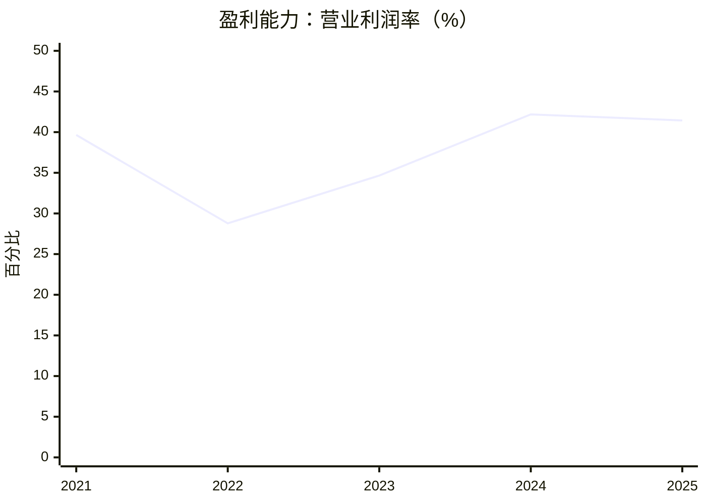
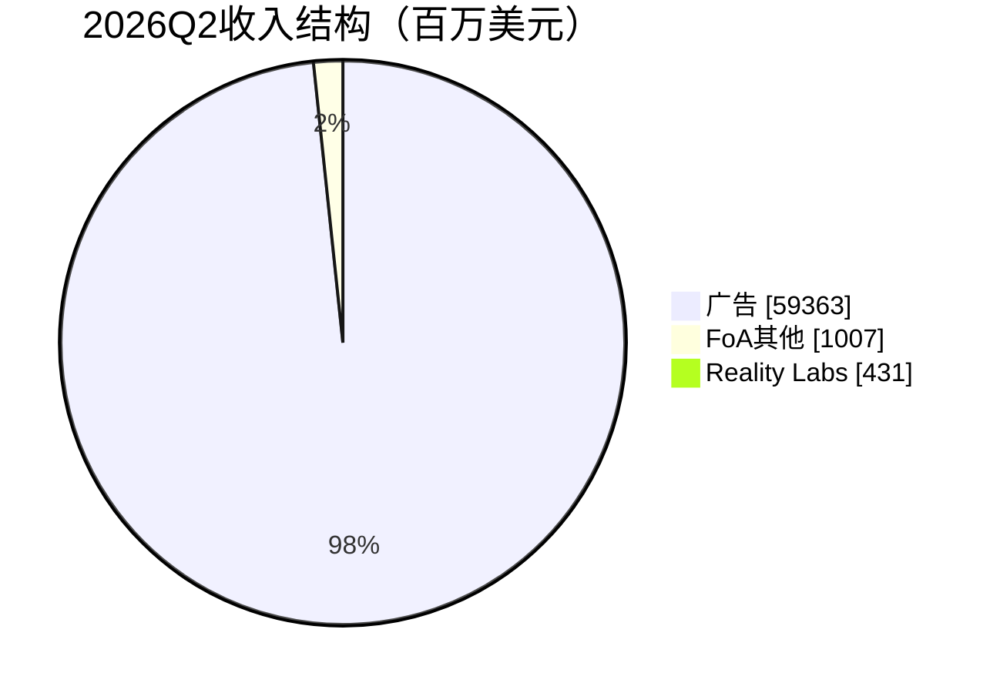

# Meta Platforms（META）研究报告

**研究日期：2026年9月16日（美东）｜财务截止：2026年6月30日｜重大事件核实至研究日**  
参考收盘价：673.31美元；按最近披露实际股本验算市值：1.715万亿美元；GAAP TTM PE：25.37倍；仅剔除两项税务事件后的参考PE：22.73倍。

Meta把全球用户的注意力和商家的获客需求连接起来，广告机制仍然强大；现在决定投资回报的关键，是AI算力投入之后还有多少现金真正属于股东。研究采用四位投资者的方法论，文末模拟追问不代表其本人对Meta的观点。

行情采用[StockAnalysis收盘快照](https://stockanalysis.com/stocks/meta/)，股份采用[2026年第二季度10-Q](https://www.sec.gov/Archives/edgar/data/1326801/000162828026050705/meta-20260630.htm)。盘后价格不纳入估值。

## AI研究偏见自觉

信息丰富度评级：A级。Meta披露充分、覆盖密集，事实容易核实，投资优势却不一定大。最容易发生的错误是把“广告增长、AI提高推荐效率”重复成一份看似确定的买入理由，却没有证明新增投资的资本回报。

AI研究局限性：无法观察广告客户真实增量获客成本、用户长期流失、内部算力利用率和各类AI投入的独立收益。公司没有把核心广告AI、通用模型研发和未来产品的资本开支分别披露；本报告不能替管理层证明这些投资值得。

- [x] 区分资料丰富与生意确定性。
- [x] 将税务事件、现金支出和经营利润分开。
- [x] 用长期现金回报检验“便宜的科技龙头”叙事。
- [x] 将估值增长率、概率判断和分配比例明确标为假设。

---

## 第一步：核心数据总览

下表金额单位为十亿美元；毛利率、营业利润率为百分比。自由现金流统一采用公司口径，扣除设备购买及融资租赁本金。

| 指标 | 2021 | 2022 | 2023 | 2024 | 2025 |
|---|---:|---:|---:|---:|---:|
| 营收 | 117.929 | 116.609 | 134.902 | 164.501 | 200.966 |
| GAAP净利润 | 39.370 | 23.200 | 39.098 | 62.360 | 60.458 |
| 毛利率 | 80.79% | 79.63% | 80.76% | 81.66% | 82.00% |
| 营业利润率 | 39.65% | 28.78% | 34.66% | 42.18% | 41.44% |
| 经营现金流 | 57.683 | 50.475 | 71.113 | 91.328 | 115.800 |
| 公司口径FCF | 38.439 | 18.439 | 43.010 | 52.103 | 43.585 |
| 现金及有价证券 | 47.998 | 40.738 | 65.403 | 77.815 | 81.592 |

收入用[Macrotrends](https://www.macrotrends.net/stocks/charts/META/meta-platforms/revenue)与[StockAnalysis](https://stockanalysis.com/stocks/meta/financials/)交叉核实；毛利率另对照[Macrotrends毛利率](https://www.macrotrends.net/stocks/charts/META/meta-platforms/gross-margin)。历史现金流以[2023年10-K](https://www.sec.gov/Archives/edgar/data/1326801/000132680124000012/meta-20231231.htm)、[2024年财报](https://investor.atmeta.com/files/doc_financials/2024/q4/Meta-12-31-2024-Exhibit-99-1-FINAL.pdf)和[2025年10-K](https://www.sec.gov/Archives/edgar/data/1326801/000162828026003942/meta-20251231.htm)为准。

公司2025年利润受税务计提影响，净利润下降不能直接理解为广告生意衰退；但FCF下降则真实反映了投入增加。

### 最近四季度的经营地图

| 指标，十亿美元 | 2025Q3 | 2025Q4 | 2026Q1 | 2026Q2 |
|---|---:|---:|---:|---:|
| 广告收入 | 50.082 | 58.137 | 55.024 | 59.363 |
| FoA其他收入 | 0.690 | 0.801 | 0.885 | 1.007 |
| FoA收入 | 50.772 | 58.938 | 55.909 | 60.370 |
| Reality Labs收入 | 0.470 | 0.955 | 0.402 | 0.431 |
| 合计收入 | 51.242 | 59.893 | 56.311 | 60.801 |
| FoA营业利润 | 24.967 | 30.766 | 26.900 | 23.394 |
| Reality Labs营业亏损 | -4.432 | -6.021 | -4.028 | -4.619 |

来源：[2025Q3财报](https://s21.q4cdn.com/399680738/files/doc_financials/2025/q3/Meta-09-30-2025-Exhibit-99-1-Final.pdf)、[2025Q4及全年财报](https://investor.atmeta.com/investor-news/press-release-details/2026/Meta-Reports-Fourth-Quarter-and-Full-Year-2025-Results/default.aspx)、[2026Q1财报](https://investor.atmeta.com/investor-news/press-release-details/2026/Meta-Reports-First-Quarter-2026-Results/)、[2026Q2 SEC财报](https://www.sec.gov/Archives/edgar/data/1326801/000162828026050596/meta-06302026xexhibit991.htm)。分部毛利率未披露，不用合并毛利率替代。

Q2广告占收入97.63%，其余来自消息、订阅和硬件等业务。下面按Q2收入取整展示结构：

### 最新季度究竟变了什么

Q2收入增长约+28%，但营业利润降约-8%，净利润降约-14%。广告展示量+14%、单价+12%，两者相乘得到约+27.68%的收入驱动；这是一种经营分解，不能把单价上涨全部归因于AI。公司称单价也受到宏观环境和汇率影响。[Q2电话会](https://s21.q4cdn.com/399680738/files/doc_financials/2026/q2/META-Q2-2026-Earnings-Call-Transcript.pdf)

Q2研发费用21.656十亿美元，同比增长约+67.33%；费用还含2.40十亿美元法律计提。营业利润率降至30.88%，FoA利润率38.75%。即使把部分费用视为阶段性事项，也不能假设全部研发支出未来会消失。[Q2 SEC财报](https://www.sec.gov/Archives/edgar/data/1326801/000162828026050596/meta-06302026xexhibit991.htm)

Q2经营现金流31.862十亿美元，资本支出含租赁本金31.078十亿美元，FCF仅0.784十亿美元，同比约-90.83%。上半年FCF13.170十亿美元；同期股权激励13.690十亿美元，上半年没有回购。[Q2 10-Q](https://www.sec.gov/Archives/edgar/data/1326801/000162828026050705/meta-20260630.htm)

> 数据追问：收入增长所创造的收益，被算力建设、人才和法律成本消耗了多少？

---

## 第二步：生意本质分析

**一句话：商家反复付钱，让Meta在大规模用户注意力中找到最可能购买的人。**

用户贡献内容、关系和行为信号，广告主参与竞价，Meta用推荐与转化预测系统决定展示什么。客户购买的是获客结果；持续投放取决于客户的投资回报，而不是长期合同强制续费。

Facebook、Instagram、WhatsApp和Messenger构成用户入口，广告拍卖、推荐系统、转化测量形成变现系统。用户可同时使用其他平台，广告主也会调整预算，因此“平台很大”不等于拥有无条件提价权。

真正驱动利润的三个变量是：可变现的参与度与展示量；广告带来的转化价值和每次展示价格；服务这些收入所需的全部成本，特别是算力、人才、折旧和监管负担。Q2展示和价格同时增长，证明广告系统仍有竞争力；利润率下降则说明新增收入没有完全转成股东收益。

历史高毛利率来自广告平台的规模，但高毛利并不等于轻资产。建设数据中心要先付现金，折旧随后多年进入利润表；若硬件更快淘汰，维护资本开支可能高于会计折旧。今天观察到的利润，有可能高估稳态可分配现金。

复购强度：广告客户日常测试预算，只要Meta带来的增量成交继续有吸引力，就有反复购买的理由。客户锁定主要来自账户历史、创意测试、受众和转化数据，强度低于不可替代的企业核心系统。

> 段永平式追问：这门生意好在哪？它帮助商家用可衡量的成本找到客户；如果获客效果不再领先，客户没有义务继续付钱。

---

## 第三步：护城河评估

| 来源 | 判断 | 可验证的机制 | 破坏条件 |
|---|---|---|---|
| 网络效应 | 强 | 关系、创作者和商家聚集，提高内容与连接价值 | 用户迁移到新的内容或社交入口 |
| 规模优势 | 强 | 同一套广告与推荐基础设施服务全球流量 | 算力成本增长快于变现，规模变成资本负担 |
| 转换成本 | 中等 | 广告账户学习、创意及转化流程积累 | 跨平台工具使预算迁移更容易 |
| 品牌及定价权 | 中等 | 广告主认可效果和覆盖，而非品牌溢价 | 转化下降或竞争者提供更高ROI |
| 技术壁垒 | 较强但会变化 | 生产系统、数据反馈与工程部署能力 | 模型商品化、隐私规则压缩信号优势 |

过去五年的判断是：广告系统的工程与变现能力增强，社交关系本身的保护程度有所下降，因为发现式内容可以绕过朋友关系。短视频竞争促使Meta从关系分发进一步转向算法分发；这个变化增强推荐系统的重要性，也使不同平台争夺注意力更直接。

拿100亿美元建一个新应用容易，复制全球用户、广告主、支付意愿与反馈系统很难。但对手无需完全复制Meta，只要拿走最有价值的一部分使用时长或广告预算，就能影响其边际盈利。

十年后护城河仍在的概率判断较高；资本回报保持历史水平的判断明显更弱。未来五年应观察用户参与度、广告价格、客户转化和资本强度，而不能只看用户总数。

> 巴菲特式追问：什么能摧毁护城河？新的注意力入口和受限的数据使用，可能比一个规模更小的社交竞品更危险。

---

## 第四步：逆向思考与风险清单

最强的空方论点是：广告生意产生大量现金，但控股创始人可以持续把现金投入通用AI、算力和硬件；少数股东无法要求停止。即使用户和收入继续增长，投入后的每股可分配现金仍可能增长不足。

### 8月和解改变了风险判断

公司公告约18十亿美元的十年分期支付安排，其中约12.7十亿美元属于分配部分，约5.3十亿美元有附加条件；预计Q3计提约10十亿美元费用，未在7月费用指导中考虑。法院批准消息于8月27日更新。18十亿美元、10十亿美元和当期现金支付是三种口径，不能混用。[Meta官方公告](https://about.fb.com/news/2026/08/agreement-with-state-attorneys-general-supporting-teens/)

和解带来的产品使用限制可能影响青少年参与度与未来留存，现金和解并不能自动消除其他原告的风险。说明会上管理层没有给出全部产品变化的收入影响量化值，不能直接把它解释为“风险出清”。[公司专项说明会](https://s21.q4cdn.com/399680738/files/doc_events/META-Conference-Call-on-Agreement-with-Bipartisan-Attorneys-General-Transcript.pdf)

| 失败路径 | 未来五年主观发生可能性 | 影响 | 观察指标 |
|---|---|---|---|
| AI投入回报低于股东要求 | 中高，约35%–50% | 利润增长但现金回报弱 | 资本开支长期高位、FCF恢复失败 |
| 注意力入口转移 | 中等，约20%–30% | 展示量和广告主ROI受损 | 成年用户参与度、单价与转化同时走弱 |
| 监管和产品限制持续加码 | 中高，约30%–45% | 变现限制及现金支付 | 新判决、限制范围与法务计提 |
| RL长期消耗核心利润 | 高，约50%–70% | 拖累每股所有者收益 | 硬件收入与经营亏损长期不匹配 |
| 严重拆分或结构性监管冲击 | 较低，约5%–10% | 破坏数据和平台协同 | FTC上诉及最终救济措施 |

这些概率是研究判断，路径可能重叠，不能相加，也不用于伪精确地计算目标价。FTC在2026年1月宣布上诉，不能将一审获胜视为诉讼终结。[FTC公告](https://www.ftc.gov/news-events/news/press-releases/2026/01/ftc-appeals-ruling-meta-monopolization-case)

欧盟数据使用、平台义务和未成年人保护也可能影响广告机制。规则允许高额罚款和部分结构性措施，影响不限于一次罚款。[欧盟DMA说明](https://www.consilium.europa.eu/en/policies/digital-markets-act/)、[DSA说明](https://www.consilium.europa.eu/en/policies/digital-services-act/)

历史类比：Yahoo说明用户入口不能仅靠过去地位维持；互联网基础设施扩张说明需求增长与投资回报可能分离。这些是机制类比，不是对Meta结局的预测。

最可能的分析错误：把AI对广告的短期改善，外推为所有AI投资都拥有高回报；第二个错误是以折旧替代未来必须投入的维护资本。

> 芒格式追问：聪明人为什么不买？因为他可能相信广告护城河，却不相信外部股东能拿到足够多的剩余现金。

---

## 第五步：管理层评估

Zuckerberg的优势是产品判断、规模化执行和战略适应；主要疑虑是资本配置约束。经济利益一致性有基础，投票权又显著超过对应股份比例。

2026年4月代理文件列示其实益拥有A股639,347股、B股341,823,978股，总投票权60.8%。用同一日期公司总股数计算，对应股份约13.49%；其中包含Biohub等实体股份，因此不应称为全部由个人享有的经济权益。A股每股一票，B股每股十票。持股表与结构说明相互核对，但管理层权益缺少第二个独立数据源，保留这一来源限制。[2026代理文件](https://www.sec.gov/Archives/edgar/data/1326801/000162828026025532/meta-20260416.htm)

| 决策 | 结果与评价 | 研究评分 |
|---|---|---|
| Instagram和WhatsApp并购 | 建立多入口平台，也留下长期反垄断争议 | 产品战略强，监管成本高 |
| 2022年以来转向短视频与推荐优化 | 广告规模恢复并扩张 | 执行能力较强 |
| 2023年效率调整 | 后续利润率恢复 | 成本纪律曾得到验证 |
| 持续投入Reality Labs | 2025年亏损19.193十亿美元，商业回报未成立 | 资本回报弱 |
| 2024年开始派息 | 增加基本股东回报 | 正面，但不足以限制再投资 |
| 2025–2026年加大AI投入 | 广告改善已有迹象，通用AI回报仍待验证 | 暂不下定论 |

评分属于分析判断。公司2025年回购约26.26十亿美元（含消费税口径），Q4无回购；2026上半年同样没有回购。回购不是无条件持续的每股增长引擎。股权激励必须通过利润费用或稀释处理，不能在FCF里加回之后完全忽略其股东成本。[2025年10-K](https://www.sec.gov/Archives/edgar/data/1326801/000162828026003942/meta-20251231.htm)

组织风险集中在AI人才成本、关键负责人变动和长期产品研发。公开资料不足以量化人才净流失或实际研发回报，不以媒体上的招聘金额代替经营证据。

> 段永平式追问：CEO退休后还能保持竞争力吗？广告系统与产品组织可以延续，但重大资本配置方向和治理机制仍明显依赖创始人。

---

## 第六步：行业与文明趋势

AI让内容生产、推荐和商业对话更加自动化，可能扩大数字广告与商业消息的市场。对Meta而言，最接近可验证利润的机会是广告效率、WhatsApp商业消息和已有入口中的新变现；通用AI和眼镜入口的收益仍需单独证明。

行业总市场不能简单用“全球广告加AI市场加眼镜市场”相加。几个机会可能替代同一笔预算，Meta最终能拿到的是客户愿意为增量效果支付的部分。本报告没有取得同口径、最新的一手全球TAM和市场份额，不给出未经核实的份额或市场预测。

主要竞争者按预算来源区分：Google/YouTube争夺搜索和视频预算，TikTok争夺发现式内容时间，Amazon争夺购物转化预算，Snap等争夺特定人群。利润最终取决于能否保持广告效果，同时避免把新增收益全部交给算力、云服务和人才供应方。

与电气化相似，技术普及会创造需求，但设备投资本身未必产生超额回报。Meta的优势是拥有现成分发和商业化系统；其弱点是并不控制主要移动操作系统，还需要外部设备、芯片和电力供应。广告客户广泛分布可降低单一客户风险，但不能消除宏观广告预算周期。

> 李录式追问：二十年后谁抓住利润？拥有用户和商业结果闭环有优势；只有把技术进步变成投入后的剩余现金，趋势才成为股东价值。

---

## 第七步：估值与安全边际

### 先把口径清楚地分开

| 指标 | 验算值 | 解释 |
|---|---:|---|
| 实际披露股本 | 2,547,506,225股 | 2026年7月24日A股加B股；不是实时股本 |
| 市值 | 1.715万亿美元 | 股价乘上述股数 |
| GAAP TTM EPS | 26.54美元 | 数据商TTM稀释EPS |
| GAAP TTM PE | 25.37倍 | 与网页25.26倍略有快照差异 |
| 仅剔除税务事件的参考EPS | 29.62美元 | 调整TTM利润后除Q2稀释股数的近似口径 |
| 上述参考PE | 22.73倍 | 未加回一般研发或日常监管费用 |
| PS | 7.51倍 | 用TTM收入228.248十亿美元 |
| 公司口径TTM FCF | 37.872十亿美元 | 2025全年加2026H1减2025H1 |
| P/FCF | 45.29倍 | 现金流收益率仅约2.21% |
| 年化股息率 | 0.31% | 每股2.10美元参考年化 |

2025Q3税务计提15.93十亿美元与2026Q1税务收益8.03十亿美元方向相反；税务调整只是辨认经营盈利的参考，不是将所有税费视为无现金成本。[2026Q1官方解释](https://investor.atmeta.com/investor-news/press-release-details/2026/Meta-Reports-First-Quarter-2026-Results/)

2026Q2现金证券90.260十亿美元减长期债务账面值83.664十亿美元，得到6.596十亿美元；再减经营租赁负债得到-22.058十亿美元。[资产负债表交叉来源](https://stockanalysis.com/stocks/meta/financials/balance-sheet/)

后续模型采用包含租金成本的股东现金流，因此不再机械扣掉全部经营租赁负债，以免重复；融资租赁支付需计入分配现金假设。现金余额并非全部“多余”，把6.596十亿美元全加到价值上只是简化，略偏有利。

### 三年价格情景

以税务调整参考EPS29.6173美元为起点，增长率与目标倍数均是主观假设。三年PE用于退出价格情景，不能作为十年终值依据。

| 情景 | 每股盈利年增长假设 | 三年后PE假设 | 三年后价格 | 相对现价变动 |
|---|---:|---:|---:|---:|
| 悲观 | +3% | 15倍 | 485.5美元 | -27.9% |
| 基准 | +10% | 20倍 | 788.4美元 | +17.1% |
| 乐观 | +15% | 25倍 | 1,126.1美元 | +67.2% |

由financial_rigor.py精确计算。以上是三年后的条件价格，尚未折现，也不含分红；将788美元直接当成今天的内在价值会高估安全边际。假设股份不发生重大净变化；增长已定义为每股增长，不额外叠加回购收益。

历史参考：数据商年末GAAP PE在2022年为13.60倍、2024年23.70倍、2025年27.52倍，税务和景气变化使这些点不能直接构成“合理PE区间”。没有完整分布，不宣称当前位于某一估值分位。[历史比率](https://stockanalysis.com/stocks/meta/financials/)

同日Alphabet网页GAAP PE约17.20倍、预测PE约25.78倍，二者差距很大；未经逐项调整非经营利润，就不能据此断言哪家更便宜。[Alphabet快照](https://stockanalysis.com/stocks/googl/)。机会成本应比较相同口径的可分配现金和风险，而非最低表面PE。

### 十年折现：回报取决于现金转化

时间简化为未来十个年度，终值年标记为2036；不是对2026年剩余月份的季度预测。起始正常利润假设为75十亿美元，接近税务调整参考利润，但不等于公司2026年预测。为避免把AI增长与免费资本混在一起，年度可分配现金只取利润的部分比例。

美元资本成本r基准10%，敏感性9.5%和11.5%。10%可以理解为假设无风险要求4.5%加股权风险补偿5.5%，β采用1；这是估值参数，不是本日国债行情或市场β估计。永续增长g基准3%，上限4%，与美元长期名义增长相容；g保持独立，不跟着r调整。

稳态增量ROIC采用15%/25%/35%。基准25%低于传统广告平台可能呈现的存量回报，反映新增算力、人才和维护需要资本；乐观35%要求新增投资产生较高回报，悲观15%反映竞争和重资产拖累。它们是待验证判断，不是披露值。

终值PE只由 `(1 − g/ROIC) ÷ (r − g)` 得出。十年间扣除再投资、维护和股权激励经济成本后的可分配现金假设，分别为利润的30%/60%/70%；可能通过派息、净回购或资产积累实现，不能理解为公司承诺派息。正常利润本身已含SBC，模型不再无条件加回SBC；不另加股息率和回购率。

| 情景 | 十年利润年增长 | 年度现金分配比例 | 稳态ROIC | 永续g | r−g | 2036利润，十亿美元 | 退出PE | 今日折现价值 |
|---|---:|---:|---:|---:|---:|---:|---:|---:|
| 悲观 | +3% | 30% | 15% | 2% | 8个百分点 | 100.79 | 10.83倍 | 226美元 |
| 基准 | +10% | 60% | 25% | 3% | 7个百分点 | 194.53 | 12.57倍 | 545美元 |
| 乐观 | +15% | 70% | 35% | 4% | 6个百分点 | 303.42 | 14.76倍 | 941美元 |

对8月和解采用保守简化：全额18十亿美元在未来十年每年支付1.8十亿美元，不考虑条件款未触发和税盾。10%折现现值11.06十亿美元，单独扣除。实际支付并非已核实的等额安排；这一假设不能用于现金预算。正常利润假设不含该单次计提，单独扣现金以避免重复。

工具terminal_value.py核实退出PE和仅终值回报；本项目模型以Decimal计算年度现金流、和解支出及完整IRR。按673.31美元买入，含假设可分配现金的十年年化经济回报为悲观-2.59%、基准+7.34%、乐观+14.31%。这是情景模型，不是保证可实现的证券账户回报。

| r敏感性 | 悲观价值 | 基准价值 | 乐观价值 |
|---|---:|---:|---:|
| 9.5% | 247美元 | 596美元 | 1,045美元 |
| 10.0% | 226美元 | 545美元 | 941美元 |
| 11.5% | 179美元 | 429美元 | 717美元 |

每档r−g均不低于5.5个百分点。三情景排序稳定，但绝对价值明显受r支配；在全部三档r下，当前价格都高于基准折现价值。提高收益要求不会消灭广告护城河，却会降低可接受买入价。

### 反向估值与尾部风险

保持75十亿美元起始利润、60%现金分配比例、ROIC25%、永续增长3%和r10%不变，当前价格要求未来十年正常利润复合增长约+12.72%。并非市场唯一预期；更高现金转化或更低收益要求也能解释现价。若资本开支使分配比例长期低于60%，需要更高增长才能成立。

严重监管冲击单列尾部档：假设价值为基准的一半，约273美元。这是压力测试，不给概率加权，避免与悲观档重复。监管风险不塞进β或折现率；创始人继任、极端网络安全事件和新增诉讼链式扩散没有完整建模。

> 巴菲特式追问：折现率错两个百分点会翻转结论吗？买入吸引力会显著变化，所以需要价格折扣和现金转化证据同时支持。

> 段永平式追问：关市五年愿意持有吗？愿意持有这门广告生意，但以当前价格买入，要额外相信AI资本配置能兑现。

---

## 第八步：最终决策与行动清单

**结论：好生意，当前价格缺少足够安全边际；空仓观望，已有适度仓位可持有并跟踪，不因AI叙事追价加仓。**

| 维度 | 结论 | 信心度 |
|---|---|---|
| 生意质量 | 高复购、可衡量获客效果，商业机制强 | 高 |
| 护城河 | 用户、广告反馈与工程规模形成保护 | 中高 |
| 管理层 | 执行强，重大资本配置缺少外部约束 | 中 |
| 最大风险 | 新增投入消耗现金，监管影响产品机制 | 中高 |
| 行业趋势 | AI有助于广告与消息，价值捕获待验证 | 中 |
| 当前估值 | 基准十年回报约7.34%，难支持重仓门槛 | 中低 |

价格区间是基准模型下的决策纪律，不代表全部风险已由低价覆盖。下表默认美元长期要求回报约10%、持有五年以上；未取得用户成本、仓位、税务和现金需求，不给个性化仓位比例。

| 投资者或价格 | 行动 | 必须满足的条件 |
|---|---|---|
| 空仓，现价约673美元 | 观望，建立跟踪 | 等待现金回报改善或价格下降 |
| 450–500美元 | 可考虑分批研究性建仓 | 核心广告机制稳定，基准现金假设仍成立 |
| 400–440美元 | 更有安全边际的候选区间 | 相对545美元基准价值留约两成以上折扣 |
| 500–600美元 | 接近基准价值，谨慎 | 若现金转化没有改善，不急于扩大仓位 |
| 已持有适度仓位 | 继续跟踪，可持有 | 能接受资本周期、监管和估值波动 |
| 已有高集中度仓位 | 暂停加仓，按现金需求评估减仓 | 单一控股人和资本配置风险不宜忽略 |
| 超过800美元且经营证据未升级 | 考虑减仓或重新估值 | 价格进一步透支基准，不能只靠历史高点锚定 |

加仓信号：广告展示和单价仍有健康增长；连续两次财报显示投入后现金改善；管理层提供资本开支与商业收益的更清晰关系；新增法律限制没有破坏核心变现。即使价格到达候选区间，论文失效也不买。

卖出或降低估值的信号：用户参与度与广告主ROI连续走弱；资本支出长期增长而每股可分配现金不恢复；为维持日常投入持续增加债务；新的法律限制改变产品可用性、信号使用或平台协同。

下一次财报优先检查五项：FoA利润率、资本开支含租赁本金、FCF与SBC、法律计提与现金支付分别多少、最新2027年投入方向。Q3计提冲击不能单独证明核心广告衰退；同样也不能用“一次性”掩盖长期现金义务。

四种方法论的模拟点评：

> 巴菲特式：护城河值得重视，但留给股东的现金比营业额更重要。
>
> 芒格式：先假设自己把AI回报想得太好，再检验价格还能否接受。
>
> 段永平式：生意可以是对的，投入方式和价格仍需逐项判断。
>
> 李录式：技术革命带来机会，资本回报决定谁真正受益。

## AI分析置信度与投资确定性

财报事实、广告依赖和治理结构的分析置信度较高；十年增长、维护资本开支、现金分配比例和AI增量ROIC的置信度中低。实际投资确定性为中等，不能由A级信息丰富度推导出高确定性。

本报告最需要后续验证的问题是：130–145十亿美元全年资本开支中，多少是维护现有竞争力、多少是有回报的扩张；广告效果改善有多少是可持续的增量；产品限制实施之后的参与度和变现如何；现金回报能否恢复而不依赖债务。

## 数据来源与审计记录

核心来源已在相应段落直接链接；估值与来源审计另存于同目录的 `Meta审计记录-20260916.txt`、`Meta估值模型-20260916.json` 和 `meta_model_20260916.py`。

关键交叉验证：2025收入200,966百万美元、净利润60,458百万美元、现金证券81,592百万美元，SEC与StockAnalysis一致；Q2现金证券90,260百万美元一致。实际股本与数据商舍入值差异低于1%；股价乘实际股数与网页1.72万亿美元市值差异0.28%。

明确口径差异：StockAnalysis的2025 FCF46.109十亿美元，比公司43.585十亿美元多融资租赁本金2.524十亿美元；2024年同样存在租赁本金差异。本报告采用公司口径，不能将这些差异当作随机误差。2021年净设备购买与数据商毛额也存在差异，历史FCF采用原始公司值。TTM收入在不同页面相差1百万美元，低于1%，采用Macrotrends228.248十亿美元。当前网页PE与精确验算略有快照差异，采用本报告固定价格的验算值。

financial_rigor.py输出已保存，十年估值通过terminal_value.py的币种、分母宽度和离散风险归属检查。工具输出自带的历史国债和ERP预设不是当前市场证据，本报告不采用。

最终抽检以固定随机种子从提取项目中抽取约15%，共20项，全部在1%误差范围内通过。其中事实使用来源核实，派生值复算，情景输入只核查与模型一致性，不冒充可从外部验证的未来事实。网页PE的两页面来自同一数据商，不属于独立源。最终三档r与三档ROIC的九组口径审计全部准出。原始记录见 `Meta报告抽检-20260916.txt`、`Meta抽检数据-20260916.json` 和 `Meta最终估值复检-20260916.txt`；抽检通过不能证明增长假设正确。
