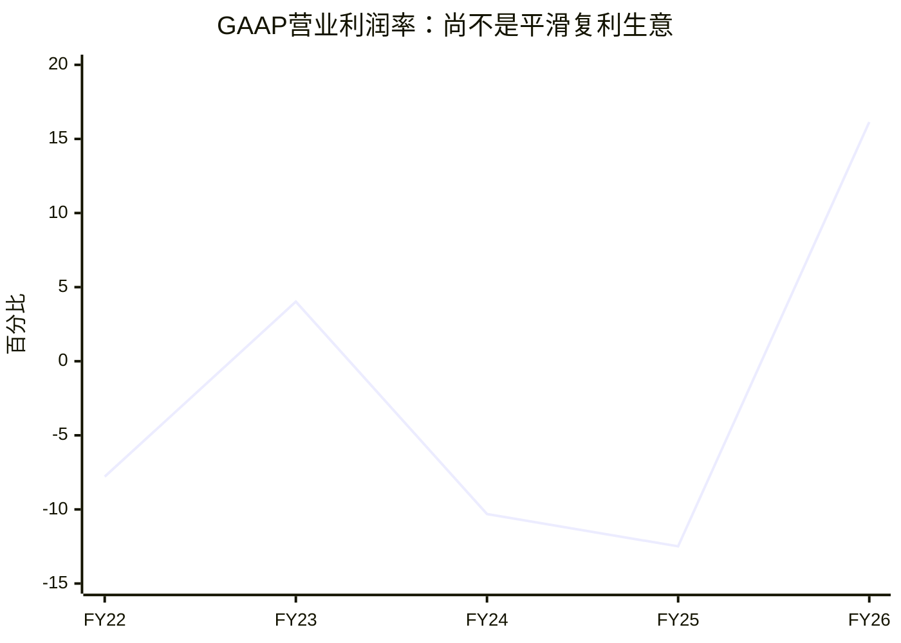
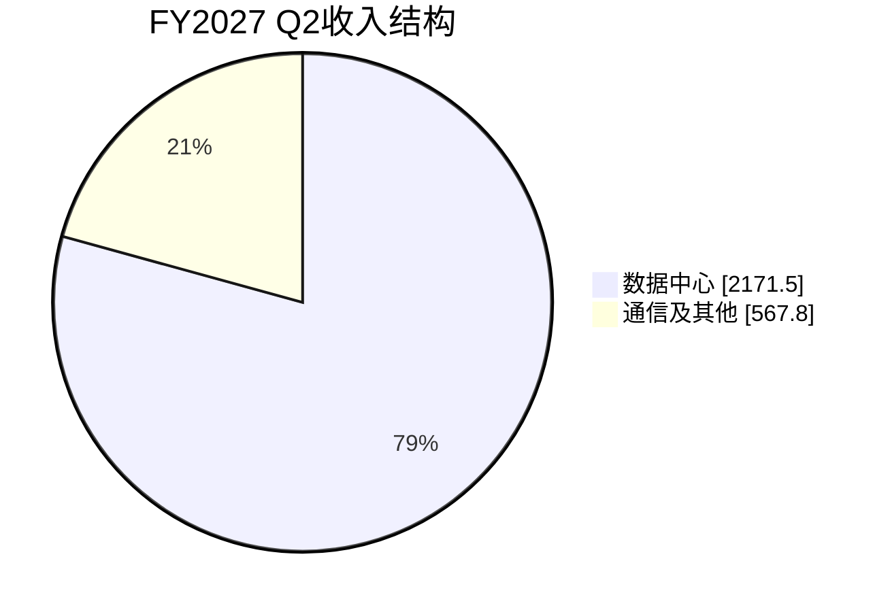

# Marvell（MRVL）研究报告

研究日期：2026-09-13，美东时间。行情截至 2026-09-11 收盘；最新财务期为截至 2026-08-01 的 FY2027 Q2。FY2026 截至 2026-01-31，不能与自然年 2026 混用。

参考股价：236.10 美元；普通股市值约 2,070.43 亿美元；普通股口径 TTM PS 21.91 倍、P/FCF 119.67 倍。股价已由 StockAnalysis 与 FinanceCharts 交叉确认。[行情](https://stockanalysis.com/stocks/mrvl/financials/)、[历史收盘](https://www.financecharts.com/stocks/MRVL/summary/price)

研究主线：**Marvell 能从 AI 集群的定制计算和高速连接中获得持续收入，但股东最终赚多少，取决于客户议价、研发与股权成本，以及买入时支付的增长溢价。**

## AI研究偏见自觉

信息丰富度评级：A。年报、季报、电话会和产品资料充足，市场对 AI 增长已有很强共识。信息多能提高财务核验置信度，却不能保证下一代芯片订单和长期利润率。

- [x] 不把数据中心收入全部当作 AI 收入，也不把全部 AI 收入当作定制 ASIC 收入。
- [x] 不把客户合作、采购目标、权证归属条件当作不可撤销订单。
- [x] 不用剔除了重组成本的第三方营业利润替代 GAAP 数据。
- [x] 不把 NVIDIA 投资、出售业务所得当作经营收入或可重复利润。
- [x] 分开看营业增长、每股现金收益和当前价格。

AI研究局限性：无法取得未公开的单客户芯片合同、项目毛利率、订单取消条款、先进制程配额和实际良率。下文“事实”“管理层展望”“研究假设”分别标注；没有可靠双源的数据明确保留来源限制。

---

## 第一步：核心数据总览

### 五年财务：增长强劲，现金利润的质量仍须检验

单位均为百万美元；利润率采用公司 GAAP。FCF＝经营现金流－购置物业设备，不含收购款；其与最终股东可分配现金仍有差别。

| 财年 | 营收 | GAAP净利润 | GAAP毛利率 | GAAP营业利润率 | FCF | 期末现金 |
|---|---:|---:|---:|---:|---:|---:|
| FY2022 | 4,462.4 | -421.0 | 46.26% | -7.79% | 650.1 | 613.5 |
| FY2023 | 5,919.6 | -163.5 | 50.47% | 4.02% | 1,082.6 | 911.0 |
| FY2024 | 5,507.7 | -933.4 | 41.64% | -10.31% | 1,034.2 | 950.8 |
| FY2025 | 5,767.3 | -885.0 | 41.31% | -12.49% | 1,396.6 | 948.3 |
| FY2026 | 8,194.6 | 2,670.1 | 51.02% | 16.14% | 1,396.4 | 2,638.8 |

原始来源：[FY2024 10-K](https://investor.marvell.com/sec-filings/all-sec-filings/content/0001835632-24-000009/mrvl-20240203.htm)、[FY2026 10-K](https://investor.marvell.com/sec-filings/all-sec-filings/content/0001835632-26-000011/mrvl-20260131.htm)。营收、净利润、现金及现金流与 [StockAnalysis](https://stockanalysis.com/stocks/mrvl/financials/)、[现金流表](https://stockanalysis.com/stocks/mrvl/financials/cash-flow-statement/)对照；GAAP 毛利和营业利润另以 [Macrotrends 毛利](https://www.macrotrends.net/stocks/charts/MRVL/marvell-technology/gross-profit)、[营业利润](https://www.macrotrends.net/stocks/charts/MRVL/marvell-technology/operating-income)及 [Morningstar](https://www.morningstar.com/stocks/xnas/mrvl/financials)核对。Macrotrends 部分正文访问受限，使用可检索条目，缺项以年报为准。

三个不能忽略的事实：

第一，FY2026 收入增长 +42.09%，传统定义的 FCF 却大致持平。公司为应收、库存和未来交付投入现金，高增长不自动等于同等幅度的可分配现金增长。

第二，FY2026 净利润包含出售汽车以太网业务的税前收益 1,830.4 百万美元。不能直接以总净利润推算经常性赚钱能力；也不能不处理税项，简单从税后净利润扣去全部税前处置收益。[年报现金流及处置说明](https://investor.marvell.com/sec-filings/all-sec-filings/content/0001835632-26-000011/mrvl-20260131.htm)

第三，截至最新季报的 TTM FCF 为 1,730.1 百万美元，SBC 为 828.9 百万美元；机械相减后仅 901.2 百万美元。FCF 减 SBC 是保守的经济成本观察口径，**不是 GAAP 指标，也不等同于公司真实可派现金**。技术许可证的现金支付还可能出现在投资或融资现金流中，传统 FCF 会遗漏部分持续成本。[最新现金流](https://stockanalysis.com/stocks/mrvl/financials/cash-flow-statement/)

### 收入结构：数据中心已成为主导

公司只有一个报告分部，以下是终端市场收入分类，不能由此编造各业务毛利率。

| 期间 | 总收入，百万美元 | 数据中心 | 通信及其他 | 数据中心同比 |
|---|---:|---:|---:|---:|
| FY2026全年 | 8,194.6 | 6,100.3 | 2,094.3 | +46% |
| FY2026 Q3 | 2,074.5 | 1,517.9 | 556.6 | 见公司原披露 |
| FY2026 Q4 | 2,218.7 | 1,651.3 | 567.4 | +21% |
| FY2027 Q1 | 2,417.8 | 1,832.7 | 585.1 | +27% |
| FY2027 Q2 | 2,739.3 | 2,171.5 | 567.8 | +45.69% |

FY2026 末起，公司将此前企业网络、运营商、消费、汽车及工业合并为“通信及其他”；表中统一到新口径。FY2027 Q2 数据中心占比为 79.27%。[全年及Q4材料](https://d1io3yog0oux5.cloudfront.net/_955449e79cdc39fc2ca8c27164bb5c67/marvell/db/3735/35341/file/2026_03_05_Marvell_Q4_FY26_financial_business_results_FINAL.pdf)、[Q1材料](https://d1io3yog0oux5.cloudfront.net/_955449e79cdc39fc2ca8c27164bb5c67/marvell/db/3734/35382/presentation/2026_05_27_Marvell_Q1_FY27_financial_business_results_FINAL.pdf)、[Q2季报](https://investor.marvell.com/sec-filings/all-sec-filings/content/0001835632-26-000025/mrvl-20260801.htm)

最新季度 GAAP / non-GAAP 毛利率分别为 53.1% / 58.9%，每股收益分别为 0.33 / 0.94 美元。下一季度收入指引中点为 3,150 百万美元，non-GAAP 毛利率中点下降到 58.0%，EPS 指引中点为 1.10 美元。[Q2业绩公告](https://investor.marvell.com/news-events/press-releases/detail/1031/marvell-technology-inc-reports-second-quarter-of-fiscal-year-2027-financial-results)

这恰好说明定制业务的特点：收入可以迅速增加，产品组合却可能拉低整体毛利率。投资者应看新增毛利额和营业利润，而不只看收入增速。

管理层在电话会中将 FY2027 / FY2028 收入展望上调至约 120 / 180 亿美元。按全年展望、已实现上半年收入与 Q3 指引相减，FY2027 Q4 需要约 3,692.9 百万美元收入，环比约 +17.23%；这是研究推算，不是单独发布的 Q4 指引。[电话会原话转录](https://www.fool.com/earnings/call-transcripts/2026/08/31/marvell-mrvl-q2-2027-earnings-call-transcript/)

> 数据追问：增长中有多少来自已经出货并收到现金的产品，有多少仍是未来项目的计划？

---

## 第二步：生意本质分析

**云厂商和设备商付钱给 Marvell，购买难以自行按时完成的芯片设计、高速信号处理与量产能力；同一产品放量会重复采购，但每一代新产品都要重新赢得客户。**

| 产品位置 | 客户为什么付钱 | 重复收入如何产生 | 主要经济约束 |
|---|---|---|---|
| 定制 XPU / ASIC | 针对自身工作负载优化性能、功耗和成本 | 设计导入后随客户设备出货 | 客户集中，项目量与单价会重谈 |
| 光 DSP、TIA、驱动器及互连 | 高速传输需要控制信号损耗、功耗和误码 | 网络带宽升级、连接数量增长 | 单位速率价格下降，架构可能变化 |
| 交换、PCIe / CXL、存储控制器 | 减少数据搬运和内存瓶颈 | 服务器及网络扩容 | 标准竞争、客户自研与竞争产品 |
| 通信及其他 | 网络设备升级及存量系统迭代 | 周期性更新 | 需求更周期化，资源投入向AI迁移 |

这是无晶圆厂硬件生意。研发主要提前发生，生产交给晶圆代工与封测厂；设计成功后具有经营杠杆，失败时研发和承诺投入却难以收回。因此“资产轻”不意味着“不需要资本”。[业务及制造模式](https://investor.marvell.com/sec-filings/all-sec-filings/content/0001835632-24-000009/mrvl-20240203.htm)

真正推动利润的变量只有三个：量产项目是否如期放量；每个项目的毛利额能否覆盖研发；经营利润能否变为扣除人才激励和供应商预付款后的每股现金收益。

管理层预期 FY2027 支付约 10 亿美元产能预付款，并提示定制业务加速对短期毛利率造成压力。这些预付款可能支持未来增长，也意味着现在的自由现金流必须为未来交付让路。[Q2电话会](https://www.fool.com/earnings/call-transcripts/2026/08/31/marvell-mrvl-q2-2027-earnings-call-transcript/)

> 段永平式追问：这门生意好在客户难以替代的技术与交付能力；但如果最大客户下一代换供应商，我是否仍然理解它的盈利能力？

---

## 第三步：护城河评估

以下为研究判断，评级不是统计测量。

| 护城河 | 判断 | 成立机制 | 如何证伪 |
|---|---|---|---|
| 品牌与定价权 | 中低 | 可靠记录帮助进入核心供应商名单 | 客户持续要求降价或额外股权激励 |
| 转换成本 | 项目内较高，跨代中等 | 重新设计、验证、软件适配及量产有成本 | 同一客户下一代项目切换供应商 |
| 网络效应 | 弱 | 更多客户主要改善经验与研发摊销 | 不存在用户相互增强的直接网络效应 |
| 规模经济 | 中高 | SerDes、DSP等IP可复用，研发平台共享 | 项目越多，但每股收益和现金转化不改善 |
| 技术与系统能力 | 较高、需持续维护 | 模拟、数字、封装与系统验证的组合能力 | 新一代标准/工艺产品落后或量产延迟 |

相比五年前，Marvell 的数据中心产品组合更完整，服务复杂项目的能力增强；但需求也更加集中在少数有研发能力的云客户。我的判断是：**技术护城河变宽，商业议价护城河没有同比例变宽。**

Broadcom 是定制计算及网络的重要竞争者；NVIDIA 的系统平台、Credo 的连接方案、Astera 的互连控制器及客户自身设计团队，也可能在不同层面挤压利润。它们不是完全同质的竞争对手，不能用一个未经定义的“ASIC市场份额”替代具体产品比较。[竞争者披露](https://investor.marvell.com/sec-filings/all-sec-filings/content/0001835632-26-000011/mrvl-20260131.htm)

NVIDIA 在 2026 年宣布与 Marvell 通过 NVLink Fusion 合作，并投资 20 亿美元。它降低了“定制芯片必须与 NVIDIA 完全对立”的叙事风险，但没有消除双方在连接和系统价值分配上的竞争。[官方合作公告](https://www.marvell.com/company/newsroom/nvidia-ai-ecosystem-expands-marvell-joins-forces-through-nvlink-fusion.html)

> 巴菲特式追问：十年后客户仍需要这种能力，并不等于仍会把今天这么多利润留给 Marvell。哪一种能力是客户花钱也难以快速复制的？

---

## 第四步：逆向思考与风险清单

最强的空方论点并不是“AI 没有需求”，而是：**AI 需求很好，云客户、晶圆代工厂和员工却可能拿走大部分增量收益，普通股东又提前支付了最乐观的价格。**

### Google 协议究竟意味着什么

2026 年的协议涉及 TPU 生态相关产品。Google 获授最多 58,970,907 股权证，执行价 206.58 美元；其中大部分按 240 批归属，每批对应 5 亿美元相关收入。全部收入条件对应 1,200 亿美元，是归属门槛的算术结果。协议明确采购由客户酌情决定，**这不是 1,200 亿美元确定订单，也不是最低采购保证**。[8-K及协议概述](https://investor.marvell.com/sec-filings/all-sec-filings/content/0001193125-26-356217/d412696d8k.htm)

权证最高股数相当于目前普通股股数的 6.72%，但不能直接当成今天的净稀释：归属有条件、行权有价款，也存在无现金行权机制。实际经济成本应随归属、股价和会计处理评估；本报告不把全部未来权证先加入股本，也不把全部潜在收入提前加入估值。

| 失败路径 | 未来3—5年主观发生可能性 | 对投资的影响 | 可观察预警 |
|---|---|---|---|
| 增长兑现但估值回归 | 高 | 利润增长，股价仍可能下跌 | 业绩上调而远期倍数持续下降 |
| 大客户延迟项目、转双供或自研 | 中高 | 收入与经营杠杆同时受损 | 定制业务指引下调、下一代项目延后 |
| 光连接架构变化削弱现有产品价值 | 中 | 新品弥补不了旧品利润池 | 新方案量产弱于预期，原产品降价加快 |
| AI资本开支放缓或电力交付受限 | 中 | 订单推迟、库存与预付款承压 | 客户部署延期、应收与库存积累 |
| 并购整合与人才留任成本过高 | 中 | 每股现金收益跟不上收入 | SBC扩大、或有对价增加、回购抵不过稀释 |
| 台湾断供或重大出口限制 | 无可靠量化概率 | 极高，可能长期破坏供应 | 贸易规则及制造交付中断 |

这些是风险排序，不是可相加的独立概率。最后两类地缘尾部事件未给任意概率，也未隐含塞进折现率。

值得借鉴的历史机制是互联网基础设施热潮中的网络设备投资：网络使用量长期增长，与某个高价设备股的股东回报之间并无必然关系。这里采用的是机制类比，不把某家历史公司的结局机械套到 MRVL。

最可能的研究错误有两个方向：高估客户关系的可持续性；或低估定制计算和光互连的放量速度。前者会让价值陷阱看起来像成长，后者会让投资者错过大幅上涨。价格纪律是承认两种错误都可能发生。

> 芒格式追问：假设公司未来很好但股票回报很差，最可能是哪里出了问题？我的答案是买入倍数和每股价值分配。

---

## 第五步：管理层评估

Matt Murphy 自 2016 年担任 CEO，此前在 Maxim 任职多年。他将公司长期重心转向数据基础设施，体现了一致的战略取向。[管理层履历](https://www.marvell.com/company/leadership/matt-murphy.html)

| 决策 | 已知结果 | 研究评价 |
|---|---|---|
| 持续向数据中心集中资源 | 最新收入结构已明显转向数据中心 | 方向有效，但提高行业与客户集中风险 |
| 2025年出售汽车以太网业务 | 交易价25亿美元现金 | 变现非核心资产较合理，处置利润不可重复 |
| 2026年完成Celestial AI收购 | 加入光学scale-up能力，仍待大规模商业验证 | 技术布局有意义，投资回报未证实 |
| 完成XConn收购 | 补充PCIe/CXL交换及UALink团队 | 产品拼图更完整，整合仍需观察 |
| 接受NVIDIA战略投资 | 获得资金及生态合作 | 增加机会，也扩大普通股转换基数 |
| 通过权证深化云客户合作 | 获得更深产品参与机会 | 客户与股东共享上行，不能只看收入潜力 |

出售业务由交易双方确认：[Marvell](https://www.marvell.com/company/newsroom/marvell-sells-automotive-ethernet-business-to-infineon.html)、[Infineon](https://www.infineon.com/press-release/2025/INFXX202504-086)。Celestial 完成时公司预计 FY2028 下半年开始贡献收入，FY2028 Q4 达到 5 亿美元年化收入速度；这是当时的前瞻目标，年化速度不等于全年收入。[收购完成公告](https://investor.marvell.com/news-events/press-releases/detail/1005/marvell-completes-acquisition-of-celestial-ai)、[XConn公告](https://www.marvell.com/company/newsroom/marvell-completes-acquisition-of-xconn-technologies.html)

股东利益一致性并非创始人控股模式。2026 Proxy 的年初口径显示 Murphy 实益持股 412,871 股，按披露基数计算约 0.04873%；包含可在规定期间结算的递延股份，不应全当已持有普通股。该持股比例只有原始文件确认，尚未完成独立第二来源复核。FY2026 总薪酬约 2,506 万美元，其中股权授予公允价值约 2,020 万美元，不能等同于当期现金收入。[Proxy](https://investor.marvell.com/sec-filings/all-sec-filings/content/0001104659-26-060253/tm261486-1_def14a.htm)

现任 CFO 是 2026-06-15 上任的 Dan Durn。管理层交接不直接构成负面信号，但后续应看现金纪律能否随业务扩张保持。[CFO变更公告](https://www.sec.gov/Archives/edgar/data/1835632/000119312526267688/d151562dex991.htm)

我的结论：战略执行能力中高；资本配置回报尚不能给最高评级。对新技术的并购和人才投入是否划算，最终要以扣除持续股权成本后的每股收益检验。

> 段永平式追问：如果 Murphy 退休，公司拥有的工程组织能延续优势吗？技术团队可以延续，但大客户关系和资本配置仍需要接班证明。

---

## 第六步：行业与文明趋势

AI 集群把瓶颈从单颗芯片扩展到整个系统：计算单元要彼此通信，也要访问内存和存储。训练规模、推理并发和模型复杂度上升，会增加连接带宽与功耗效率的价值。Marvell 的机会来自这个系统层面的需求。

但产业价值链同时包含模型与云平台、计算芯片、连接芯片、晶圆代工、封装及电力。需求快速增加时，利润可能暂时集中在产能和平台控制者，而不是每一个供应商。

公司在 2025 年公布的预测把自然年 2028 数据中心半导体 TAM 定为 940 亿美元，其中定制加速计算相关约 554 亿美元。这是公司定义的可服务市场预测，属于历史展望，不能当作今天已经实现的市场规模，也不能与 FY2028 公司收入直接相除得到精确份额。[公司TAM说明](https://www.marvell.com/blogs/inside-marvell-expanding-custom-silicon-opportunity.html)

最大的结构性张力是：客户希望摆脱标准 GPU 的成本与供应约束，因而需要 Marvell；但这些客户同样不希望再被另一家供应商锁定。因此规模扩张会提升 Marvell 的技术价值，也会刺激客户发展自研、第二供应商和标准接口。

公司披露的客户数据还混有分销渠道，不能把某个大分销商占比直接指认成 Amazon 或 Google 的最终采购份额。供应端对先进晶圆制造的依赖，则使产能和地缘风险难以靠多几个产品项目分散。[供应链及客户风险](https://investor.marvell.com/sec-filings/all-sec-filings/content/0001835632-26-000025/mrvl-20260801.htm)

> 李录式追问：AI 可能是长期技术革命，MRVL 是否就是长期利润的最终归属者？现在能确认它占据重要位置，不能确认它拥有永久分配权。

---

## 第七步：估值与安全边际

### 先统一股本和现金口径

普通股以 StockAnalysis 的 876.93 百万股为报价基数，与 10-Q 披露 8 月 21 日的 876.9 百万股一致。乘以 236.10 美元得到 207,043.173 百万美元，与网站市值一致。

NVIDIA 优先股可转为 21.778 百万普通股；按假设转换后的经济权益计算，市值约 212,184.959 百万美元。用于未来每股估值的模型则采用公司 Q3 指引的 921 百万稀释加权股数近似，覆盖转换与既有激励影响；**它是估值近似基数，不是当日流通普通股数**。[股本统计](https://stockanalysis.com/stocks/mrvl/statistics/)、[季报股本附注](https://investor.marvell.com/sec-filings/all-sec-filings/content/0001835632-26-000025/mrvl-20260801.htm)、[Q3指引](https://investor.marvell.com/news-events/press-releases/detail/1031/marvell-technology-inc-reports-second-quarter-of-fiscal-year-2027-financial-results)

最新现金 3,932.8 百万美元，有息债务账面值 4,962.9 百万美元，净债务 1,030.1 百万美元。第三方总债务约 5,286 百万美元包含更广义口径，不能与只含有息债务的数字混用。没有把其他资产中的战略投资当作现金。EPS估值和后文股权现金流模型均已采用利息后收益，不再重复扣净债务。

| 指标 | 本报告计算值 | 解释 |
|---|---:|---|
| 普通股TTM PS | 21.91倍 | 使用TTM收入9,450.3百万美元 |
| 假设优先股转换后的EV/收入 | 22.56倍 | 使用上述有息净债务口径 |
| 普通股TTM P/FCF | 119.67倍 | 对当前现金产出要求很高 |
| 普通股TTM FCF收益率 | 0.84% | 未扣SBC及额外持续许可证现金成本 |
| FCF减SBC观察收益率 | 0.44% | 经济成本代理，非GAAP指标 |
| 股价/TTM GAAP EPS | 79.23倍 | 处置收益仍在TTM内，不适合判断正常盈利 |
| 股价/FY2026调整后EPS | 83.13倍 | EPS为2.84美元 |
| 股价/Q2调整后EPS年化 | 62.79倍 | 仅运行速度参考，非年度预测 |
| FY2027前瞻PS | 17.25倍 | 假设120亿美元展望全部兑现 |
| FY2028前瞻PS | 11.50倍 | 假设180亿美元展望全部兑现 |

网站显示的 TTM PE 79.33 倍与使用四舍五入 EPS 算得的 79.23 倍略有差别，未超过核验阈值。网站远期 PE 43.27 倍、PEG 0.94 仅作供应商预期快照：预测期、调整项和增长分母未完全统一，不能因为 PEG 小于一就认定便宜。[估值快照](https://stockanalysis.com/stocks/mrvl/statistics/)

### 自身历史与同业参照

| 公司 | 网站远期PE | 网站P/FCF | 网站毛利率 |
|---|---:|---:|---:|
| MRVL | 43.27倍 | 119.67倍 | 52.22% |
| Broadcom | 20.91倍 | 43.85倍 | 75.52% |
| NVIDIA | 18.12倍 | 41.50倍 | 74.67% |

均为截至研究日同一第三方的快照，未对竞争者另做完整财报审计；毛利率采用供应商标准化口径，不保证等同原始 GAAP，不用于主模型。Broadcom 含软件业务，NVIDIA 有不同的平台经济，两者都不是可直接复制的 MRVL 定价标尺。[MRVL](https://stockanalysis.com/stocks/mrvl/statistics/)、[AVGO](https://stockanalysis.com/stocks/avgo/statistics/)、[NVDA](https://stockanalysis.com/stocks/nvda/statistics/)

同一网站历史期末远期 PE 在 FY2023、FY2024、FY2025、FY2026 分别为 23.54、36.15、43.66、23.66 倍，目前处于这些观测值的较高一侧。这不是完整历史分位统计；公司业务结构也已变化。[历史估值表](https://stockanalysis.com/stocks/mrvl/financials/)

机会成本很直观：投资 MRVL 需要为尚未完全实现的利润增长支付更多倍数。是否优于其他半导体企业，必须证明它未来每股现金收益增长足够快，不能仅靠“体量更小”成立。

### 三年情景：市场可能给什么价格

研究假设：用 3.00 美元作为前瞻正常化经济 EPS 起点，约相当于 27.63 亿美元经济利润。它不是已披露 GAAP EPS 或分析师共识；是在当前季度调整后盈利运行速度与未来放量之间，扣除持续股权及相关经济成本后的粗略锚点。历史无形资产摊销可部分调整，但维持产品竞争力所需的新研发、许可证和再投资不能免除。

这一锚点明显高于当前 FCF 减 SBC 的每股数，已经给予未来现金转化改善的信用。如果 FY2027 最终无法形成接近这一正常化盈利，所有估值都需下调；若经济 EPS 可持续达到 4 美元，其他条件不变时估值应同比例提高。

| 研究情景 | 前三年EPS年增速 | 三年后EPS，美元 | 三年退出PE假设 | 三年后价格，美元 | 价格累计回报 | 价格年化回报 |
|---|---:|---:|---:|---:|---:|---:|
| 悲观 | +10% | 3.993 | 20倍 | 79.86 | -66.18% | -30.32% |
| 基准 | +30% | 6.591 | 30倍 | 197.73 | -16.25% | -5.74% |
| 乐观 | +40% | 8.232 | 40倍 | 329.28 | +39.47% | +11.73% |

这些是三年后的市场倍数情景，不是今天内在价值。20/30/40倍分别代表增长降温、保持成长溢价和继续处于高预期；没有用它们决定十年终值。表中未计股息，当前每年每股0.24美元的分红规模不足以改变结论；也未假设回购能自动创造额外收益。

这组结果说明：哪怕盈利每年增长三成，若市场三年后给三十倍，股价仍可能低于现在。乐观情景则说明股票继续上涨并不难想象，只是需要增长和估值共同支持。

### 十年折现：永久价值是否支撑现价

全部为美元股权现金流。主用资本成本 r＝10%，敏感性取9%、11%、11.5%。这里用长期归一化无风险基准4%＋beta 1×权益风险溢价6%解释10%的要求回报率，**是研究假设，不冒充当日国债收益率或实测CAPM**。没有采用网站2.25的历史价格beta；不把项目取消、台湾断供或出口禁令藏在beta中。

稳态增量资本回报率 ROIC 取20%，是成熟技术平台新增研发与资本投入的经济回报假设，不是公司报表上的当前ROIC。永久增长主用3%，低于美元名义长期增长上限4%；另审计2%、3%、3.5%。它们与前十年增长分开。

终值公式遵循项目工具约定，以第十年经济利润乘以下式；未另外乘以一年增长，略偏保守：

`终值PE = (1 - g / ROIC) / (r - g)`

主档为 `(1 - 3% / 20%) / (10% - 3%) = 12.142857倍`。留存15%用于支持永久增长，剩余85%才可分配。

| 情景 | 第1—3年EPS增长 | 第4—10年EPS增长 | 两阶段增量投入回报假设 | 第10年EPS，美元 | 第10年经济利润，百万美元 |
|---|---:|---:|---|---:|---:|
| 悲观 | +10% | +5% | 25% / 15% | 5.62 | 5,174.7 |
| 基准 | +30% | +15% | 60% / 30% | 17.53 | 16,147.1 |
| 乐观 | +40% | +20% | 80% / 40% | 29.50 | 27,166.5 |

前十年可分配现金按 `经济EPS × (1 - 当期增长率 / 当期增量投入回报)` 计算。基准与乐观因此保留一半利润再投资；这不是对实际股息政策的预测，而是可分配能力模型。高早期回报假设依赖已有IP复用和产能合作，不代表厂房资本回报，且偏有利于成长公司。维持同样增长若需要更高再投资，则价值下降。

当前及预期激励成本已反映在经济EPS中，模型股数近似固定，不再叠加相同SBC的年度稀释，以免双重扣减。尚未归属的客户权证、额外并购发行及或有对价若超过预留成本，需另行下调每股估值。

| r | 主档r−g宽度 | 终值PE | 悲观现值，美元/股 | 基准现值，美元/股 | 乐观现值，美元/股 |
|---|---:|---:|---:|---:|---:|
| 9% | 6个百分点 | 14.17倍 | 51.55 | 133.58 | 217.38 |
| 10% | 7个百分点 | 12.14倍 | 43.38 | 109.21 | 176.65 |
| 11% | 8个百分点 | 10.63倍 | 37.30 | 91.31 | 146.79 |
| 11.5% | 8.5个百分点 | 10.00倍 | 34.82 | 84.06 | 134.72 |

所有主档分母大于5个百分点；其他永续增长审计档也满足约束。同一增长情景的价值对折现率敏感，但在所列折现率下，“236.10美元没有足够安全边际”的方向稳定。单公司分析不存在公司间排序；三种情景价值排序始终一致。

按主档终值、逐年可分配现金，用完整现金流方程求得的十年模型 IRR 分别约 -9.31%、+1.14%、+6.61%。这不是对实际股价收益的保证；如果企业保留资金但不能获得模型假定的回报，股东结果会更差。附录工具另保留只看终值、分配率为零的诊断输出，两者口径不同。

### 反向DCF：236.10美元要求什么

保持起点EPS 3美元、第4—10年增长15%、前十年一半利润可分配、r为10%、g为3%及稳态ROIC20%不变，反解显示：前三年EPS需每年增长约 **68.72%**，三年后达到14.41美元，才能支撑现价。

这不是说市场只有这一种预期组合。更高的正常化起点、更长的高速增长、更高的成熟资本回报率或更低的要求回报都能替代部分增长要求；但假设必须明示。尤其要在保留一半利润时实现这种早期增长，隐含极高的增量回报，不能仅靠TAM叙事证明。

> 巴菲特式追问：把折现率调低后才能得到想买的价格，是发现了便宜，还是改了自己的回报要求？
>
> 段永平式追问：如果股市关闭五年，我愿意用236.10美元买入吗？以当前可验证的盈利和上述增长假设，我不愿意。

---

## 第八步：最终决策与行动清单

**结论：业务值得长期跟踪，当前价格观望；不适合作为以安全边际为首要原则的新增重仓。**

| 维度 | 结论 | 判断信心 |
|---|---|---|
| 生意质量 | 技术含量高、成长强，盈利稳定性一般 | 中高 |
| 护城河 | 项目内转换成本较强，跨代定价权受客户约束 | 中 |
| 管理层 | 战略方向有效，新并购的经济回报仍待验证 | 中 |
| 最大风险 | 付出高估值，但增量利润未充分归属普通股东 | 中高 |
| 行业趋势 | AI连接和定制计算需求有长期基础 | 中高 |
| 估值 | 当前价格需要超越基准的持续兑现 | 中 |

下面是基于本模型的行动区间，不是短期股价预测，也不代表价格一定会回落到这些位置：

| 价格，美元/股 | 空仓者 | 已有持仓者 |
|---|---|---|
| 80—90 | 基本面完好时可分批研究性建仓 | 可考虑增加，先重算现金收益和稀释 |
| 90—135 | 接近基准敏感性价值带；需要更强现金转化证据 | 低成本小仓位可持有，停止机械加仓 |
| 135—180 | 已需要更乐观的增长或资本回报 | 重新核对仓位与未来收益要求 |
| 高于180，包括当前236.10 | 不追价，等待盈利上修或价格提供空间 | 集中持仓可考虑分步降低；先考虑税务与组合约束 |

80—90美元来自主档基准价值约109美元再留约20%—25%折价后的整数区间。低于80美元也不是自动买点：若客户项目流失或经济EPS起点下调，应先降低估值。用户尚未提供成本、仓位、税务与资金期限，本报告不指定个人卖出比例。

加仓应同时看价格和事实：FY2027下半年及FY2028项目按期出货；FCF转化改善；持续股权成本和稀释受控；数据中心新增毛利能覆盖新增研发；在重新计算后仍有安全边际。

卖出或减仓信号：核心客户下一代项目流失，管理层连续降低定制业务预期，光互连新平台商业化显著延迟，回购无法抵消超预算稀释，或者股价上涨使未来回报低于自己的机会成本。单季毛利率因定制产品组合降低，不足以单独判定论文失败。

下一次值得核验的公开节点是公司计划于2026-10-06举行的投资者日：重点看项目收入转化时间、毛利与现金承诺、客户激励成本，不只看更大的TAM。[公司活动公告](https://investor.marvell.com/news-events/press-releases)

以下是四种投资方法的模拟追问，不是四位投资者的真实言论或持仓意见：

> 段永平式：我愿意承认这是一门有价值的技术生意，但不能因为生意在变好，就忽略价格已经走了多远。
>
> 巴菲特式：项目设计导入带来的黏性，与十年不用重新竞争的定价权，不是一回事。
>
> 芒格式：最危险的错误，可能是每条AI新闻都是真的，但每条利好都被重复算进估值。
>
> 李录式：技术革命创造巨大财富，投资者仍需辨认财富最后留在哪一层。

---

## AI分析置信度与投资确定性

历史收入、现金与GAAP财报口径：置信度高。近期指引和协议文本：事实识别置信度中高，但兑现确定性较低。十年EPS、增量资本回报与公平价格：假设敏感、置信度中低。

实际投资确定性低于资料丰富度所呈现的确定感。本报告最有把握的判断是：MRVL处于强需求领域，而当前价格要求很高；最不确定的是：定制计算和光互连能否连续跨代维持超额每股增长。

限制：尚未量化台湾长期断供、突发全面出口禁令等尾部风险；未完成客户合同和项目良率的一手访谈；管理层持股尚缺独立第二来源；同业倍数与部分历史指标仅为第三方参照；归属条件复杂的未来客户权证和并购对价没有逐笔期权估值。不能把未量化理解为风险为零。

## 数据来源与审计记录

来源链接已置于相应表格和段落。主财务以SEC原始披露为准，公开报价与第三方财务用于交叉验证，所有派生计算由本地工具完成。

| 核验字段 | 原始/主值 | 对照值 | 结论 |
|---|---:|---:|---|
| FY2026收入，百万美元 | 8,194.6 | 8,195 | 四舍五入差异，小于1% |
| FY2026净利润，百万美元 | 2,670.1 | 2,670 | 一致 |
| FY2026现金，百万美元 | 2,638.8 | 2,639 | 一致 |
| FY2027 Q2现金，百万美元 | 3,932.8 | 3,933 | 一致 |
| 普通股，百万股 | 876.9 | 876.93 | 日期精度/四舍五入差异，小于1% |
| FY2025 GAAP毛利，百万美元 | 2,382.2 | 2,382 | 年报与Macrotrends一致 |
| FY2025 GAAP营业利润，百万美元 | -720.3 | -720 | 年报与Macrotrends一致 |

必须保留的差异记录：StockAnalysis概览的FY2025毛利为2,740百万美元、营业利润为-8.5百万美元，与GAAP原始披露不一致。独立绝对误差核验确认超差；与原始费用附注对照，差额与标准化处理中排除的重组等费用相对应。报告采用年报数据，未强行把两者平均。相同问题影响部分其他年份的营业利润和毛利，因此主表统一从原始报表重建。原交叉验证工具以带符号的中位数为分母，会错误放行负数营业利润差异；本次另用绝对分母逐项复算并保留差异，未依赖该错误的绿色通过提示。

原始工具输出保存在 [MRVL研究核验记录](C:/Users/Liang/Documents/AI-berkshire/MRVL研究核验记录-20260913.txt)；全部假设及十年现金流保存在 [MRVL研究计算](C:/Users/Liang/Documents/AI-berkshire/MRVL研究计算-20260913.json)。核验工具的固定无风险利率参考来自旧配置，不作为当日市场数据，主报告资本成本采用明确的研究假设；准出仅验证币种范围、终值分母和风险归属，不证明增长假设正确。

报告随机抽检结果见 [MRVL报告抽检](C:/Users/Liang/Documents/AI-berkshire/MRVL报告抽检-20260913.txt)。抽检覆盖的历史值按信源核对，模型值按输入与独立算式核对，误识别项明确区分；抽检通过不等于所有数据都已双源核实。
