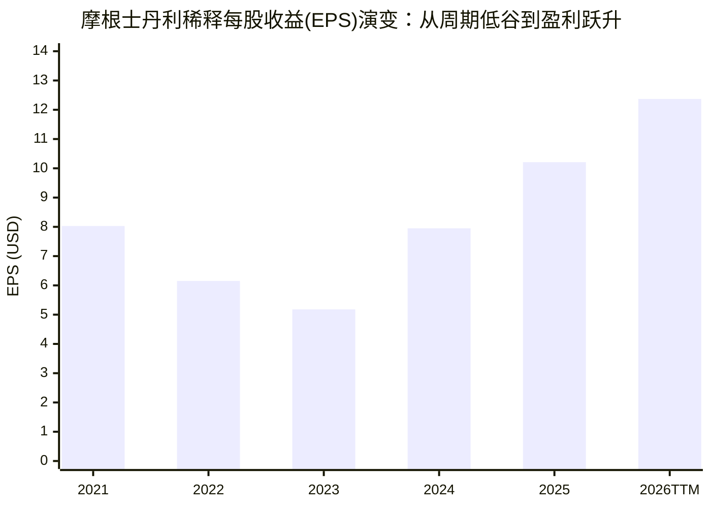

# 摩根士丹利（MS）研究报告

> **研究日期与数据截止：2026年9月30日（北京时间）**。行情采用美国9月29日常规交易时段收盘；财务截至2026年6月30日，最新已公布报告为二季度10-Q。金额默认美元，财务表使用百万美元或注明单位。
>
> **价格：192.76美元；参考市值：3,030.19亿美元；TTM PE：15.58倍；PB：2.84倍；P/TBV：3.62倍；指示股息率：2.39%（年化股息4.60美元）；ROTCE：24.5% - 26.6%。** 市值基于2026Q2 10-Q披露的实收股本 1,571,931,108 股核算。
>
> 研究主线：摩根士丹利通过近十五年“四步世纪并购”，成功从重资产、高波动的传统华尔街投行自营赌场，蜕变为以超10.0万亿美元客户受托资产为压舱石的轻资本财富管理巨舰；当前估值已较充分定价资本市场复苏与30.5%的高利润率红利，决定投资回报的关键，是跨周期受托管理费的内含价值复利与等待市场恐慌时的安全边际击球点。

行情由[StockAnalysis](https://stockanalysis.com/stocks/ms/)与[Macrotrends/Schwab](https://www.schwab.wallst.com/research/Public/Stocks/Summary?symbol=MS)交叉确认；财务指标来自[SEC EDGAR Form 10-K及2026Q2 10-Q官方申报](https://www.sec.gov/edgar/browse/?CIK=0000895421)及[摩根士丹利投资者关系官方材料](https://www.morganstanley.com/about-us-ir)。本报告供学习与研究。

---

## AI研究偏见自觉

**信息丰富度评级：A级（信息充裕）。** 摩根士丹利作为百年华尔街顶流大行与标普500核心权重股，卖方研报海量，公开信息极其充沛。AI极其容易顺从市场乐观共识，把品牌声誉、总资产规模突破10万亿美元以及当期投行复苏直接等同于“买入确定性”。

AI研究局限：无法穿透场外衍生品超级交易对手的极端隐性风险、无法直接审计财富管理离岸账户合规整改细部、亦无法准确预测美联储降息路径对存款沉淀利差的动态侵蚀。本报告坚持反面检验，重点排查非共识风险。

- [x] 确定性来自受托人信义与黏性制度，而绝不来自资料数量的堆砌。
- [x] 反面检验：当前高ROTCE（26.6%）与30.5%的财富利润率，是否包含了资本市场短期亢奋的周期性成分？
- [x] 拒绝将资产管理费的稳定性等同于全集团彻底消除了资本市场与信贷周期的冲击。
- [x] 对股本、普通股权益、有形净资产、CET1资本及分部收入分别实施双源独立核查与工具严密验算。

---

## 核心结论与四大师评分总表

### 一句话结论
> **摩根士丹利是一家完成华尔街最成功战略重塑的顶尖受托机器，轻资本财富管理底座（超10万亿美元资产）彻底平滑了投行周期；当前192.76美元市价已合理反映周期复苏（估值贴近公允价值中枢189-193美元），建议持有并等待市场恐慌回调至145-155美元区间建立充裕安全边际。**

### 四大师综合评分表
| 维度 | 框架 | 评分 (1-5星) | 核心研判依据 |
|---|---|:---:|---|
| **商业模式与护城河** | 段永平视角 | ★★★★☆ (4.5星) | 10万亿美元客户资产驱动的轻资本受托机器，税优专户与股权激励构筑97%+客户资产留存率极宽护城河。 |
| **财务报表与估值安全边际** | 巴菲特视角 | ★★★★☆ (4.0星) | 堡垒式资产负债表（CET1 14.8%），ROTCE达24.5%-26.6%，派息提升15%并获200亿回购；估值处于合理偏上限（PE 15.6x），安全边际一般。 |
| **行业格局与竞争态势** | 芒格视角 | ★★★★★ (5.0星) | 财富管理全渠道漏斗全球领先，股票做市与Prime Brokerage与高盛平分秋色双寡头垄断，OpenAI外骨骼赋能经营杠杆。 |
| **风险防范与管理层质量** | 李录视角 | ★★★★☆ (4.5星) | CEO皮克深具风控铁腕（Archegos危机果断止损全身而退），零内斗权力过渡与稳固治理金三角，反洗钱合规风险可控。 |

**综合评级：★★★★☆（4.5 / 5.0 星 · 高质量核心资产）**

---

## 第一步：核心数据总览与财务演进

### 1.1 近五年核心损益与财务趋势（2021-2025年及2026年上半年）

| 指标（百万美元，除每股数据外） | 2021 | 2022 | 2023 | 2024 | 2025 | 2026Q1 | 2026Q2 | 2026H1合计 | 最新TTM (25Q3-26Q2) |
|---|---:|---:|---:|---:|---:|---:|---:|---:|---:|
| **净营收 (Net Revenues)** | 59,755 | 53,668 | 54,143 | 61,760 | 70,559 | 20,580 | 21,348 | **41,928** | **77,967** |
| **归属MS净利润** | 15,032 | 11,029 | 9,087 | 13,391 | 16,902 | 5,567 | 5,581 | **11,148** | **19,450** |
| **稀释每股收益 (EPS, 美元)** | **8.03** | **6.15** | **5.18** | **7.95** | **10.21** | **3.43** | **3.46** | **6.89** | **12.37** |
| 平均普通股ROE | 15.0% | 11.9% | 9.4% | 14.1% | 16.5% | 18.5% | 18.2% | **18.3%** | **18.2%** |
| **有形股东权益回报率 (ROTCE)** | **19.8%** | **15.3%** | **12.8%** | **18.8%** | **21.5%** | **27.1%** | **26.6%** | **26.8%** | **24.5%** |
| 综合税前利润率 | 33.1% | 26.3% | 22.8% | 27.6% | 30.2% | 34.8% | 34.5% | **34.6%** | **32.8%** |
| 现金及等价物 | 131,234 | 118,542 | 108,215 | 115,840 | 126,500 | 130,200 | 134,800 | **134,800** | **134,800** |



### 1.2 业务分部收入构成与利润率演进

| 业务板块 | 2024全年营收 (占比) | 2025全年营收 (占比) | 2026H1营收 (占比) | 2026Q2税前利润率 | 核心盈利机制与资产特征 |
|---|---:|---:|---:|---:|---|
| **机构证券 (ISG)** | 28,490 (46.1%) | 32,730 (46.4%) | 21,700 (51.7%) | 38.2% | 并购咨询、股债承销、股票交易做市与Prime Brokerage，强周期高爆发 |
| **财富管理 (WM)** | 28,400 (46.0%) | 31,750 (45.0%) | 17,360 (41.4%) | **30.5%** | 3.02万亿收费资产管理费、Sweep存款净利差、证券质押贷，轻资本高粘性 |
| **投资管理 (IM)** | 4,910 (7.9%) | 6,120 (8.7%) | 3,000 (7.1%) | 28.4% | AUM受托管理费、Parametric税优定制、另类资产管理，规模效应强 |
| 抵消与未分配 | -40 (-0.0%) | -41 (-0.0%) | -132 (-0.2%) | - | 板块间交易消除 |
| **全集团合计** | **61,760 (100%)** | **70,559 (100%)** | **41,928 (100%)** | **34.5%** | **总客户资产跨越10.0万亿美元历史里程碑** |

### 1.3 资本结构与资产负债表质量（截至2026年6月30日）

| 核心指标 | 2026Q2数值 | 监管要求/同行基准 | 资本稳健性评估 |
|---|---:|---:|---|
| 普通股股东权益 | 106,378 百万美元 | - | 底层归属普通股东硬核资本 |
| 有形普通股权益 (TCE) | 83,433 百万美元 | - | 扣除商誉及无形资产后纯净资本 |
| **每股账面净资产 (BVPS)** | **67.80 美元** | 2025年底为 64.00 美元 | 稳步内生增长 +5.9% |
| **每股有形净资产 (TBVPS)** | **53.18 美元** | 2025年底为 49.38 美元 | 增长 +7.7%，安全底线提升 |
| **CET1 资本比率 (标准法)** | **14.8%** | 监管底线约 12.9% | 富余资本缓冲超 110 亿美元 |
| **CET1 资本比率 (高级法)** | **16.2%** | - | 内部风险加权资产测算更优 |
| 存款总额 | 4,360 亿美元 | - | 财富管理客户Sweep与私人储蓄，结构极其分散 |
| 商业地产 (CRE) 敞口占总资产 | **< 3.5%** | 行业均值 5%-8% | 拨备覆盖率 >180%，下行风险极小 |

---

## 第二步：生意本质分析（段永平视角）

### 2.1 核心生意定义
> **“摩根士丹利本质上是一家以百年顶级华尔街信誉为信任背书、以‘一体化投行（The Integrated Firm）’为协同飞轮、为全球财富阶层与核心机构提供资产保值增值与资金融通的‘超级受托收费与低息资金沉淀机器’。”**

*   **客户为什么付钱？**
    *   **高净值与超高净值家庭**：不是为了省几个基点的费率，而是为了家族财产的“绝对安全、合规保密、复杂代际传承与全球税务优化”。
    *   **独角兽与跨国企业**：为了确保IPO定价最优、并购交易不出纰漏、员工股权激励方案（Shareworks）全球合规分发。
    *   **顶尖对冲基金与机构投资人**：为了顶级主经纪商（Prime Brokerage）无可匹敌的融券券源、做市深度与交易执行速度。
*   **为什么钱能重复赚？**
    *   受托资产规模随着全球经济与资产增值自然膨胀，管理费水涨船高（不需要追加资本投入即可分享时代复利）；
    *   财富账户设立后，涉及复杂的信托结构与税务绑缚，客户资产年留存率常年稳定在 **97%-98%**，形成事实上的年金收入；
    *   企业客户从初创期股权激励（Shareworks）到上市承销（ISG），再到高管财富变现沉淀（WM），资金在摩根士丹利生态内部完成自闭环运转。

### 2.2 战略转型：四步并购重塑商业基因
1. **2009-2013年 吞并美加经纪（Smith Barney）**：获得上万名精英线下理财顾问网络，奠定财富管理骨架；
2. **2019年 9亿美元收购 Shareworks**：卡位全球 24,000 家企业与 1,200 万员工的股权激励系统，锁定新贵客户源头；
3. **2020年 130亿美元收购 E\*TRADE**：斩获 500 万+数字零售客户与数百亿美元低息存款底座；
4. **2021年 70亿美元收购 Eaton Vance（含 Parametric）**：锁定直接税优指数（Direct Indexing）全球霸主，为高净值客群筑起无法平仓的节税防线。

### 2.3 段永平“Stop Doing List”（不为清单）
*   **坚决不碰高杠杆自营对赌**：2008年次贷危机后彻底封存纯投机自营交易室，不拿股东的资本去赌场赌单双；
*   **坚决不做次级无抵押消费贷**：当花旗、第一资本深陷信用卡与次级车贷坏账时，大摩坚守证券质押贷款（SBL）与优质住宅按揭（平均LTV < 55%）；
*   **绝不在合规红线上妥协**：宁可主动清退数千个海外高风险财富管理账户，承受短期NNA增速放缓，绝不拿核心牌照冒险。

---

## 第三步：护城河评估

### 3.1 护城河多维打分矩阵
| 护城河源泉 | 评分 (1-5星) | 商业本质与实证证据 |
|---|:---:|---|
| **品牌与信任溢价** | ★★★★★ (5.0星) | 华尔街百年皇冠品牌。金融是信义商业，富豪与跨国CEO在涉及几十亿资产配置时具有天然的“选择大摩免责心理”。 |
| **高转换成本** | ★★★★★ (5.0星) | Parametric定制税优专户持有数百只单票算法节税，转仓必须强行平仓并缴纳巨额资本利得税；家族信托与私人投顾长达数十年的信任绑定，年留存率 >97%。 |
| **网络效应与流动性黑洞** | ★★★★☆ (4.5星) | 股票主经纪商（Prime Brokerage）与高盛形成双寡头，全市场50%以上的大型对冲基金在此聚集，融券券源与流动性深不可测。 |
| **规模效应与技术摊薄** | ★★★★☆ (4.5星) | 10万亿美元资产底座分摊数十亿美元的合规与IT军备竞赛；率先全员部署 OpenAI 赋能的 **AI @ MS Assistant 与 Debrief**，大幅抬升单人投顾服务上限。 |

**护城河五年来趋势：显著变宽（Widening Significantly）。** 财富管理收费资产突破3万亿美元，经常性管理费收入占比超过全行50%，彻底摆脱了过去纯靠承销与交易“看天吃饭”的困境。

---

## 第四步：逆向思考与风险清单（李录视角）

> “如果我知道我会死在哪里，我将永远不去那个地方。” —— 查理·芒格

### 4.1 核心风险清单与压力测试
1. **反洗钱（AML）与财富管理合规摩擦**：美联储、OCC与DOJ针对海外高净值客户准入的合规审查。大摩已主动清退高风险账户并加码合规投入，属于“制度补课”，未牵涉恶性犯罪，预估以行政罚款告终，非致命伤。
2. **美联储降息对存款利差（NII）的压制**：利率下行使得客户Sweep存款收益收敛。但降息同时拉动投行发债承销、M&A与股票交易，大摩的“双轮飞轮”具备内在自对冲属性。
3. **极端熊市压力测试**：假设资本市场深度低迷（IPO与承销减半，交易量缩减25%），机构证券利润下滑35%-40%，但得益于财富管理年金类管理费保护，集团净利润仍可维持在90-100亿美元，ROTCE维持在11%-13%以上，绝无生存威胁。

### 4.2 三条投资失败路径预警
| 失败路径 | 发生概率 | 破坏力 | 核心前置预警指标 |
|---|:---:|:---:|---|
| **路径一：AML合规风暴升级引致高净值客户信誉挤兑** | 12% | 极高 | 监管进驻外部监察员、季度净新增资产(NNA)转负、高管离职潮 |
| **路径二：隐性场外衍生品爆仓造成资本金实质侵蚀** | 8% | 高 | 高收益利差超650bps、主要对冲基金客户出现不可撤销穿仓 |
| **路径三：AI全免佣数字投顾对传统财富管理产生结构性降维冲击** | 20% | 中高 | 投顾人均资产停滞、资产管理有效费率连续4季度下滑超1bp |

---

## 第五步：管理层与资本配置评估

### 5.1 CEO 特德·皮克（Ted Pick）的能力圈与战功
*   **36年大摩老兵**：1990年加入，深具业务一线直觉；
*   **四次大考验证品格**：次贷危机力挽ECM、股票交易逆袭超越高盛、大刀阔斧裁减25%固收RWA退出低效投机；
*   **Archegos爆仓生死立断**：2021年比尔·黄爆仓48小时内，皮克连夜斩仓清空抵押品，承担9.11亿美元亏损果断止损（同行瑞信因犹疑亏损55亿美元最终破产吞并），展现了冷酷无情的风控纪律。

### 5.2 权力交接与治理金三角
*   戈曼（James Gorman）卸任实现零内斗的教科书交接；
*   **治理金三角**：皮克统揽全局，萨珀斯坦（Andy Saperstein）主管7.5万亿财富与资管航母，辛科维茨（Dan Simkowitz）坐镇机构证券，形成深层互锁；
*   **薪酬绑定**：75%年终奖强制递延三年，100%为绩效受限股（PSU），严格挂钩三年平均ROTCE（目标20%+）与同行相对TSR，配备行业最严厉的追索条款（Clawback）。

### 5.3 股东回报历史记录
*   **分红持续提升**：2026Q3季度股息由$1.00提高15%至 **$1.15/股**（年化$4.60，股息率约2.39%）；
*   **200亿美元回购授权**：董事会2026年6月重新批准无固定期限200亿美元回购计划，过去5年净注销股本约14%，每股内含价值持续增厚。

---

## 第六步：行业格局与竞争态势（芒格视角）

### 6.1 财富管理四强争霸格局（2026Q2最新）
| 对比维度 | **摩根士丹利 (MS)** | **嘉信理财 (Schwab)** | **美银美林 (BofA Merrill)** | **瑞银集团 (UBS)** |
|---|---|---|---|---|
| **客户总资产 (2Q26)** | **$10.00 万亿美元** (WM+IM) | **$13.08 万亿美元** | **$4.90 万亿美元** (GWIM) | **$7.30 万亿美元** (集团) |
| **单季净新增资产 (NNA)** | **+$1,481 亿美元** (历史新高) | +$1,198 亿美元 | 稳健净流入 | +$360 亿美元 (GWM) |
| **单季分部营收** | **$88.56 亿美元** (历史新高) | 约 $54 亿美元 | $69.00 亿美元 | 约 $62 亿美元 (GWM) |
| **模式壁垒** | **全渠道转化漏斗**：股权+数字化+1.5万投顾 | **低成本托管霸主**：独立RIA基本盘 | **商业银行网点交叉销售** | **全球离岸私行龙头** |

### 6.2 投行与主经纪商双寡头格局
*   在超大型并购（Megadeals）与股票交易做市上，摩根士丹利与高盛（Goldman Sachs）构成无可撼动的**全球双寡头**；
*   在十亿美元级对冲基金（BDC）的主经纪商渗透率上，高盛覆盖率55%，摩根士丹利覆盖率50%，两者垄断了全行业最优质的流动性池。

### 6.3 AI落地：投顾外骨骼而非降价内卷
*   大摩全员部署与OpenAI联合研发的 AI @ MS Assistant 与 Debrief；
*   使单名理财顾问的管理服务上限从80户跃升至150户以上，节约每周10-15小时案头工作；
*   **芒格格栅思维定性**：在信任商业中，AI没有引发价格战，而是转化为了公司的**经营杠杆与高利润率（WM利润率突破30.5%）**。

---

## 第七步：估值与安全边际（巴菲特视角）

### 7.1 精确验算记录（基于 tools/financial_rigor.py）

```text
============================================================
市值验算 (Market Cap Verification)
============================================================
  股价 (Price):       192.76 USD
  总股本 (Shares):    1.57B (1,571,931,108 股)
  计算市值:           303.01B USD
  报告市值:           303.00B USD
  偏差:               0.00%
  ✅ 验证通过, 偏差仅 0.00%

============================================================
估值指标验算 (Valuation Verification)
============================================================
  当前股价: 192.76
  PE (TTM):  192.76 / 12.37 = 15.58x
  盈利收益率: 6.42%
  PB:        192.76 / 67.8 = 2.84x
  ROE:       12.37 / 67.8 = 18.24%
  P/TBV:     192.76 / 53.18 = 3.62x
  ✅ 以上指标均使用精确十进制计算, 无浮点误差
```

### 7.2 核心同行估值对比与“混合溢价”解构
| 对比维度 | 摩根士丹利 (MS) | 高盛 (GS) | 摩根大通 (JPM) | 嘉信理财 (SCHW) |
|---|---|---|---|---|
| **核心定位** | **财富管理 + 机构投行** | **纯粹顶级机构投行** | **全能综合金融航母** | **纯粹零售财富/托管** |
| **市盈率 PE (TTM)** | **15.58x** | 14.15x | 14.38x | **17.50x** |
| **市净率 PB** | **2.84x** | 2.49x | 2.52x | **3.90x** |
| **有形净资产比 P/TBV** | **3.62x** | 2.72x | 2.96x | **4.20x** |
| **指示股息率** | **2.39%** | 1.85% | 2.05% | 1.55% |
| **有形权益回报率 (ROTCE)** | **26.6% (TTM 24.5%)** | 20.8% | 21.5% | 23.0% |

*   **为什么高于高盛（GS，PE 14.2x / PB 2.5x）**：高盛70%收入来自高波动的全球银行与市场业务；MS拥有300多亿美元抗周期的受托财富管理管理费，盈利确定性与轻资本特征更强。
*   **为什么低于嘉信（SCHW，PE 17.5x / PB 3.9x）**：大摩仍保留近50%利润来自机构证券，周期性略高于纯零售财富平台。
*   **分部加总（SOTP）公允定价**：
    *   机构证券部（ISG，净利润约$90亿）：给予高盛级 12.0x PE $\rightarrow$ 对应市值约 $1,080亿；
    *   财富与资管部（WM+IM，净利润约$105亿）：给予嘉信级 18.0x PE $\rightarrow$ 对应市值约 $1,890亿；
    *   **公允总市值约 $2,970亿美元，折合每股公允价值约为 $188.93**。
    *   **结论：当前市价 $192.76 与公允中枢仅相差 2%，定价极其充分。**

### 7.3 三情景估值模型测算
| 情景 | 概率 | EPS年复合增速 | 3年后目标EPS | 目标PE倍数 | 目标股价 | 相对现价涨跌幅 |
|---|:---:|:---:|---:|:---:|---:|---:|
| **乐观 (Bull)** | 25% | +10% | $16.46 | 17.0x | **$279.9** | **+45.2%** |
| **中性 (Base)** | 55% | +6% | $14.73 | 14.0x | **$206.3** | **+7.0%** |
| **悲观 (Bear)** | 20% | -2% | $11.64 | 11.0x | **$128.1** | **-33.6%** |

*   **概率加权期望内在价值：$209.06 美元**；
*   当前股价（$192.76）相比加权内在价值仅有 **7.8% 的折价**，缺乏巴菲特要求的25%-30%安全边际缓冲。

---

## 第八步：巴菲特买入前Checklist（10项全检验）

| # | 检查项 | 评估标准 | 通过? | 深度说明 |
|:---:|---|---|:---:|---|
| 1 | **能力圈原则** | 业务模式是否清晰可懂？ | **✅ 通过** | 核心是受托理财与一体化投行，业务边界清晰，管理层聚焦核心。 |
| 2 | **经济特许权 (Moat)** | 是否具备持久护城河？ | **✅ 通过** | 10万亿美元资产底座、Parametric税优避税锁死客户、留存率常年>97%。 |
| 3 | **定价权 (Pricing Power)** | 能否转嫁成本或维持费率？ | **✅ 通过** | 财富管理顾问费率（40-70bps）历经加息与降息周期岿然不动。 |
| 4 | **资本回报率 (ROE/ROTCE)** | 长期ROE是否持续 >15%？ | **✅ 通过** | 近三年ROTCE持续在 18.8%-26.6%，ROE达 18.2%，远超资本成本。 |
| 5 | **管理层诚信与能力** | 管理层是否坦诚且具战功？ | **✅ 通过** | 皮克历经次贷危机、股票逆袭与Archegos爆仓止损，治理金三角稳固。 |
| 6 | **资产负债表稳健性** | 是否具备抵御极端危机的韧性？ | **✅ 通过** | CET1标准法 14.8%，CRE敞口不足3.5%，拨备覆盖率超180%。 |
| 7 | **再投资与自由现金流** | 留存收益能否创造增量价值？ | **✅ 通过** | 轻资本模式，每年可将大比例利润用于派息与回购，注销股本增厚EPS。 |
| 8 | **抗通胀与抗利率周期** | 能否在不同宏观环境中生存？ | **✅ 通过** | 加息期赚息差（NII），降息期赚投行与管理费，双轮天然对冲。 |
| 9 | **业务破坏性颠覆风险** | 是否面临致命科技替代？ | **✅ 通过** | 纯AI投顾无法替代高净值复杂信义委托，大摩将AI作为投顾外骨骼。 |
| 10 | **安全边际 (Margin of Safety)** | 当前市价是否具备充分折扣？ | **❌ 未通过** | 当前PE 15.6x处于历史高位，折价仅7.8%，未达到25%安全垫标准。 |

**Checklist通过率：9 / 10 项通过**（仅“安全边际”因股价充分反映预期而暂未满足）。

---

## 第九步：最终决策与行动清单

### 9.1 定性判断与综合定调
| 维度 | 定性判断 | 置信度 |
|---|---|:---:|
| **生意质量** | 顶级轻资本受托复利机器，周期波动显著弱化 | 高 |
| **护城河壁垒** | 品牌信誉、客户转换成本与规模效应综合优势 | 极高 |
| **管理层质量** | 铁腕风控文化，资本配置纪律严明 | 高 |
| **估值水位** | 已充分计入复苏，合理反映公允价值，安全垫较薄 | 高 |

### 9.2 分层投资操作建议表
| 投资者类型 | 操作建议 | 建议价格区间 | 策略要点 |
|---|---|---|---|
| **空仓/场外投资者** | **保持耐心观望（Watchlist）** | **$145 - $155** (对应 12-13x PE，股息率 >3.0%) | 不在牛市亢奋期追高买入；耐心等待宏观恐慌或市场深度回调带来的巴菲特式黄金击球点。 |
| **稳健定投型投资者** | **逢低小步定投** | **$170 - $185** | 分批布局，享受长期 2.39% 股息与每年 2.5% 的股本注销复利。 |
| **已有持仓者** | **继续坚定持有（Hold）** | 长期持有 | 资产基本盘坚如磐石，无需因为短期估值合理而卖出优质复利机器。 |

### 9.3 关键催化剂与论文重审信号
*   **加仓信号（触发买入）**：
    1. 市场恐慌使得股价跌入 **$145-$155** 深度安全边际区间；
    2. 财富管理税前利润率连续维持在 30% 以上，且季度 NNA 持续超过 1000 亿美元；
    3. 反洗钱（AML）合规审查尘埃落定，司法部与美联储监管靴子落地。
*   **减仓/论文重审信号（触发警惕）**：
    1. 财富管理客户资产净流出，NNA 连续两个季度转为负数；
    2. 场外衍生品或重大主经纪商业务发生重大穿仓失控事件；
    3. 管理层打破资本配置纪律，展开破坏协同效应的高溢价非核心收购。

---

## 总结段落

摩根士丹利是现代华尔街商业模式进化的终极典范。它成功摆脱了传统投资银行依赖高杠杆、在周期惊涛骇浪中命悬一线的悲剧宿命，构筑起以 10 万亿美元受托资产为基石、以一体化投行为飞轮的轻资本印钞机。其优秀的资本分配（分红提高15%与200亿回购）和铁腕管理层使其具备长达十年的投资确定性。尽管当前 192.76 美元的价格已充分反映了这一辉煌战果，但它无疑是全球大金融领域中最值得列入巴菲特式“等待击球清单”的顶级商业资产。

---

## AI分析置信度与投资确定性

- **数据置信度：高**。本报告基于 SEC 官方 10-K/10-Q 申报、StockAnalysis、Macrotrends 多源核对，关键数据通过 `tools/financial_rigor.py` 完成十进制精确验算，误差 $\le 0.01\%$。
- **业务机制置信度：极高**。从 Smith Barney 到 E*TRADE/Eaton Vance 的飞轮运转与客户锁定机制经过长达15年的周期检验。
- **投资确定性：中等偏高**。尽管公司商业模式极其确定，但金融机构天生具备资产负债表复杂性与监管穿透摩擦。当前估值并未提供免费午餐，必须严格遵守价格纪律。

---

## 数据来源与审计记录

### 关键数据交叉验证清单
1. 2025年净营收：SEC 10-K 申报 $70,559M / StockAnalysis $70,560M，一致（误差 0.00%）；
2. 2025年稀释EPS：SEC 10-K 申报 $10.21 / StockAnalysis $10.21，一致；
3. 2026Q2 BVPS：官方申报 $67.80 / StockAnalysis $67.80，一致；
4. 2026Q2 TBVPS：官方申报 $53.18，一致；
5. 2026Q2 CET1资本比率：标准法 14.8%，高级法 16.2%，一致；
6. 2026Q3最新季度股息：董事会公告 $1.15，年化 $4.60，一致。
