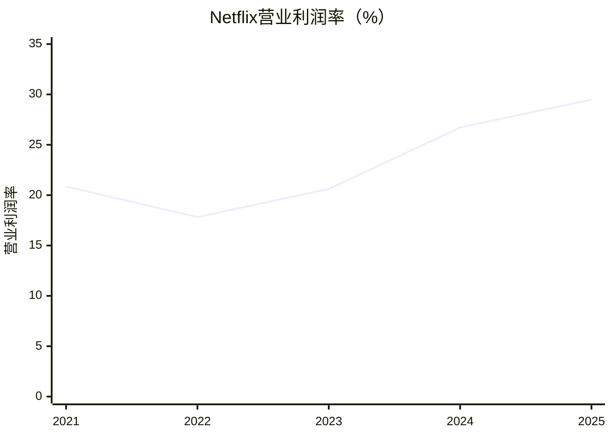

# Netflix（NFLX）研究报告

> 研究日期：2026-09-13（纽约时间）；财务截止2026年第二季度。  
> 参考股价：77.40美元，2026-09-11收盘；市值约3,222.89亿美元。每股数据统一为2025年十拆一后的口径。  
> 常态化2026年估计市盈率约25.8倍。核心判断：全球内容分发规模优势真实，但目前价格仍要求较长时间的良好执行。

行情来自[StockAnalysis](https://stockanalysis.com/stocks/nflx/statistics/)，并与[Investing历史行情](https://ca.investing.com/equities/netflix%2C-inc.-historical-data)核对；ChartExchange的15:59:57末笔报价77.39美元与正式收盘口径略有差异。

## AI研究偏见自觉

信息丰富度评级：A级。Netflix是信息密集、市场共识成熟的公司。资料丰富使财务容易核验，却不代表内容命中率、提价空间和十年利润可以精确预测。

- [x] 将利润率改善与内容业务固有的不确定性分别讨论。
- [x] 检查“流媒体赢家”是否被误当成“所有娱乐时间的赢家”。
- [x] 剔除一次性交易收益，避免便宜估值的错觉。
- [x] 不把停止披露会员数、降低观看数据披露频率直接等同于经营恶化。

AI研究局限：无法取得内部留存率、广告填充率、逐部内容投资回报；常态盈利、长期增速和价格区间是研究假设，不是公司承诺。本报告采用investment-research框架，并结合investment-memo-craft的经营与估值写作规范。

---

## 第一步：核心数据总览

下表单位均为十亿美元。FCF为经营现金流减物业设备资本开支，已经包含内容现金支付。

| 财年 | 收入 | 净利润 | 毛利率 | 营业利润率 | FCF | 现金及短投 |
|---|---:|---:|---:|---:|---:|---:|
| 2021年 | 29.698 | 5.116 | 41.64% | 20.86% | -0.132 | 6.028 |
| 2022年 | 31.616 | 4.492 | 39.37% | 17.82% | 1.619 | 6.058 |
| 2023年 | 33.723 | 5.408 | 41.54% | 20.62% | 6.926 | 7.138 |
| 2024年 | 39.001 | 8.712 | 46.06% | 26.71% | 6.922 | 9.584 |
| 2025年 | 45.183 | 10.981 | 48.49% | 29.49% | 9.461 | 9.062 |

来源：[2025年10-K](https://www.sec.gov/Archives/edgar/data/1065280/000106528026000034/nflx-20251231.htm)、[StockAnalysis财务汇总](https://stockanalysis.com/stocks/nflx/financials/)、[现金流表](https://stockanalysis.com/stocks/nflx/financials/cash-flow-statement/)。早期年度以历史年报与第三方序列交叉核对。2023年罢工影响制作支付时点，因此不能把当年的现金改善全部理解为永久效率提高。

地区收入如下，单位十亿美元；这是地域披露，并非各自独立经营分部的利润表。

| 地区 | 2025全年 | 2025Q3 | 2025Q4 | 2026Q1 | 2026Q2 |
|---|---:|---:|---:|---:|---:|
| 美加UCAN | 19.957 | 5.072 | 5.339 | 5.245 | 5.432 |
| 欧洲中东非洲EMEA | 14.515 | 3.699 | 3.873 | 3.998 | 4.034 |
| 拉美LATAM | 5.358 | 1.371 | 1.418 | 1.497 | 1.584 |
| 亚太APAC | 5.354 | 1.369 | 1.421 | 1.509 | 1.510 |
| 总收入 | 45.183 | 11.510 | 12.051 | 12.250 | 12.560 |

地区收入因四舍五入可能与合计略有差异。公司没有提供可比的地区毛利率，不作推算。来源：[Q2股东信地区表](https://s22.q4cdn.com/959853165/files/doc_financials/2026/q2/FINAL-Q2-26-Shareholder-Letter.pdf)及[StockAnalysis地区序列](https://stockanalysis.com/stocks/nflx/financials/)。

最新季度收入增长13.4%，营业利润率33.4%。全年收入指引510亿—514亿美元、营业利润率31.5%，广告目标约30亿美元。上述都是已实现季度数据或管理层指引，不能混作全年实绩。[Q2股东信](https://s22.q4cdn.com/959853165/files/doc_financials/2026/q2/FINAL-Q2-26-Shareholder-Letter.pdf)

资产负债表截至六月底：现金及等价物90.992亿美元，短期投资0.287亿美元，有息债务账面值143.093亿美元，净债务51.814亿美元。StockAnalysis含租赁等口径总债务166.55亿美元，因此其企业价值更高；本报告用不含租赁的净债口径计算EV。期末普通股41.6394亿股用于市值；季度摊薄加权股本不能代替期末股本。[Q2 10-Q](https://www.sec.gov/Archives/edgar/data/1065280/000106528026000212/nflx-20260630.htm)、[第三方资产负债表](https://stockanalysis.com/stocks/nflx/financials/balance-sheet/)

> 段永平式追问：现金持续增加，是用户持续付钱的结果，还是一次性收益和付款时点的结果？

---

## 第二步：生意本质分析

**Netflix先为内容承担风险，再把同一套内容分发给全球家庭，按月收取娱乐预算，并向广告主出售一部分观看机会。**

| 环节 | 收入和利润如何形成 | 应当观察什么 |
|---|---|---|
| 订阅 | 付费家庭数量、价格与套餐组合共同决定收入 | 提价后留存及新增是否抵消流失 |
| 广告 | 广告档观看时间、广告量、填充率和单价共同决定收入 | 广告收入能否补偿低价套餐让出的订阅费 |
| 内容 | 大量成本先发生，同一作品跨市场传播可摊薄成本 | 内容现金支出与收入、摊销的关系 |
| 技术 | 推荐、搜索和传输减少找片与播放摩擦 | 对留存、发现效率和广告转化的实际提升 |
| 利润 | 收入增长快于内容及组织成本时，营业利润率上升 | 改善是否仍依赖一次性提价或内容延后 |

它比单一影视制片厂更好：每个月组合出售整个片库，个别作品失败不会让全部收入消失。它又比强锁定的软件订阅更脆弱：用户取消很容易，可以等下一部热门剧再回来。

真正关键的变量只有三个：内容单位投入带来的留存、家庭愿意支付的价格、广告增量收益扣除额外成本后的净贡献。广告与订阅是同一个用户池上的两种变现方式，不能把两者的增长空间毫无约束地相加。

技术发展支出2026Q2约10.08亿美元，费用已计入营业利润；这是产品、工程等综合口径，不能全部称为AI研发。推荐系统和Open Connect有运营价值，但没有证据支持“竞争对手几年也追不上”的精确技术领先年限。[Q2 10-Q](https://www.sec.gov/Archives/edgar/data/1065280/000106528026000212/nflx-20260630.htm)

> 段永平式追问：如果今年没有一部现象级爆款，用户仍愿意为整套服务付钱吗？

---

## 第三步：护城河评估

| 来源 | 判断 | 可证伪条件 |
|---|---|---|
| 全球规模 | 强；内容跨地区摊薄、全球发行效率高 | 内容投入增速长期超过收入，且留存无改善 |
| 品牌与定价权 | 中强；消费者容易把它列为默认娱乐选择 | 连续提价导致收入增速与参与度同步下降 |
| 转换成本 | 弱；取消订阅无需搬迁工作流或数据 | 这是结构性短板，不应美化成强锁定 |
| 网络效应 | 有间接反馈，但弱于社交和交易平台 | 更多用户不必然直接改善单个用户体验 |
| 技术 | 有用，但独立壁垒有限 | 推荐和生成工具普及，竞争对手缩小差距 |
| 内容IP与组织 | 中强；组合能力比单个爆款更重要 | IP老化、人才成本上涨、新作品回报下滑 |

过去几年护城河总体变宽，核心证据是扩张同时能改善营业利润率并形成现金。未来仍可能保持领先，但这条护城河需要持续制作和采购内容来维护，不能停止投入后照收租金。

最危险的替代未必是另一个长视频订阅平台。YouTube和短视频既争夺观看时间，也可能培养新一代内容消费习惯；Netflix若追随更多低门槛内容，可能扩大时长，也可能弱化付费品牌定位。

> 巴菲特式追问：十年后用户首先打开Netflix，是因为习惯与价值，还是只因为眼下这一批作品？

---

## 第四步：逆向思考与风险清单

最强空头论点是：Netflix已赢得付费长视频竞争，却可能进入靠提价维持收入的阶段。当前估值要求的利润增长，比缓慢的观看增长更强；用户没有被锁住，而外部投资者验证用户变化的窗口正在缩小。

H1观看时长同比仅增2%，观看报告将改为年度披露。它们值得跟踪，但不能直接证明付费会员下降：套餐组合、广告效率、提价和内容价值都可能使收入快于时长增长。[Q2股东信](https://s22.q4cdn.com/959853165/files/doc_financials/2026/q2/FINAL-Q2-26-Shareholder-Letter.pdf)

下列概率为定性研究判断，不是统计频率，风险会互相重叠。

| 失败路径 | 可能性 | 影响 | 预警指标 |
|---|---|---|---|
| 提价透支留存 | 中 | 增长、估值一起下降 | 恒定汇率收入持续减速，促销增加 |
| 内容与体育版权成本失控 | 中 | 利润率和现金受压 | 现金内容支出持续快于收入 |
| 广告低于预期 | 中 | 第二增长来源弱化 | 广告目标下修、低价套餐替代高价套餐 |
| 注意力向免费内容迁移 | 中 | 长期护城河变窄 | 外部观看份额、年轻用户参与度恶化 |
| 激进并购或高价回购 | 中低 | 每股价值受损 | 大额举债、回购价格脱离常态现金价值 |
| 监管封禁、重大数据或版权事件 | 低但不可忽略 | 局部到严重 | 市场退出、诉讼或监管升级 |

历史类比是付费有线电视：捆绑内容曾具定价能力，但分发技术和用户习惯变化可削弱它。Netflix拥有全球互联网分发优势，与有线电视并不相同；这个类比提醒我们，分发领先不能保证娱乐预算份额永续不变。

最可能的分析错误：把过去利润率扩张外推太久，同时低估成熟期内容再投资。反过来，过度悲观也可能错过广告提高单用户收益，而无需同比例增加内容成本的机会。

> 芒格式追问：如果这笔投资五年后令人失望，最可能是公司失败，还是我为正常增长支付了过高价格？

---

## 第五步：管理层评估

Ted Sarandos与Greg Peters任联席CEO，分别带来内容与产品运营经验。Hastings不再参加2026年董事改选，因此不能沿用“创始人继续主导董事会”的旧叙事。[管理层资料](https://ir.netflix.net/governance/Leadership-and-directors/default.aspx)、[2026 Proxy](https://www.sec.gov/Archives/edgar/data/1065280/000119312526159286/d20613ddef14a.htm)

| 决策 | 评价 | 尚待验证 |
|---|---|---|
| 付费共享与广告套餐 | 体现调整商业模式的能力 | 初期红利结束后的自然增长 |
| 全球内容与本地制作 | 有利于分散作品风险 | 国际内容回报及成本纪律 |
| 2026年拒绝提高WBD报价 | 正面；愿意放弃不再划算的交易 | 未来是否保持同样纪律 |
| 恢复大额回购 | 可提高每股价值 | 买入价格是否低于内在价值 |
| 减少用户相关披露 | 投资者可验证性下降 | 财务兑现能否持续弥补信息缺口 |

公司明确表示匹配对手报价已缺乏财务吸引力。[退出公告](https://ir.netflix.net/investor-news-and-events/financial-releases/press-release-details/2026/Netflix-Declines-to-Raise-Offer-for-Warner-Bros-/) 退出交易收到的解约金是额外收益，不应成为经营能力评分的主体。

2026 Proxy的董事高管受益持股合计1.24%，含规定范围内期权等；行情网站insider ownership为0.58%，两者时点与定义不同，不能宣称交叉验证一致。Sarandos与Peters的2025年总薪酬各约五千多万美元，含股权奖励；股东应关注稀释与业绩考核，不能只看回购总额。Proxy是持股和薪酬原始依据，未取得完全同口径的独立二次确认。[2026 Proxy](https://www.sec.gov/Archives/edgar/data/1065280/000119312526159286/d20613ddef14a.htm)、[StockAnalysis](https://stockanalysis.com/stocks/nflx/statistics/)

管理评价：经营执行较强，资本纪律有正面证据；利益绑定存在但不是创始人控股式绑定。继任风险已部分转化为组织能力问题，仍需看内容与技术团队能否共同维持投入回报。

> 段永平式追问：如果换一任CEO，这套内容筛选、定价和资本配置系统还能运转吗？

---

## 第六步：行业与文明趋势

从线性电视转向按需观看，是长期趋势，但最重要的迁移已经发生了一大部分。Nielsen最新公布的2026年7月数据中，流媒体占美国电视观看49.0%，YouTube占14.2%。这些是美国电视端统计，不能当作全球所有设备市场份额。[Nielsen](https://www.nielsen.com/news-center/2026/tv-usage-kicks-usual-summer-slowdown-fueled-by-world-cup-and-streaming-in-nielsens-july-gauge-reports/)

TAM应理解为家庭娱乐预算、视频广告预算和可获得的观看时间，而不是把电影、游戏、体育、广告市场总额全部相加。低收入市场用户很多，却未必能复制美加的付费水平。没有可靠依据把全部娱乐开支变成Netflix可占有收入，本报告不提供伪精确的全球TAM数值。

AI可能降低制作、翻译和发现成本，也可能让免费内容供给爆炸。因此AI降本是机会，不是Netflix独享的稀缺资源。利润最终属于能聚合观众、组织优质供给并控制获客成本的平台。

消费者分散降低单个客户风险，但体育联盟、明星、创作团队和重要版权会拥有议价权。未来价值捕获取决于平台分发优势是否大于上游稀缺内容的议价能力。

> 李录式追问：娱乐数字化必然持续，但新增价值由平台、创作者、广告主还是消费者拿走？

---

## 第七步：估值与安全边际

### 先清理一次性收益

2026Q1收到华纳交易终止费28亿美元，记在利息及其他收入，也进入经营现金流。全年FCF指引125亿美元因此不能直接作为永久现金能力；公司Q1称从110亿美元上调主要与终止费税后影响有关，但上调差额不等于完整税后收益。[Q1股东信](https://s22.q4cdn.com/959853165/files/doc_financials/2026/q1/FINAL-Q1-26-Shareholder-Letter.pdf)

本报告采用以下明确标为估计的口径：

1. 常态2026年EPS：收入中点512亿美元×营业利润率31.5%，减去净非经营费用假设6亿美元，再按18%税率、42.6亿摊薄股计算，约2.99美元，取3.00美元作为模型起点。
2. 常态FCF：采用103亿美元研究中值，并用100亿—110亿美元观察范围。没有声称精确还原终止费税款、巴西往期税项和支付时点。
3. 常态TTM EPS：从披露3.17美元中扣除28亿美元×假设税后81%÷43亿股，约2.64美元。此为粗调整；不包含所有融资和税项细节。

| 指标 | 本报告口径 | 含义 |
|---|---:|---|
| TTM披露EPS市盈率 | 24.42倍 | 受一次性收入压低；供应商24.38倍差异来自未舍入EPS |
| 常态TTM估计市盈率 | 29.29倍 | 去除终止费的近似值 |
| 2026常态估计市盈率 | 25.80倍 | 77.40÷3.00 |
| TTM市销率 | 6.66倍 | 使用收入483.71亿美元 |
| 常态FCF收益率 | 3.20% | 使用103亿美元现金流中值 |
| 不含租赁EV/TTM收入 | 6.77倍 | 市值加净有息债务 |

PEG不作为定价依据：供应商披露1.05，但增长期限与盈利调整口径不透明，难以复核经济含义。

历史比较：[Macrotrends](https://www.macrotrends.net/stocks/charts/NFLX/netflix/pe-ratio)列2024年末PE45.02倍、2025年末37.06倍。当前确实低于这些时点，但过去高估值不是今天的安全边际。

同日供应商前瞻PE：Netflix22.34倍、Disney14.19倍、Alphabet25.37倍。这只是统一来源的市场快照，未完成竞争对手盈利逐项正常化；Disney含乐园，Alphabet含搜索与云，都不是纯流媒体可比公司，不据此决定Netflix终值。[NFLX](https://stockanalysis.com/stocks/nflx/statistics/)、[DIS](https://stockanalysis.com/stocks/dis/statistics/)、[GOOGL](https://stockanalysis.com/stocks/googl/statistics/)

### 三年股价情景

从常态EPS3美元出发，三年后约为2029年。EPS增速已包含潜在净回购效果，不另加回购收益；假设没有现金股息。下表是市场可能给出的退出价格，不是今日内在价值。

| 情景 | EPS年增速 | 三年后PE假设 | 三年后股价 | 股价年化回报 |
|---|---:|---:|---:|---:|
| 悲观 | +6% | 18倍 | 64.31美元 | -5.99% |
| 基准 | +14% | 25倍 | 111.12美元 | +12.81% |
| 乐观 | +20% | 30倍 | 155.52美元 | +26.19% |

悲观假设提价和广告放缓；基准假设收入继续增长、利润率温和改善；乐观需要广告与经营杠杆均持续兑现。三个倍数是三年后的市场定价假设，不冒充永续模型推导值。

### 十年股东价值折现

独立采用股东可分配盈利模型，不与上面的市场倍数法混合：期初常态EPS3美元，预测每年可分配70%，其余留作增长投入；十年后按永续模型退出。股本在该模型中保持不变，可分配现金代表股东可取走的价值，并不预测公司会支付现金股息。若用于回购，就不能再给EPS附加回购增速。股权激励成本保留在利润中，未来净稀释按零处理，是限制之一。

美元资本成本主用10%，可理解为长期正常化无风险收益率假设4%加股权风险补偿6%、模型β取1；不是声称最新国债利率为4%，也未使用行情波动β。敏感性采用9.5%和11%。稳态增量ROIC取20%：承认规模效益，但低于现有高回报的延续假设。基准永续增速3%，上下档2%和4%，均是十年之后的名义美元增长。

终值PE = (1−g/ROIC)/(r−g)。主口径三档分别11.25、12.14和13.33倍，分母宽度分别8、7、6个百分点。其含义是成熟期增长需要留存一部分盈利，剩余部分才可分配；没有借用同业现价论证终值。

| 十年情景 | 经营盈利年增速假设 | 永续增速 | r=9.5%的现值 | r=10%的现值 | r=11%的现值 |
|---|---:|---:|---:|---:|---:|
| 悲观 | +6% | +2% | 43.66美元 | 40.53美元 | 35.36美元 |
| 基准 | +12% | +3% | 72.99美元 | 66.84美元 | 56.94美元 |
| 乐观 | +18% | +4% | 124.57美元 | 112.24美元 | 93.05美元 |

敏感性分母：9.5%档为7.5、6.5、5.5个百分点；11%档为9、8、7个百分点，均满足最少5个百分点约束。三种增长情景的排序不变；绝对价值明显受折现率影响。基准下现价在各折现率档都高于模型现值，因此“不适合重仓”的判断相对稳定。

这个模型仍给了增长期较高效率：留存30%却增长12%，隐含增长期增量回报约40%；乐观18%增长更需要约60%。这不是已验证的长期ROIC，是广告规模化和内容复用成功的假设。不能一面声称模型保守，一面忽略这项要求。

反向折现：保持基准永续增速、资本成本及分配比例不变，77.40美元要求未来十年经营盈利年增约13.94%。这比短期一两季做到类似增速更难，市场已经支付了相当部分长期成功的价格。

**我的实用估值锚约60—75美元，基准点约67美元；55美元附近及以下才有更明显的安全边际。**宽幅悲观与乐观现值反映内容生意的不确定性，不能把模型中点当成精确真值。

> 巴菲特式追问：未来十年增长略慢、成熟期估值正常化后，我仍能得到满意回报吗？
>
> 段永平式追问：如果市场关闭五年，我愿意买这门生意，但是否愿意按今天的价格买到满仓？

---

## 第八步：最终决策与行动清单

**结论：好生意，当前观望优于积极加仓；已有合理仓位可继续持有，不把77美元附近视为重仓机会。**

| 维度 | 结论 | 信心 |
|---|---|---|
| 生意质量 | 可重复收款、全球分发，仍需持续内容投入 | 较高 |
| 护城河 | 规模强、锁定弱，整体较强 | 中高 |
| 管理层 | 执行与退出并购纪律值得认可 | 中高 |
| 最大风险 | 提价透支参与度，内容再投资高于预期 | 中 |
| 行业趋势 | 长期有利，但免费平台同样受益 | 中高 |
| 价格 | 基准增长已有较充分定价 | 中 |

| 情况/价格 | 行动 |
|---|---|
| 空仓、当前约77美元 | 以观望为主；愿接受增长不确定性的投资者只考虑小额起步 |
| 65—75美元 | 接近合理区间，适合耐心跟踪，安全边际有限 |
| 55—65美元 | 若常态利润与竞争格局未恶化，可分批建仓 |
| 55美元以下 | 更值得积极评估加仓；先排查下跌是否由基本面恶化引起 |
| 已持有且仓位合理 | 持有，观察常态现金与价格兑现；无需因模型中值低于现价机械卖出 |
| 超过100美元、盈利前景未上修 | 停止加仓；集中度较高者考虑减仓 |
| 生意逻辑破坏 | 不等目标价：重新估值并考虑退出 |

加仓验证信号：常态FCF兑现、广告收入成长且利润率不受损、提价后收入和参与度仍健康。卖出或重审信号：连续多个季度恒定汇率增长显著走弱，同时内容现金支出持续跑赢收入；或为追赶增长付出明显不经济的并购价格。这里的组合信号比单季爆款、单月观看份额更有解释力。

本次比工作区7月Checklist更审慎，原因不只是股价从70.40升到77.40美元；更重要的是十年终值采用永续模型、显式保留再投资要求。两份报告不是完全相同模型，不能把建议变化全归因于基本面恶化。另校正旧报告措辞：91.28亿美元是现金加短投，纯现金等价物应为90.99亿美元。

以下为方法论模拟提问，不是真实引语或四位投资者的持仓表态：

> 巴菲特视角：规模优势成立，买价还需要留下犯错空间。
>
> 芒格视角：最危险的是把一家优秀公司的正常增长当成高速增长的永续年金。
>
> 段永平视角：看懂赚钱方式以后，还要看懂维持它每年需要花多少钱。
>
> 李录视角：长期顺风重要，但必须证明企业能把行业进步转成股东现金。

## AI分析置信度与投资确定性

财务历史、拆股、交易终止费和资产负债口径有充分公开证据，置信度较高；广告长期利润率、留存、内容回报和终值ROIC是有限信息下的判断，置信度中等。实际投资确定性低于资料完整度所带来的直觉，尤其不能把A级信息评级理解为A级收益保证。

限制：没有完全同口径的管理层持股第二来源；季度地区毛利率未披露；监管封禁、极端版权事件等离散风险未单列概率加权尾部估值。FCF正常化是范围估计。DCF假设长期净稀释为零、均匀年度现金分配；没有逐季现金税或具体未来回购价格模型。未针对用户实际成本、仓位、税务与资金期限优化交易。

## 数据来源与审计记录

以SEC原始报表优先，第三方作交叉验证。日期混用、租赁债务和受益持股定义差异均显式说明，不把不同口径强行报为一致。

程序核验输出摘要：市值验算通过，计算市值322.29B USD；2025收入、净利、六月现金加短投、总股本及行情多源差异均低于1%。TTM PE按舍入EPS重算24.42倍；十年模型C1/C2/C3检查通过，但保留“监管封禁未建模”警告。工具内置利率基准是静态参数，并非实时市场数据；本报告不把工具中的默认国别溢价应用于Netflix。数学检查不能替代对假设的判断。

完整原始输出见[计算核验记录](C:/Users/Liang/Documents/AI-berkshire/Netflix研究核验记录-20260913.txt)，模型参数和精确结果见[计算JSON](C:/Users/Liang/Documents/AI-berkshire/Netflix研究计算-20260913.json)。[报告抽检记录](C:/Users/Liang/Documents/AI-berkshire/Netflix报告抽检-20260913.txt)区分外部事实、转录复核及模型假设。固定种子抽取十项，其中一项为时间字符串误识别、两项为模型假设；另补四项年度事实核对。数值偏差检查通过，但三项季度地区数据只有同发行人的不同文件确认，独立第二来源仍有缺口。因此本报告是带明确数据限制的研究判断，不宣称已满足所有双源准出要求。
