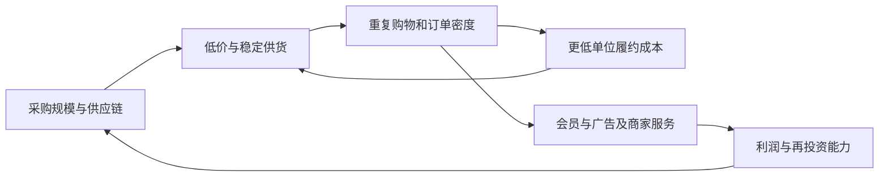

# 沃尔玛（WMT）研究报告

研究日期及信息截止：2026年9月10日（北京时间）；行情采用9月9日美东正常交易收盘；财务截至2026年7月31日。WMT目前在NASDAQ交易。金额除特别说明外为百万美元，每股金额为美元。

参考股价：105.83美元；按最新披露实际股本重算市值839,628百万美元；FY2027调整后EPS指引中值对应PE为37.33倍；TTM自由现金流收益率1.61%。

**研究主线：沃尔玛已经把低价零售的规模优势延伸到配送、会员与广告，但今天的价格要求利润和现金回报改善持续兑现，不能仅靠“生意稳健”来支持。**

本报告用于学习和研究。估值为明确假设下的计算结果，价格区间不代表必然到达，也不是针对个人财务状况的投资建议。

---

## AI研究偏见自觉

信息丰富度评级：A级。年度及季度披露充分，商业模式容易理解；真正难的是判断增长收益如何在顾客、员工、供应商和股东之间分配。

容易形成的共识是“杂货防御性＋电商高增长＋广告高利润＝应该长期享受高倍数”。反面检验应放在：自动化究竟减少了多少单位成本？降价是否吸收了广告赚来的利润？增长投入结束后，维持竞争力的资本开支会不会仍然很高？

- [x] 分开判断经营稳定性和当前买入回报。
- [x] 区分净销售与总收入、GAAP与调整后利润。
- [x] 用公司报表重建TTM，未直接照抄第三方衍生估值。
- [x] 对未来增长、投资回报和终值倍数明确标为假设。

局限：未进行实地门店调研、供应商访谈或广告主投放回报核验；公开资料未充分拆出广告、第三方平台、配送业务各自的净利润、维持性资本开支和新增资本回报。资料充分不等于这些关键变量已经确定。

## 第一步：核心数据总览

### 先看股东实际拥有的资产与收益

| 指标 | 数值 | 口径 |
|---|---:|---|
| 正常交易收盘价 | 105.83 | 2026-09-09，非盘后价格 |
| 实际发行股数 | 7,933,746,241 | 2026-08-26，最新10-Q封面 |
| 重算市值 | 839,628 | 最新披露股本乘参考价格 |
| TTM总收入 | 735,840 | FY2026＋FY2027上半年－FY2026上半年 |
| TTM营业利润 | 32,280 | GAAP，包含关税退款等影响 |
| TTM归母净利润 | 22,076 | 不含少数股东损益 |
| TTM经营现金流 | 42,923 | 合并口径 |
| TTM资本开支 | 29,414 | 购置物业及设备现金支出 |
| TTM自由现金流 | 13,509 | 经营现金流减资本开支 |
| 现金及等价物 | 11,529 | 2026-07-31 |
| 有息债务含融资租赁 | 57,243 | 经营租赁另列 |
| 净债务 | 45,714 | 上述有息债务减现金 |
| 经营租赁负债 | 16,512 | 未计入上行净债务 |
| 归母股东权益 | 98,238 | 不含少数股东权益 |
| 总资产 | 293,914 | 2026-07-31 |

行情由[StockAnalysis](https://stockanalysis.com/stocks/wmt/)与[FinanceCharts](https://www.financecharts.com/stocks/WMT/summary/price)交叉核验；实际股本及资产负债来自[最新10-Q](https://stock.walmart.com/sec-filings/all-sec-filings/content/0000104169-26-000154/wmt-20260731.htm)，现金、权益等与[独立资产负债表](https://stockanalysis.com/stocks/wmt/financials/balance-sheet/)对照。

计算市值时没有使用季度平均稀释股数。8月26日到9月9日间的实际回购可能改变股本，故这是“最新披露股本口径市值”，不是对每日实际股数的断言。

### 五年增长有没有变成现金

沃尔玛财年截至当年1月31日；例如FY2026对应2025年2月至2026年1月。自由现金流不扣收购款，不能视为完全可供普通股东分配的现金。

| 指标 | FY2022 | FY2023 | FY2024 | FY2025 | FY2026 |
|---|---:|---:|---:|---:|---:|
| 总收入 | 572,754 | 611,289 | 648,125 | 680,985 | 713,163 |
| GAAP营业利润 | 25,942 | 20,428 | 27,012 | 29,348 | 29,825 |
| 归母净利润 | 13,673 | 11,680 | 15,511 | 19,436 | 21,893 |
| 经营现金流 | 24,181 | 28,841 | 35,726 | 36,443 | 41,565 |
| 资本开支 | 13,106 | 16,857 | 20,606 | 23,783 | 26,642 |
| 自由现金流 | 11,075 | 11,984 | 15,120 | 12,660 | 14,923 |
| 现金及等价物 | 14,760 | 8,625 | 9,867 | 9,037 | 10,727 |
| 营业利润率／总收入 | 4.53% | 3.34% | 4.17% | 4.31% | 4.18% |

年度收入、归母利润及现金流经[StockAnalysis财务表](https://stockanalysis.com/stocks/wmt/financials/)、[现金流表](https://stockanalysis.com/stocks/wmt/financials/cash-flow-statement/)、[Macrotrends收入序列](https://www.macrotrends.net/stocks/charts/WMT/walmart/revenue)与公司年度披露交叉核验。最新三年主要依据[FY2026 10-K](https://stock.walmart.com/sec-filings/all-sec-filings/content/0000104169-26-000055/wmt-20260131.htm)，较早年度补查[FY2025 10-K](https://www.sec.gov/Archives/edgar/data/104169/000010416925000021/wmt-20250131.htm)。

这里最重要的不是收入连续增长，而是四年收入复合增长约5.63%，营业利润复合增长约3.55%，资本开支却复合增长约19.41%。FY2024以后自由现金流仍有波动。扩张和数字化投资可能创造价值，但尚不能把“高增长业务出现了”直接等同于“整个公司变成轻资产生意”。FY2023利润受异常费用影响，不能拿低基数增长率当作正常盈利趋势。

### 收入结构与利润来源

| FY2026分部 | 净销售 | 营业利润 | 营业利润率／净销售 | 主要经营作用 |
|---|---:|---:|---:|---|
| Walmart U.S. | 482,975 | 25,158 | 5.21% | 高频杂货与日用品建立客流，门店支持配送 |
| Walmart International | 130,423 | 5,103 | 3.91% | 多市场零售、电商与会员业务 |
| Sam’s Club U.S. | 93,015 | 2,442 | 2.63% | 精简商品组合、会员续费和规模采购 |

以上为分部利润，尚需扣集团及支持费用，不能直接作为合并营业利润；净销售合计706,413，集团总收入713,163，两者差额为会员及其他收入。分部毛利率口径分别约27.5%、21.4%、11.3%，但商品组合及费用归类不同，不能据此给各分部作简单好坏排名。来源：[FY2026 10-K经营分部](https://stock.walmart.com/sec-filings/all-sec-filings/content/0000104169-26-000055/wmt-20260131.htm)。

FY2026年末美国Walmart门店4,611家。门店既卖货，也承担存货前置、自提和配送功能；其价值取决于周边订单密度、库存准确度和履约成本，而不仅是土地或建筑的账面价值。国际业务包含中国山姆等业务，不能把“中国山姆”与“Sam’s Club U.S.”混为一个报告分部。

最近四季度分部净销售如下，特以十亿美元计，括号为公司公布的报告汇率同比；不使用舍入后的金额反算同比。

| 分部净销售，十亿美元 | FY26 Q3 | FY26 Q4 | FY27 Q1 | FY27 Q2 |
|---|---:|---:|---:|---:|
| Walmart U.S. | 120.7（+5.1%） | 129.2（+4.6%） | 117.2（+4.5%） | 125.2（+3.5%） |
| Walmart International | 33.5（+10.8%） | 35.9（+11.5%） | 35.1（+18.0%） | 35.2（+12.8%） |
| Sam’s Club U.S.含油 | 23.6（+3.1%） | 23.8（+2.9%） | 23.4（+6.1%） | 25.7（+8.8%） |

来源：[FY26 Q3](https://www.sec.gov/Archives/edgar/data/104169/000010416925000177/earningsreleasefy26q3.htm)、[FY26 Q4](https://stock.walmart.com/sec-filings/all-sec-filings/content/0000104169-26-000032/earningsreleasefy26q4.htm)、[FY27 Q1](https://stock.walmart.com/sec-filings/all-sec-filings/content/0000104169-26-000095/earningsreleasefy27q1.htm)、[FY27 Q2](https://stock.walmart.com/sec-filings/all-sec-filings/content/0000104169-26-000145/earningsreleasefy27q2.htm)。最新Q2三个分部毛利率分别29.4%、21.4%、11.4%，美国受退款影响明显；国际Q2恒汇率净销售增长7.9%，明显低于报告汇率增幅，不能将汇兑顺风视为经营加速。季度分部数据为官方一手披露，未全部完成独立第三方双源复核，置信度相应低于年度核心财务。

### 最新季度：增长质量比表面增速重要

最新Q2 FY2027收入187,937，全球电商增长23%，广告增长38%，会员费增长17%；美国Walmart同店销售增长2.6%。FY2027调整后EPS指引为2.80—2.87，资本开支指引由净销售约3.5%提高至约4%。[最新业绩发布](https://stock.walmart.com/sec-filings/all-sec-filings/content/0000104169-26-000145/earningsreleasefy27q2.htm)

两个关键拆分：

第一，Q2收到约29亿美元关税退款并冲减销售成本，公司同时把部分收益用于降价。它不是持续增长的利润来源；也不能简单从营业利润中扣掉全部退款就宣称得到了正常利润，因为季度内还有对应的价格投入和其他变化。[10-Q关税退款说明](https://stock.walmart.com/sec-filings/all-sec-filings/content/0000104169-26-000154/wmt-20260731.htm)

第二，同店增长放缓既包括需求信号，也包含药品价格因素。电商对美国同店增长贡献约510个基点，超过整体同店增幅，说明线上增长中包含渠道迁移；它不能全部视为新增消费。线下和线上共用门店资产，评估应看合计利润及现金，而不只看电商增速。[Q2经营指标](https://stock.walmart.com/sec-filings/all-sec-filings/content/0000104169-26-000145/earningsreleasefy27q2.htm)

按净销售恒汇率增长指引中点近似换算，4%资本开支约295亿美元；仅从3.5%提高至4%的增量约37亿美元。此为估算，未精确预测汇率、季节性与公司资本支出时点。

> 数据追问：利润增加中，有多少来自可重复的运营效率，又有多少来自退款、投资估值和税务项目？

---

## 第二步：生意本质分析

**沃尔玛用高频、低价的日常购物聚集订单，把采购和配送成本摊薄，再向希望接近这些顾客的品牌与商家收费。**

顾客付钱主要是为了商品、价格与方便；会员付费购买持续的便利与权益；品牌和第三方卖家为曝光、成交机会及履约服务付钱。日常消费反复发生，给后两种收入提供基础。

这个循环需要三个条件同时满足：顾客相信购物总成本低；履约密度增加带来的效率超过送货补贴；向商家收费不损害商品竞争力和消费者体验。任何一条失效，都可能出现收入增长却不创造增量价值。

利润最敏感的变量是商品与履约毛利、运营费用率，以及广告和会员业务的增量利润贡献。以FY2026收入作静态示意，利润率变化50个基点就对应约35.66亿美元营业利润；这只是灵敏度，不是预测。工资、医保、运输、损耗和折旧的小幅变化足以抵消部分新业务收益。

技术价值主要体现在库存预测、仓储自动化、路线密度、搜索推荐和广告归因。公司没有提供足够独立数据来可靠拆出“AI研发投入回报率”，所以本报告不编造单独研发占比或技术领先年限。技术本身也不是排他性护城河，必须通过成本和服务改善证明价值。

> 段永平式追问：这门生意好在顾客持续需要，而且规模能创造真实节省；但把节省交给顾客之后，股东还剩多少？

---

## 第三步：护城河评估

下列评分为研究判断，满分五分，不是统计结果。

| 来源 | 判断 | 可证伪指标 |
|---|---|---|
| 采购与物流规模 | 强，5/5；长期累积的门店、配送与采购协调难以一次复制 | 同业价格差缩小而Walmart利润率持续下降 |
| 低价品牌信任 | 较强，4/5；核心是价格可信，不是任意提价能力 | 同类购物篮失去价格竞争力、交易量持续减弱 |
| 客户转换成本 | 中低，2/5；顾客可以同时使用多家零售商 | 会员流失或配送体验下降迅速引发迁移 |
| 平台网络效应 | 中等，3/5；流量吸引卖家、品类反过来吸引顾客 | 商家增长不能改善选择、广告负担损害转化 |
| 技术及专利壁垒 | 中等，3/5；执行与数据积累强于单项技术排他性 | 对手以更低成本实现相同配送与购物体验 |

与五年前相比，门店支持电商的能力以及多种盈利来源增强，我判断渠道适应性有所提升。不过，综合利润率尚未出现与“平台化”叙事同等强度的持续跃升，因此不能给所有收入套上平台倍数。

Costco的少SKU和会员价值约束，对山姆形成持续压力；Amazon的搜索、广告、会员与配送能力，则对线上订单和商家预算形成竞争。Costco最新完整财年销售增长10.2%，Amazon最新季度广告增长26%，说明竞争者也在扩张，并非沃尔玛单方面收获行业红利。[Costco销售披露](https://investor.costco.com/news/news-details/2026/Costco-Wholesale-Corporation-Reports-August-Sales-Results/default.aspx)、[Amazon季度披露](https://ir.aboutamazon.com/news-release/news-release-details/2026/Amazon-com-Announces-Second-Quarter-Results/default.aspx)

> 巴菲特式追问：十年后成本与便利优势大概率仍在，但它能否支持今天支付的价格，是另一项需要计算的问题。

---

## 第四步：逆向思考与风险清单

最有力的看空论点是：投资者支付了接近成长平台的价格，却仍拥有一个需要大量存货、门店、员工和资本支出的零售集团。广告和会员增加的利润，有一部分要用来维持商品低价与配送竞争力。如果利润增长正常、倍数下降，企业经营成功与股东回报平庸可以同时发生。

以下为未来数年的主观风险判断，概率使用高／中／低等级，不假装有可测量的精确发生频率；各项可能重叠，不能加总。

| 失败路径 | 主观概率 | 影响 | 可观察信号 |
|---|---|---|---|
| 成长溢价回落 | 中高 | 估值压缩抵消盈利增长 | 业绩达标却无法维持高倍数，预期EPS增长下修 |
| 资本投入回报不及预期 | 中 | 现金持续被扩张消耗 | capex高位不降，FCF持续慢于利润 |
| 商品和配送竞争加剧 | 中 | 降价、补贴与工资侵蚀利润 | 订单增加但单位履约成本不改善 |
| 消费承压、商品结构转向低毛利 | 中 | 收入防御性优于盈利防御性 | 交易增长弱、可选消费疲软、费用率上行 |
| 关税及政策再次冲击 | 中 | 采购成本、价格和需求波动 | 退款消退后盈利缺乏后续支持 |
| 网络事故或国际政策突变 | 低至中、低置信度 | 个别业务重大损失或中断 | 服务中断、监管限制、数据合规处罚 |

历史类比只用于检验机制：传统零售商一旦失去低价或便利，庞大门店就可能由优势变成成本负担；但沃尔玛已建立线上履约能力，不能机械套用传统百货衰退结局。同样，不能只因具备广告业务，就把它类比为资本需求很低的互联网公司。

**我最可能犯的错误是过低估计广告与自动化改善的持久性，过早假设十年后利润增速降到成熟水平。** 相反，多头最容易犯的错误是把毛利改善全部留给股东，忽略持续降价、配送补贴和新增资本需求。

> 芒格式追问：如果未来公司一直增长、股价却十年不涨，今天这份看多理由是否依然说得通？

---

## 第五步：管理层评估

John Furner自2026年2月1日起担任集团CEO，前任Doug McMillon任内形成的转型成果不能全部归给新CEO。新管理层的判断重点是资本纪律、运营效率与组织协同，而不是一次季度超预期。[继任公告](https://corporate.walmart.com/news/2025/11/14/walmart-announces-john-furner-as-president-and-chief-executive-o0/press-center)、[管理层职责调整](https://corporate.walmart.com/news/2026/01/16/walmart-announces-leadership-changes)

| 决策 | 研究评价 | 后续检验 |
|---|---|---|
| 持续建设门店履约与供应链自动化 | 战略方向合理，避免线上线下各自为战 | 资本周转、每单成本与现金回报 |
| 收购VIZIO拓展广告触点 | 商业逻辑可以理解，不能仅以广告增速判定收购成功 | 扣整合成本后的新增利润与投入回报 |
| 山姆门店及数字化扩张 | 会员业务具备复购基础，但改造支出必须计入 | 新店成熟期、续费与投资回收 |
| 关税退款部分投入价格 | 有利于顾客信任与长期份额 | 是否形成持续客流，而非一次利润转移 |
| 高估值期间继续回购 | 需保留意见；回购本身不等于创造价值 | 买入价格相对内在价值、净股数变化 |

VIZIO最初公布的交易股权价值约23亿美元；山姆2025年披露的长期扩张计划包括改造现有门店，并扩大新店管线。这些是资本配置承诺，不是已兑现的回报。[VIZIO交易公告](https://corporate.walmart.com/news/2024/02/20/walmart-agrees-to-acquire-vizio-holding-corp-to-facilitate-accelerated-growth-of-walmart-connect-through-vizio-s-smartcast-operating-system)、[山姆战略计划](https://corporate.walmart.com/about/samsclub/news/2025/04/11/sams-club-unveils-ambitious-growth-strategy-at-2025-investment-community-meeting)

上半年回购披露约51亿美元、4,230万股，粗略平均价格约120.57美元，使用了四舍五入披露值。它高于参考价格，但短期跌价并不能证明回购错误；真正标准仍是长期现金流价值。当前本报告估值不支持以这类价格积极回购。

治理方面，2026代理声明披露Walton Enterprises受益所有权约44.11%，其中包含Walton Family Holdings Trust委托的投票权；不能再加上Trust的6.44%。这不等于Walton Enterprises直接拥有全部对应经济权益。家族的长期持有有利于战略延续，也削弱外部小股东影响董事会的能力。[正式代理声明](https://stock.walmart.com/sec-filings/all-sec-filings/content/0001193125-26-173673/wmt-20260423.htm)、[股东提案方对投票权的核验与异议](https://nlpc.org/proxy-solicitations/walmart-inc-annual-meeting-cumulative-voting-shareholder-proposal-2026/)

管理层综合判断：运营体系较强，资本配置需要持续观察。公司依赖制度、供应链和庞大团队，单一CEO离任不应摧毁生意；新增投资是否持续创造超过资本成本的回报，仍应由结果验证。

CEO持股方面，代理声明截至4月10日列示Furner受益所有权475,161股，其中包含132,850股在未来六十日内可取得的股份；它不等于当日已实有股票，也不是9月实时持仓。未完整核对后续Form 4，本报告不据此判断近期增减持方向。仅有股权激励不足以证明资本配置与小股东完全一致。

> 段永平式追问：如果这家公司完全属于我，我会以今天这个价格回购自己的股份，还是等待更高回报的用途？

---

## 第六步：行业与文明趋势

零售需求有长期重复性，但行业的总消费增长并不天然很高。沃尔玛的机会主要来自份额提升、交易数字化、会员渗透以及在既有商品交易上提供广告和商家服务，而不是凭空创造一个无限大的新市场。

全渠道趋势对沃尔玛有利，因为门店网络可以提供接近消费者的库存。AI和自动化也有降低操作成本的潜力；但当对手都能采用类似技术时，效率收益会通过价格竞争流向顾客。只有沃尔玛依靠订单密度、库存管理和组织执行保留的部分，才是可投资的超额收益。

| 竞争领域 | 价值归属问题 | 对沃尔玛的意义 |
|---|---|---|
| 低价杂货和日用品 | 节省由消费者还是零售商保留 | 份额与利润率之间需要平衡 |
| 即时配送和自提 | 订单密度能否覆盖额外履约支出 | 门店网络有优势，经济性仍需证明 |
| 会员 | 权益成本是否低于续费带来的长期收益 | 重复现金流强，但不能忽略免运成本 |
| 零售广告 | 商家新增投放是否有真实增量销量 | 需要投放ROI，而非只看广告收入 |
| 国际业务 | 本地竞争、汇率与少数股东如何分配利润 | 收入增长不完全等于归母价值增长 |

本次未找到口径一致、足以双源核验的最新全球杂货TAM或美国全渠道市占率，因此不使用精确市场份额或市场规模预测填充报告。供应商及顾客基础分散，单一顾客风险低；更集中的风险是美国消费环境、劳动力和物流成本。对特定供应商的精确采购占比未获充分披露。

> 李录式追问：二十年后更高效的零售体系大概率存在，但沃尔玛股东能够保留多少效率收益？

---

## 第七步：估值与安全边际

### 当前估值先统一口径

| 指标 | 重算值 | 解释 |
|---|---:|---|
| FY2026 GAAP PE | 38.77倍 | 105.83／2.73 |
| TTM稀释EPS PE | 38.34倍 | 105.83／2.76 |
| FY2027指引中值PE | 37.33倍 | 调整后EPS中值2.835 |
| TTM PS | 1.14倍 | 市值／735,840 |
| PB | 8.55倍 | 最新归母权益口径 |
| TTM FCF收益率 | 1.61% | 合并FCF／市值，非普通股东净派息率 |
| 年度指示股息率 | 0.94% | 已宣布年股息0.99／参考价格 |

FY2026归母净利润除以期初期末平均归母权益，ROE约22.97%；与某些网站的ROE口径不同。高ROE有利，但不能代替新增资本回报或现金回报。TTM营业利润率按总收入计算为4.39%。

历史比较使用[同一数据源的财年末估值快照](https://stockanalysis.com/stocks/wmt/financials/ratios/)：FY2022、FY2024、FY2026年末前瞻PE分别约21.06、24.21、41.65倍。这些采用当时分析师预期，与本报告公司指引中值不是完全相同分母，只用于观察估值扩张，不能宣称精确历史分位。当前已低于最近高倍数阶段，也仍高于较早阶段。

Costco当前网站前瞻PE约41.93倍，说明高质量零售确有高定价；但Costco的会员经济、财年和预测分母不同。Amazon还包含云业务，集团PE更不适合直接作WMT目标倍数。[Costco估值快照](https://stockanalysis.com/stocks/cost/financials/ratios/?p=quarterly)

### 三年市场定价情景

起点使用FY2027指引中值EPS 2.835，向前滚动三年，近似覆盖至FY2030盈利水平；不是对三个精确财年末交易价格的预测。EPS增长包含可能的净回购贡献，因此没有再额外加回购收益率。年一股息0.99，此后按对应EPS增速增长，含息年化采用逐年现金流IRR，税费未计。

| 情景 | EPS年增长假设 | 三年后PE假设 | 三年后EPS | 情景价格 | 价格变动 | 含息年化 |
|---|---:|---:|---:|---:|---:|---:|
| 悲观 | +5% | 25倍 | 3.282 | 82.05 | -22.47% | -7.06% |
| 基准 | +9% | 30倍 | 3.671 | 110.14 | +4.07% | +2.35% |
| 乐观 | +13% | 35倍 | 4.091 | 143.17 | +35.28% | +11.55% |

三种情景分别对应缓慢增长且溢价回落、盈利稳步提升但估值部分正常化、以及利润结构明显改善且市场继续支付成长溢价。25—35倍属于市场定价假设，均明显高于下文成熟终值模型；不能把这些情景价格当作内在价值证明。

即使基准经营路径达成，回报仍偏低，说明当前价对“经营改善”的要求并不宽松。这里没有可靠概率基础，故不提供看似精确的概率加权目标价。

### 十年现金流：独立于市场倍数的检验

以下为研究模型，不是公司指引。以2.835作为当前正常化年度每股盈利代理值，忽略财年与研究日之间的小幅时间差；这个起点尚未完全剔除关税退款的净影响，可能偏乐观。使用归母每股盈利构建股权现金流，不再扣一次净债务，也不把经营所需现金当作额外闲置现金加回。

模型分两段：前十年按假设增长；第十一年起进入稳态。前十年可分配比例＝1－增长率／新增资本回报假设。这里用经营增量回报近似股权增量回报，隐含资本结构稳定，是模型简化；杠杆、营运资金或资本结构改变时必须重估。可分配资金视为经济上可用于股息或回购的合计，不再另加实际股息或EPS回购增厚。

| 输入假设 | 悲观 | 基准 | 乐观 |
|---|---:|---:|---:|
| 前十年盈利年增长 | +4% | +8% | +12% |
| 前十年新增资本回报代理 | 15% | 20% | 25% |
| 前十年可分配比例 | 73.33% | 60% | 52% |
| 稳态新增资本回报 | 15% | 15% | 15% |
| 第十一年起永续增长g | +2% | +3% | +4% |
| 主口径股权折现率r | 10% | 10% | 10% |
| r－g | 8个百分点 | 7个百分点 | 6个百分点 |

r的依据：美国财政部9月9日十年期国债收益率4.83%，加研究者选择的股权风险溢价5.17个百分点，β取1，得到10%。风险溢价是判断值；没有把关税、数据事故等离散风险塞进β。美元g主档3%代表成熟阶段的名义长期增长，乐观4%已接近长期经济增速上界，不是把十年12%增长永久延伸。[美国财政部收益率](https://home.treasury.gov/resource-center/data-chart-center/interest-rates/TextView?field_tdr_date_value=2026&type=daily_treasury_yield_curve)

稳态15%的资本回报是对规模零售与服务组合的判断，非公司披露的增量ROIC。基准前十年20%已经假定新业务优于传统重资产投入；但不假设这类回报永远维持。TTM合并FCF约为归母净利的61.19%，与基准可分配比例接近，仅作合理性参照，二者因少数股东、租赁和营运资金口径不同而并非等价。

终值倍数严格由公式给出：PE＝(1－g／ROIC)／(r－g)。此处是第十年末对第十一年利润的前瞻倍数，故终值＝第十年盈利×(1＋g)×PE，避免漏掉一年增长。基准为(1－3%／15%)／(10%－3%)＝11.43倍。

| 十年模型结果，r为10% | 悲观 | 基准 | 乐观 |
|---|---:|---:|---:|
| 第十年每股盈利 | 4.20 | 6.12 | 8.81 |
| 稳态前瞻PE | 10.83倍 | 11.43倍 | 12.22倍 |
| 第十年末剩余业务价值／股 | 46.37 | 72.05 | 111.92 |
| 今日现金流折现价值／股 | 33.35 | 43.18 | 59.45 |
| 以105.83买入的经济现金流IRR | -4.31% | -0.78% | +3.16% |

上表IRR包括前十年全部模型可分配现金及终值，是股东经济现金流情景，并非公司承诺的分红回报。按季度披露的股息而非全部可分配现金计算会更低，但未分配资金如何使用不能忽略，因此不将“只算股息”的保守结果作为主结论。

这些低终值倍数并不意味着预测市场必然给沃尔玛十一倍PE，而是说明：当长期增长降至成熟水平，并要求约10%的美元回报时，不能依靠今天同行的高PE继续维持估值。该模型容易低估超额回报持续超过十年的公司，因此应把33—59美元视为本组保守至乐观现金流假设的价值区间，不能宣称市场一定会跌到这里。

### 折现率敏感性与反向DCF

g和经营假设不随r移动。

| 股权折现率 | 悲观价值 | 基准价值 | 乐观价值 |
|---|---:|---:|---:|
| 9.5% | 35.79 | 47.09 | 65.99 |
| 10% | 33.35 | 43.18 | 59.45 |
| 11% | 29.30 | 36.88 | 49.28 |

各档r－g均至少5.5个百分点，满足模型约束；所有折现率下均为乐观高于基准高于悲观，而且最高值仍低于参考价格，因此“不具备本模型要求的安全边际”具有一定稳定性。绝对价值数字则明显受折现率和超额增长年限影响。

反向DCF固定60%现金转化、稳态ROIC15%、g为3%、r为10%，求解支持105.83美元的前十年盈利增速约19.73%。这是联合条件下的隐含门槛，不是市场唯一的真实预期。维持该增长同时保留60%可分配现金，需要异常高的新增资本效率；另一种支持价格的路径是延长超额增长期、提高可分配率或接受更低回报要求。不能只修改其中一项而不交代其经济代价。

> 巴菲特式追问：盈利每年增长不错，但我是否在依赖下一位买家继续支付高倍数？
>
> 段永平式追问：如果五年不能卖出，仅靠生意产生的现金，今天这个价格是否让我舒服？本报告答案是否定的。

---

## 第八步：最终决策与行动清单

**结论：生意质量较高，当前参考价格缺乏安全边际。空仓者等待；持有者以仓位和机会成本复核，当前不宜仅因股价回落而加仓。**

| 维度 | 判断 | 信心 |
|---|---|---|
| 生意质量 | 日常需求重复，成本与便利优势明显 | 较高 |
| 护城河 | 规模和执行强，提价权与客户锁定有限 | 较高 |
| 管理层 | 运营体系成熟，新CEO资本配置待持续检验 | 中等 |
| 最大风险 | 支付过高倍数，同时低估持续资本需求 | 中高 |
| 行业趋势 | 数字化有利，收益需与消费者及对手分享 | 中等 |
| 当前估值 | 37倍指引PE对现金回报改善要求较高 | 较高；绝对内在价值信心较低 |

### 价格与行动

以下都是以本报告盈利及折现假设不变为前提，基本面受损时不能机械沿用。

| 价格区域／美元 | 空仓者 | 已持有者 |
|---|---|---|
| 高于85 | 等待，当前105.83处于此区间 | 不加仓；若原目标是约10%长期回报且仓位偏重，考虑逐步降低集中度 |
| 60—85 | 重新研究；市场倍数有所降低，但现金流安全边际仍不足 | 检验正常化利润和资本支出，不能自动补仓 |
| 45—60 | 只有在服务利润和资本效率证据明显改善时，才考虑小额分批 | 本模型偏乐观假设更重要，维持纪律 |
| 35—45 | 基本面完整时可考虑分批建立长期仓位 | 结合更新后的价值与组合集中度评估加仓 |
| 低于35 | 若并非经营结构恶化造成，可进入优先研究与配置区 | 先重新核查风险再决定，价格低本身不足以触发买入 |

35—45不是整个区间都有充分安全边际：43.18是主模型基准值，约35才较其留出约两成折让。70.88和85.05分别只是指引中值25倍、30倍的机械价格，不能因为“比现在便宜”就当成长期价值买点。

用户未提供持仓成本、税务和组合权重，所以不建议统一清仓比例。即使长期模型偏贵，稳定经营和持续高估值也使做空风险很高，本报告没有做空建议。

### 什么会改变判断

加仓或上调价值的信号：正常化盈利与FCF同步增长；资本开支增长降速且服务质量没有恶化；广告及会员新增利润有更透明证据；美国交易量保持健康且增长不主要依赖补贴；价格降到重新验证后的合理区间。

减仓或重审信号：连续多个季度调整后利润增长失速且无一次性解释；资本开支维持高位但FCF没有改善；退款消退后利润结构显著变弱；会员或商家经济性恶化；回购消耗现金却不能合理提升每股价值。

下一份财报重点核对：Q2退款及价格投入跨季度影响、全年资本开支兑现、同店交易与药品价格拖累的拆分、以及经营现金流是否能跟上盈利。本报告不安排自动监控。

以下为依据投资方法论的模拟提问，非四位投资者真实言论，也不代表他们持有或买卖WMT：

> 巴菲特视角：优秀企业也需要合理的买入价格。
>
> 芒格视角：最容易忽略的失败，是公司做得不错而投资回报很差。
>
> 段永平视角：先确认未来真正能拿走的现金，再判断便宜不便宜。
>
> 李录视角：行业效率提升不等于全部利润归属于这一家公司的股东。

## AI分析置信度与投资确定性

财务报表、股数和参考行情的置信度较高；正常化利润、服务业务增量回报和十年终值的置信度中等或偏低。沃尔玛需求与规模优势的持续性较高，但以105.83买入获得高回报的确定性明显低于企业继续经营成功的确定性。

重大网络事故和国际政策突变没有单独量化到现金流；关税和竞争冲击仅由悲观经营情景概括，未形成精确损失分布。模型没有单列Flipkart、PhonePe等资产未来出售或上市收益，亦未纳入一次性交易税费；这些均可能使结果与实际出现差异。

## 数据来源与审计记录

正式报表优先，独立来源用于交叉检查；同一公司公告与SEC镜像不算两个独立来源。详细核验见[财务源记录](sources/financial-source-check.md)。

已识别并处理的差异：StockAnalysis FY2023营业利润24,528与官方20,428不符；该网站TTM营业利润28,980与官方滚动重算32,280不符，故未采用其EV/EBIT。FY2023经营现金流采用正式年报28,841，早期业绩发布29,101已由正式年报核实替代。以上网站差异的成因未全部确定，不擅自称为公司财报错误。

工具计算留痕：[估值计算与校验输出](sources/valuation_tool_log.txt)、[模型参数及精确结果](sources/model_results.json)、[研究计算脚本](sources/wmt_model_20260910.py)。三年情景及市值调用financial_rigor；十年终值运行terminal_value约束检查，并使用Decimal逐期现金流重新计算DCF及IRR。工具自带IRR为近似口径，本报告主表采用逐期计算结果。

报告数据抽检已完成。固定随机种子抽取二十四项，逐项分类后，二项为日期／财年文字误识别，一项为明确模型假设；其余二十一项事实或计算核验均在允许误差内。其中九项完成独立双源对照，三项仍以官方披露或官方滚动重算为准，九项为计算复核。没有把假设或被误识别的年份冒充事实核验通过。[抽检原样分类](sources/audit_sample_classified.json)、[审计输出](sources/report_audit_log.txt)。

估值参数完成定稿后复检，美元币种、分母宽度和风险归属约束均通过。工具通过只表示所检数字和参数符合检查规则，不消除季度分部双源缺口，也不验证未来增长假设；本报告应保留上述研究限制，不标为全量数据双源审计完成。
