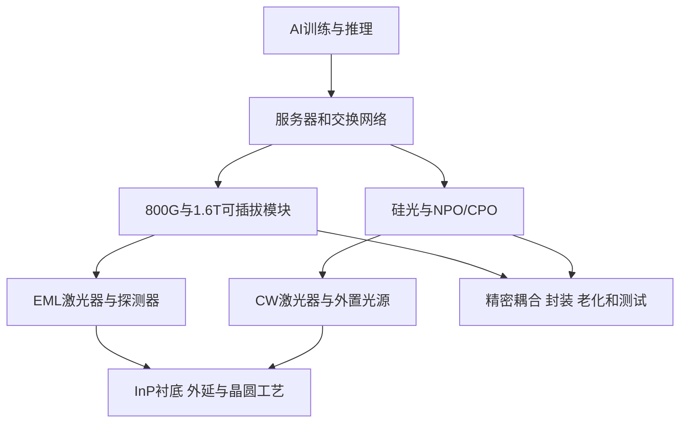

# 美股光模块产业链研究报告

**研究日期与数据截止：2026-10-08（亚洲/上海）。** 行情统一采用美东2026-10-07常规收盘，美国10月8日尚未开盘。财务为截至2026年6月的最近四季TTM，FN、COHR、LITE对应最新完整财年。美元为统一币种，各表注明单位。本报告仅供学习研究。

研究主线：AI带宽需求使合格激光器、InP材料和封装良率更重要，但扩产与技术迁移可能先压低价格，再压低利润。物理瓶颈与股票安全边际必须同时验证。

本次为此范围首次建图，无历史扫描可供比较。AXTI利润存在未解决来源差异，保留限制，不能视为全部数字已无保留通过发布审计。

---

## 第一步：超级趋势确认

趋势可追踪，永久短缺未被证明。

| 日期 | 已发生验证 | 意义及反证 |
|---|---|---|
| 2026-03-02 | NVIDIA分别宣布向Lumentum、Coherent投资20亿美元，附多年采购承诺及未来产能使用权 | 客户为供给付出真金白银；协议非独家，投资款不是产品收入 |
| 2026-06-16 | JX金属宣布未来四年追加最高1,200亿日元InP投资，连同既有计划将产能提高至2025年度7—10倍 | 需求强；新增供给会侵蚀未来稀缺租金 |
| 2026-07-29 | AXT与Lumentum签署截至2031年底的InP供货及产能预留协议，约定两笔各4,350万美元订金 | 上游材料也被锁产；第二笔条件仍待确定，订金须抵扣出货，不能直接计收入 |
| 2026-08-17 | FN公布FY2026收入增长约36% | 需求已传到制造环节；不证明服务涨价 |

来源：[NVIDIA/Lumentum](https://investor.nvidia.com/news/press-release-details/2026/NVIDIA-Announces-Strategic-Partnership-With-Lumentum-to-Develop-State-of-the-Art-Optics-Technology/default.aspx)、[NVIDIA/Coherent](https://nvidianews.nvidia.com/news/nvidia-and-coherent-announce-strategic-partnership-to-develop-optics-technology-to-scale-next-generation-data-center-architecture)、[JX金属](https://www.jx-nmm.com/newsrelease/2026/20260616_01.html)、[AXT锁产协议](https://investors.axt.com/Investors/news/news-details/2026/AXT-Inc--Announces-Long-Term-Supplier-Agreement-with-Lumentum/default.aspx)、[FN财报](https://investor.fabrinet.com/node/13666/pdf)。

规模门槛成立：Amazon截至2026年6月的TTM净设备购置约1,690亿美元，同比增加约64%，公司称增量主要反映AI投资；单家公司已超过技能的全球年度500亿美元门槛。但其中有非光通信建设，不能全部算成光模块TAM。[Amazon财报](https://ir.aboutamazon.com/news-release/news-release-details/2026/Amazon-com-Announces-Second-Quarter-Results/default.aspx)

独立行业验证更加克制：LightCounting四月预测2026年以太网光模块市场增长65%，当时需求超供给约30%，约束是InP EML和激光芯片；同时预计短缺可能于2026年底缓解，并提示重复下单消失后价格下降会加快。**这是四月预测，不是十月实测缺口。** [LightCounting四月预测](https://www.lightcounting.com/newsletter/en/april-2026-market-forecast-379)

3—5年光互连渗透方向有客户合同支持，但每年需求都快于扩产、公司每年持续高速增长没有得到证明。供需判断：历史短缺已确认，十月剩余缺口不确定；长期增长与短期短缺不可混为一谈。

---

## 第二步：物理链条与利润归属

| 环节 | 具体产品与美股 | 利润变量 |
|---|---|---|
| 模块 | 电光互转模块：AAOI、COHR；LITE也有模块业务 | 单价、产品组合、客户份额、良率 |
| 器件 | EML/CW激光器、探测器：LITE、COHR | 合格芯片产出、功率可靠性、ASP |
| 材料 | InP衬底：AXTI | 合格晶体、出口许可、认证、价格 |
| 制造 | 封装、集成、测试：FN | 可用产线、生产效率、迁移成本、营运资金 |
| 潜在新工艺 | 光学中介层及光引擎：POET | 量产收入、重复采购、成本及现金消耗 |

硅光改变调制与集成方式，仍需光源。它可能减少EML使用，却增加CW需求。所以“硅光消灭所有InP”与“所有InP企业同等受益”都不准确。LightCounting五月预测硅光模块2026年占比过半，InP激光器市场继续增长。[技术路线](https://www.lightcounting.com/newsletter/en/may-2026-silicon-photonics-lpolro-and-npocpo-377)

日本供给必须纳入反证：住友电工公布光器件及InP扩产，三菱电机公布EML扩产方向。它们不在本次美股范围，但会影响美股厂家的份额与ASP。[住友计划](https://sumitomoelectric.com/sites/default/files/2025-11/download_documents/Growth%20strategy%20for%20data%20center-related%20business_2025.pdf)、[三菱计划](https://www.mitsubishielectric.com/en/pr/2026/pdf/0529_co5.pdf)

SOI、外延设备、通用测试设备：本轮未找到足够两源证据证明其为当前出货咽喉，保留线索，不按物理位置更上游自动升级。MRVL、AVGO、GLW、CIEN为邻近产业链，本轮不将整家公司收入算成光模块瓶颈收入。

---

## 第三步：瓶颈地图

技能以六项评分、至少四红判S、三红判A。本轮“未知不计红”，**没有证据足够的S级瓶颈**。

| 环节 | 集中度 | 扩产周期 | 替代难度 | 利用率 | 需求增速 | 验证周期 | 当前评级 |
|---|---|---|---|---|---|---|---|
| 高速EML及合格InP激光芯片 | 多家日美厂商，未证明仅两家 | 扩线与新厂不同；跨年项目存在 | 黄：硅光/CW替代部分EML | 无可靠可比实测值 | 红：行业2026年预测+65%，非实测 | 无统一可靠数字 | B，A级候选 |
| CW及高功率外置光源 | LITE、COHR等；份额未知 | 新厂跨年 | 黄：架构可变，性能约束仍在 | 未知 | UHP高增长是厂家预测 | 未知 | 候选，不认证A/S |
| InP衬底 | AXTI、JX、住友等；份额未知 | 红：JX整体追加计划四年，不代表每台设备要四年 | 黄：多条路线仍需InP光源 | 未知 | 锁产支持需求，行业同比未知 | 未知 | B，A级候选 |
| 高复杂度封装测试 | 自制与其他制造商均存在 | 装线、扩厂和认证须区分 | 黄：可以转厂但需验证 | 未知 | FN公司增长不能当全行业增长 | 未知 | 能力壁垒有证据，缺货未确认 |
| 通用模块组装 | 竞争广泛 | 厂房落成不等于合格产能 | 可竞争、可换技术 | 未知 | 高速强于普通品类 | 未知 | 非统一瓶颈 |

评级为证据最低限度，不代表真实约束一定弱。升级须有交期、合格产能利用率及客户认证时间的两源验证，股价上涨不计验证。

解除窗口要分产品。Lumentum披露EML扩产，并规划英国UHP增量供应、新美国厂量产分别到2027年、2028年；均为管理层计划。不能把这些日期写成所有EML短缺必然延续至2028年。[Lumentum产能路线](https://www.lumentum.com/en/blog/backbone-ai-infrastructure-why-optical-components-will-define-next-era-data-centers)

---

## 第四步：公司筛选与估值

排名是研究顺序。六家公司当日成交额明显超过100万美元；只有AXTI、POET市值低于100亿美元，AAOI也已超过技能优先门槛。精确市场份额均缺少两源确认；纯瓶颈业务收入超过30%不能简单由宽泛“光通信”分类替代。

| 排名 | 公司/代码 | 收盘价 | 市值：亿美元 | TTM收入：亿美元 | TTM净利润：亿美元 | PS | PE | 收入同比 | 当前信号 |
|---|---|---:|---:|---:|---:|---:|---|---:|---|
| 1 | Fabrinet FN | 497.99 | 178.50 | 46.411 | 4.730 | 3.85x | 38.16x | +35.7% | ★★，相对便宜，现金兑现待验证 |
| 2 | Coherent COHR | 334.56 | 655.20 | 71.180 | 7.699，普通股口径 | 9.20x | 81.20x | +22.5% | ★★，技能TAM红灯及高PE |
| 3 | Lumentum LITE | 1,111.07 | 1,006.40 | 30.140 | -69.351 | 33.39x | 不适用，GAAP亏损 | +83.2% | ★★，估值红灯 |
| 4 | AXT AXTI | 79.79 | 51.20 | 1.255 | 0.0388，平台口径有差异 | 40.79x | 约1,320x，平台利润法 | +45.8% | ★★，红灯且利润低置信 |
| 5 | Applied Optoelectronics AAOI | 122.54 | 111.00 | 5.960 | -0.570 | 18.63x | 不适用，亏损 | +61.8% | ★★，盈利与稀释待验证 |
| 6 | POET Technologies POET | 7.42 | 12.80 | 0.01713 | -0.757 | 747.25x | 不适用，IFRS亏损 | +266.1% | ★，商业验证不足 |

行情及平台财务：[FN](https://stockanalysis.com/stocks/fn/)、[COHR](https://stockanalysis.com/stocks/cohr/)、[LITE](https://stockanalysis.com/stocks/lite/)、[AXTI](https://stockanalysis.com/stocks/axti/)、[AAOI](https://stockanalysis.com/stocks/aaoi/)、[POET](https://stockanalysis.com/stocks/poet/)。股价乘平台股数与其市值偏差均不足1%，是内部算术一致性，不是独立行情验证。

重要口径：

- 常规PE用股价/稀释EPS；市值按当前股数，EPS按期间加权稀释股数，FN市值/利润为37.74x，与38.16x不同。COHR还有优先股转换分子调整，其市值/普通股利润为85.10x，与EPS法81.20x不同。
- LITE GAAP亏损主要来自77.566亿美元非现金债务清偿损失。FY2026非GAAP利润7.823亿美元，市值倍数约128.65x。不能将一次性损失视为每年同额烧钱，也不能忽略转换的股权变化。[LITE财报](https://investor.lumentum.com/financial-news-releases/news-details/2026/Lumentum-Announces-Fourth-Quarter-and-Full-Fiscal-Year-2026-Results/default.aspx)
- AAOI用2025全年加2026上半年减2025上半年重建TTM约5.960亿美元；POET四季相加171.295万美元，均与平台差异不足1%。[AAOI年度](https://investors.ao-inc.com/node/16676)、[AAOI半年](https://appliedoptoelectronics.gcs-web.com/news-releases/news-release-details/applied-optoelectronics-reports-second-quarter-2026-results)、[POET四季数据](https://www.globenewswire.com/news-release/2026/08/13/3344383/0/en/poet-technologies-reports-second-quarter-2026-results-revenue-up-112-year-over-year-in-sixth-consecutive-quarter-of-sequential-growth.html)
- AXTI收入公告重建为88.326+74.513-37.330=125.509百万美元；利润公告归母重建为-21.260+9.508-(-15.806)=4.054百万美元，平台为3.88百万美元，相差约4.5%。相应市值/利润为约1,263x或1,320x。未查清后续重述及口径前，不认定高置信盈利预测。[AXTI年度](https://www.sec.gov/Archives/edgar/data/1051627/000143774926004731/ex_878149.htm)、[AXTI半年](https://www.sec.gov/Archives/edgar/data/1051627/000143774926025061/ex_974537.htm)、[平台财务](https://stockanalysis.com/stocks/axti/financials/)

### 必做估值门槛

LightCounting五月基准情景预计2031年光模块、AOC、NPO/CPO合计近800亿美元，光芯片约150亿美元，其中InP相关激光等约69亿美元。整机收入不能在每层重复相加。即便采用宽松800亿美元代理，COHR和LITE市值也超过其20%，按技能给予红灯；但两者含其他业务，须进一步分部估值，市值/TAM不是普适估值定律。[分层TAM](https://www.lightcounting.com/newsletter/en/may-2026-silicon-photonics-lpolro-and-npocpo-377)

| 公司 | 红黄绿灯判断 | 市值/五年乐观收入 | 限制与处理 |
|---|---|---:|---|
| FN | PS低于10x且增长，单项绿灯；未完整验证可触达外包TAM | 1.68x | 不给予全绿灯；FCF和TAM缺口令信号封顶★★ |
| COHR | PS单项绿灯；PE超过80x黄灯，TAM代理红灯 | 3.41x | 信号封顶★★ |
| LITE | PS超过30x且TTM增长不足100%红灯；TAM代理红灯 | 9.72x | 不能用超过100%的单季增速替代TTM；封顶★★ |
| AXTI | PS超过30x且TTM增长不足100%红灯；五年预测另触发红灯 | 10.99x | 材料TAM不能用整机替代；封顶★★ |
| AAOI | 亏损且PS超过15x黄灯 | 4.15x | 必须验证盈利路径，不以调整后利润替代GAAP |
| POET | 增长超过100%可豁免PS红线，仍有亏损黄灯；五年假设触发红灯 | 12.80x | 五年收入1亿美元是研究假设；规模收入不足，★ |

五年乐观收入分别采用后文乐观增长复利五年；POET单独假设1亿美元，不是公司预测。POET的PS超过盈利同行5倍以上，极小基数的高百分比增长尚不能解释溢价。COHR、AXTI从负利润或接近零基数恢复，历史PEG无稳定意义；仅作假设检验：COHR未来EPS若年增50%，PEG约1.62；AXTI若年增100%，约13.20，不能借此解除黄灯。

增发后60天翻倍条件：本轮未完整验证全部融资日与对应走势，不认定已触发也不视作通过。确认的最近七日事件为AAOI在10月5日完成6亿美元ATM，须更新股数；融资不自动满足翻倍条件。[AAOI融资](https://www.prnewswire.com/news-releases/applied-optoelectronics-announces-completion-of-previously-announced-at-the-market-offering-302897857.html)

---

## 第五步：公司机会摘要

### FN：优先研究利润能否变现金

生意是替客户做好复杂光学制造，以交付质量、效率及迁移成本挣钱，不必独占激光技术。反证是客户自制与其他承包商仍可竞争；全球封装份额、真正瓶颈收入占比和利用率未取得两源数字。

FY2026 GAAP利润约4.73亿美元，但经营现金流约2.567亿美元、资本开支约2.525亿美元，简单FCF仅约422万美元；季度毛利率约12%，同比略降。收入很好，现金兑现很弱。扩产及营运资金可能造成阶段影响，不能直接认定明年全部逆转。[FN年度财报](https://investor.fabrinet.com/node/13666/pdf)

1—3个月看现金流、库存及回款；3—12个月看新增产能回报。基准十年年化仅约7.3%。结论：优先深入研究，不支持无条件当前买入。

### COHR：路线覆盖广，价格已要求成功

NVIDIA协议是客户侧验证；9月21日发布PhotonLink并披露扩大6英寸InP及特种光纤制造。平台发布不等于已实现收入。[PhotonLink](https://ir.coherent.com/news-releases/news-release-details/coherent-launches-photonlinktm-integrated-optics-platform-ai)

FY2026收入71.18亿美元，最新季度GAAP毛利率38.5%。器件、模块及工业业务组合对单一技术迁移有缓冲，也降低纯正度。深入研究须同时查债务、优先股转换及分部利润，不能将全部收入当激光瓶颈。[COHR财报](https://ir.coherent.com/news-releases/news-release-details/coherent-corp-reports-fourth-quarter-and-full-year-fiscal-2026)

1—3个月看器件和模块利润贡献；3—12个月看新平台订单、合格产能。基准年化约5.1%，乐观14.8%。结论：第二研究优先级，当前买入信号被红灯封顶。

### LITE：激光器证据强，安全边际弱

FY2026器件约占收入三分之二，但包含多类产品，不能全部当AI EML/CW。NVIDIA合同验证比一般概念强；EML、CW、OCS与模块提供多方向增长。毛利提升仍可能来自组合与效率，不等于同型号普遍涨价。

1—3个月看利润率持续性，3—12个月看扩产与合格交付，2027—2028年看新产能与需求匹配。反证是EML被硅光分流、市场提前支付多年利润。市值超过1,000亿美元，PS约33.39x；十年增长28%、终局净利率30%的极乐观模型仅给约10.2%年化。结论：核心产业观察，当前缺乏足够安全边际。

### AXTI：锁产是真证据，低基数容易制造估值幻觉

材料产能预留协议强于“三强”标签；中国生产与出口许可会影响交付，日本大规模扩产影响价格。晶圆订单增长不等于可长期获得整机利润。

最新季度毛利率44.9%证明拐点，但TTM利润很小且有来源差异。1—3个月核验许可、出货、归母利润；3—12个月看新增合格供应及订金抵货。管理层资金运用还需分清扩产现金与投资资产。[AXTI季度公告](https://www.sec.gov/Archives/edgar/data/1051627/000143774926025061/ex_974537.htm)

十年收入增长30%、终局净利率25%仍只得约7.8%年化，低于10%。结论：真实上游机会，当前不通过安全边际门槛。

### AAOI：模块弹性强，供需租金未确认

TTM数据中心收入约52%，含不同代际，不能全当800G/1.6T。最新季度GAAP毛利率同比下降，仍亏损；调整后盈利不代表普通股已获得稳定回报。[AAOI财务结构](https://stockanalysis.com/stocks/aaoi/financials/)

ATM降低部分融资压力，也影响每股收益。六月现金与十月融资不得不扣消耗就相加成“当前现金”。盈利路径要验证高速产品兑现、GAAP毛利和费用率改善、现金流转正，至少连续两季确认再升级；没有依据保证具体盈利日期。1—3个月验证这些指标，3—12个月看扩产和客户集中。结论：观察，PS18.63x不能用“比龙头小”解释便宜。

### POET：可能改善封装，尚未掌握已验证的缺货租金

最近季度收入约57万美元，包含NRE和产品；季末现金及短期投资约7.963亿美元，主要来自融资，不能证明持续大量采购。IFRS亏损受认股权证公允价值影响，改善不能都归于量产。[POET季度公告](https://www.globenewswire.com/news-release/2026/08/13/3344383/0/en/poet-technologies-reports-second-quarter-2026-results-revenue-up-112-year-over-year-in-sixth-consecutive-quarter-of-sequential-growth.html)

1—3个月检验下半年量产计划是否转为规模收入；3—12个月看重复采购、客户集中及毛利。五年1亿美元、十年10亿美元收入只是宽松假设，不是已证实订单。结论：保留技术观察，不列明确投资机会。

---

## 第六步：十年25xPE退出检验

所有增长和终局净利率均为研究假设。起点TTM，终局市值=收入×净利率×25，年化=(终局市值/当前市值)^(1/10)-1。假设不分红、不新增净股数，不额外加当前现金、不单列终局净债；实际每股回报可能更低。十年复利维持高增长已很乐观。

| 公司 | 基准：收入CAGR/净利率 | 乐观：收入CAGR/净利率 | 基准年化 | 乐观年化 | 乐观终局收入：亿美元 |
|---|---|---|---:|---:|---:|
| FN | +12% / 10% | +18% / 11% | +7.3% | +14.1% | 242.91 |
| COHR | +15% / 15% | +22% / 20% | +5.1% | +14.8% | 519.94 |
| LITE | +20% / 25% | +28% / 30% | +1.5% | +10.2% | 355.83 |
| AXTI | +20% / 20% | +30% / 25% | -2.7% | +7.8% | 17.30 |
| AAOI | +25% / 12% | +35% / 18% | +4.1% | +17.1% | 119.83 |
| POET | 终局收入3亿美元 / 15% | 终局收入10亿美元 / 20% | -1.3% | +14.6% | 10.00 |

乐观终局可能要求超过已验证分部TAM的份额，应视为有利上限检验，不能当合理预测。只过乐观、不过基准，仍不足以证明安全边际。

反推十年年化10%：必需终局利润=当前市值×1.1^10/25；收入沿用乐观净利率。

| 公司 | 必需净利润：亿美元 | 必需收入：亿美元 | 当前收入倍数 | 判断 |
|---|---:|---:|---:|---|
| FN | 18.52 | 168.36 | 3.63x | 需增长与制造利润率持续、现金回报改善 |
| COHR | 67.98 | 339.88 | 4.78x | 扩张与利润率共同兑现 |
| LITE | 104.41 | 348.05 | 11.55x | 极高增长与利润率才能刚过门槛 |
| AXTI | 5.31 | 21.25 | 16.93x | 乐观情景仍不足10%，无模型安全边际 |
| AAOI | 11.52 | 63.98 | 10.74x | 需规模盈利，未扣未来稀释 |
| POET | 1.33 | 6.64 | 387.63x | 商业收入基数过小 |

下行敏感性：基准终局利润减半，年化FN约+0.1%、COHR约-1.9%、LITE约-5.3%、AXTI约-9.2%、AAOI约-2.8%、POET约-7.9%。这不等同于近期终端需求下降50%：后者还通过库存、固定成本、闲置产能放大冲击。

---

## 第七步：逆向验证与风险

| 失败路径 | 主观可能性（非统计概率） | 影响 | 观察信号 |
|---|---|---|---|
| 扩产解除短缺、重复下单回撤 | 中高 | ASP及毛利先承压 | 交期缩短、客户库存、同规格降价 |
| 硅光转移EML利润 | 中高 | 产品组合不同，受益不同 | CW/EML结构、200G/lane份额 |
| AI建设放缓或GPU交付制约采购 | 中 | 模块订单后移，材料产能闲置 | 实际开支、取消订单、库存应收 |
| 良率可靠性不达标 | 中 | 研发成果无法形成收入 | 返修报废、认证延期、费用率 |
| 稀释跑赢利润增长 | AAOI/POET较高 | 公司增长而每股回报落后 | 期末及完全稀释股数、每股FCF |
| AXTI许可或日本供给冲击 | 中 | 交付、ASP、份额承压 | 许可、区域出货、新合格产能 |

最可能分析错误：将客户为未来光源锁产误读为所有当前可插拔模块永久缺货，再把强劲单季增速延长十年。

本轮未完整检查管理层交易、关联交易与历史稀释，不授予治理高分。客户投资与融资是已验证行为，不等于完整资本配置评价。价格验证未取得统一同规格报价序列，不能将组合毛利上升当普遍涨价。

---

## 第八步：最终行动与观察价格

**当前没有通过全部门槛的高置信买入标的。** FN优先研究；COHR、LITE是产业核心观察；AXTI看上游供应。小市值、上游位置和真实短缺都不能覆盖价格。

| 标的 | 空仓者 | 已持有者 | 升级条件 |
|---|---|---|---|
| FN | 优先深入研究FCF与外包TAM | 看现金而非只看营收 | 回款、扩产回报明确，基准估值可接受 |
| COHR | 先做分部估值 | 看组合与每股利润 | 高毛利产能兑现、价格回报改善 |
| LITE | 等利润追上市值或回落 | 核验隐含增长 | PS红灯解除、合格交付和定价验证 |
| AXTI | 当前不通过估值 | 看许可与归母口径 | 两源利润一致、现金兑现、价格降低 |
| AAOI | 等连续两季盈利质量 | 看稀释与每股现金流 | GAAP盈利与高速产品贡献稳定 |
| POET | 技术观察 | 用量产和复购检验论文 | 规模产品收入而非NRE/融资 |

沿用基准、要求十年12%年化，机械反推研究参考价约FN 324美元、COHR 178美元、LITE 415美元、AXTI 19.5美元、AAOI 59美元、POET 2.09美元。不是目标价或自动买单价，亏损与小基数公司尤其依赖假设。FN当前约498美元虽相对便宜，仍需强于基准的经营证据解释。

持仓者重审论文的条件：合格出货与每股利润持续不达预期、短缺消失而估值仍按短缺定价、稀释吞掉增长。缺少仓位、成本、现金需求等信息，不给个性化卖出比例。

## AI研究偏见与数据审计

偏见控制：不把美股少数厂家当全球仅有供应商；纳入日企扩产；不把硅光推广和InP消失混淆；用反向行业预测检验永久短缺；不因单季超过100%增长豁免TTM估值红灯。

产业方向置信度中高，实时缺口中低，主流公司收入高，AXTI利润低，十年回报低。平台虽独立于公司，也可能使用同一底层申报数据，不等于独立审计。第二行情支持LITE、COHR、FN，另三家同日独立行情未全部确认，均未授予高信号。

已使用仓库财务工具核验六家公司市值算术、收入跨源及情景，复利用高精度Decimal；计算和抽检记录同目录保存。数字抽检不证明TAM、独家供给或未来利润率。AXTI差异未解决，报告保留发布限制。
